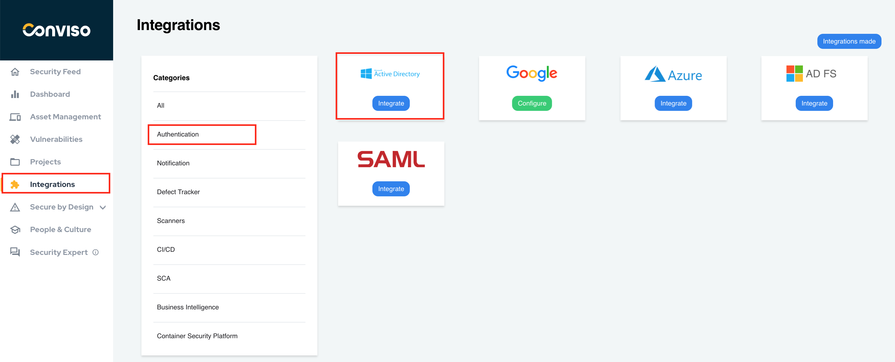
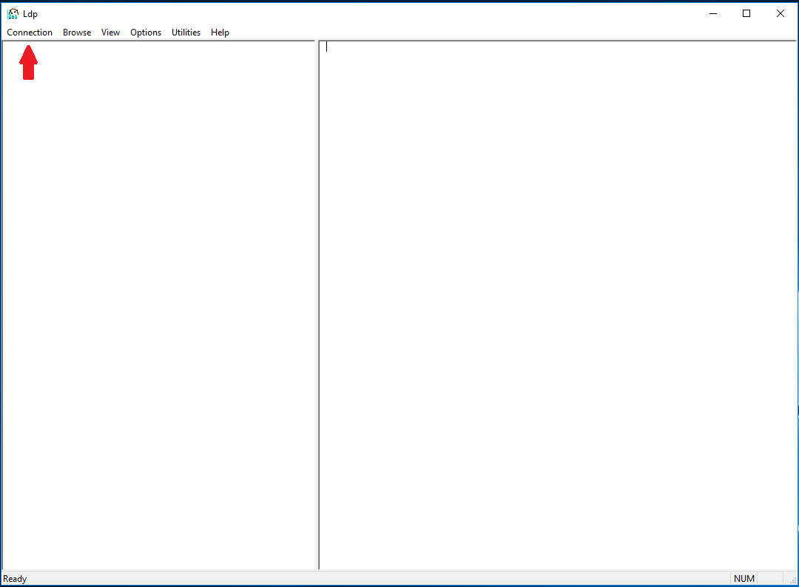
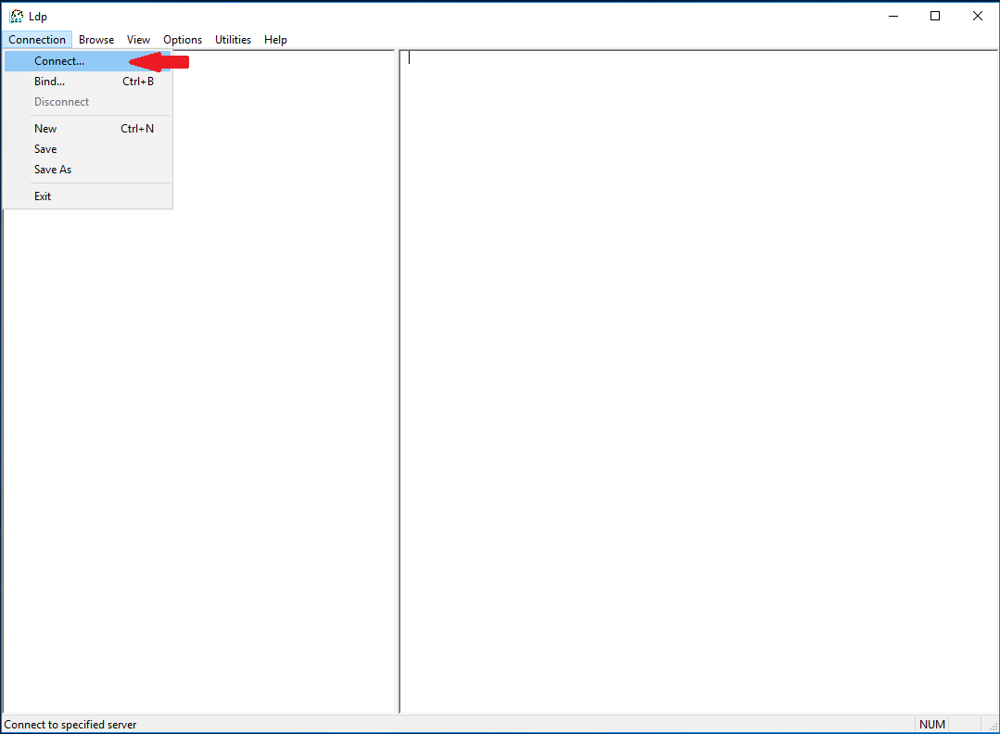
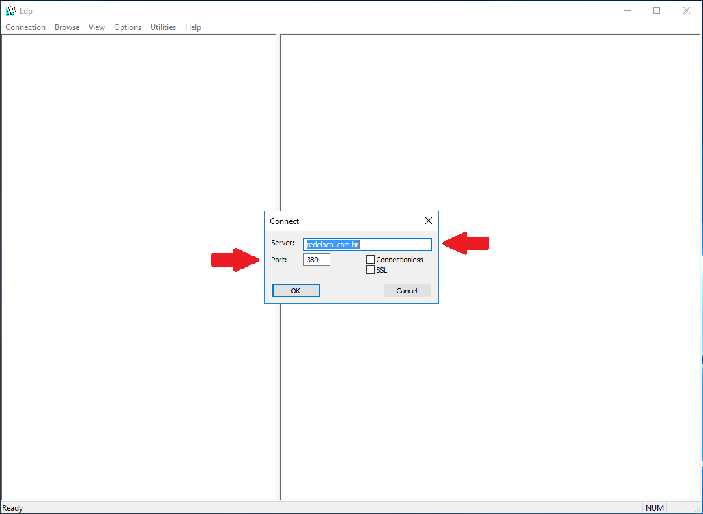
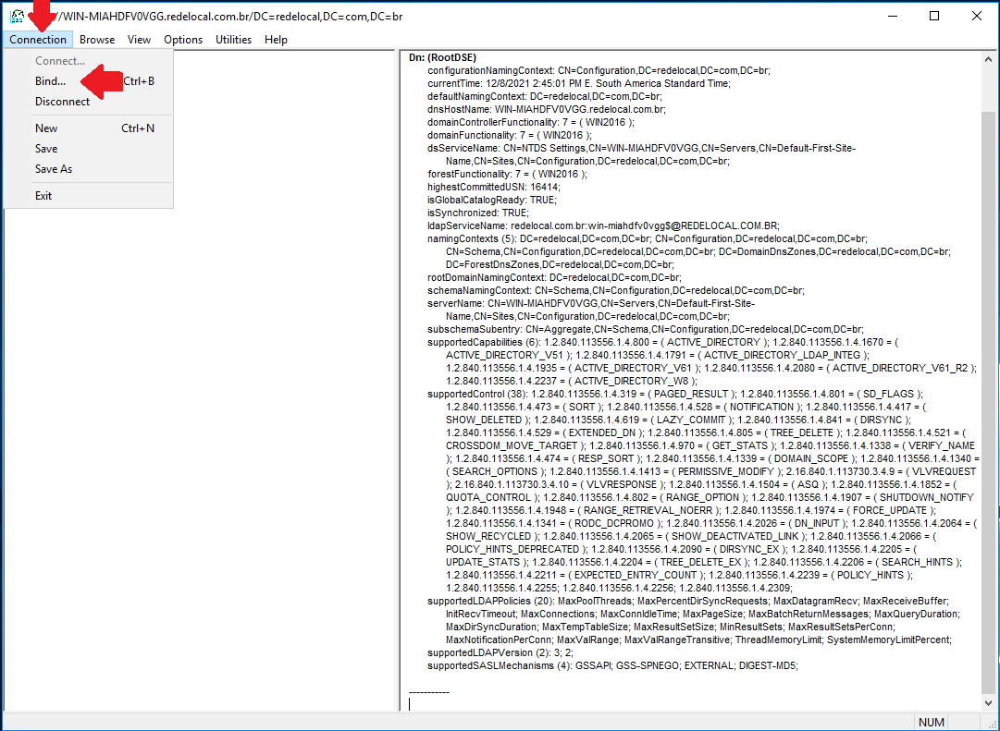
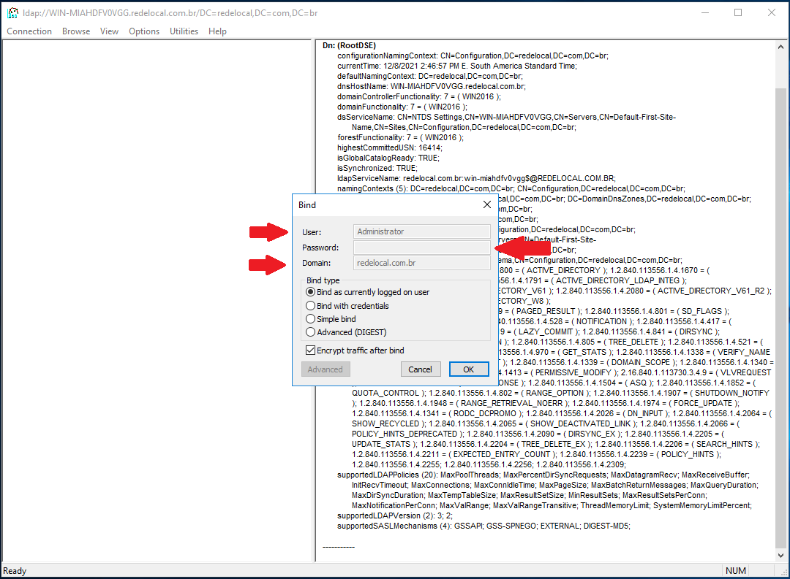
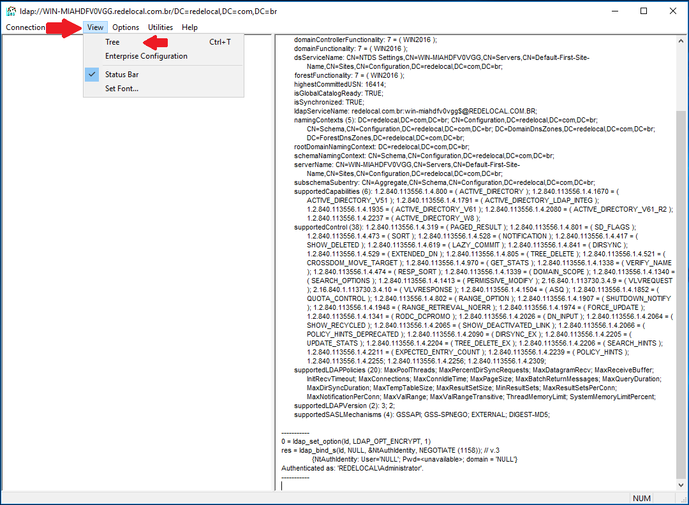
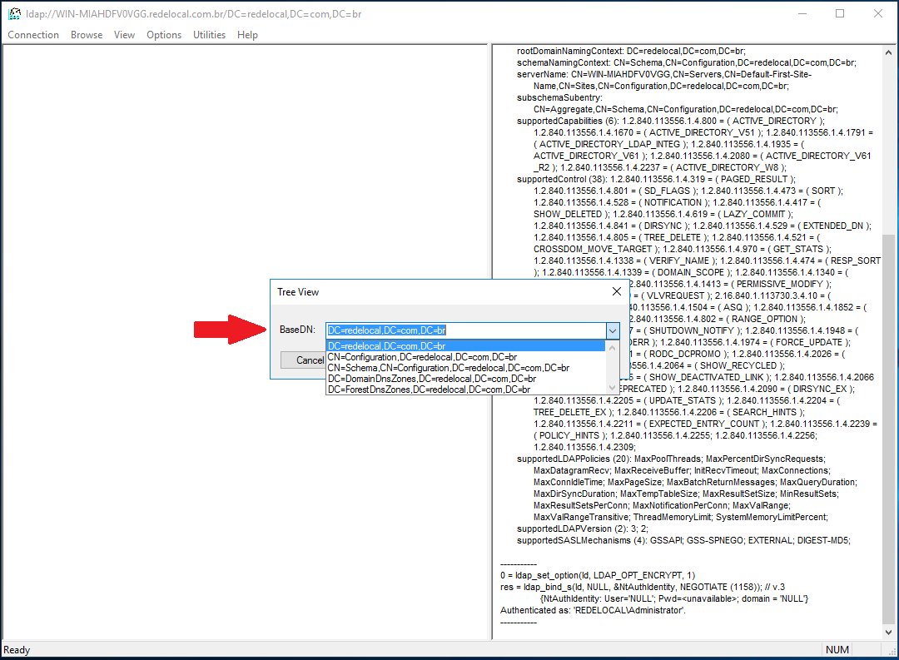
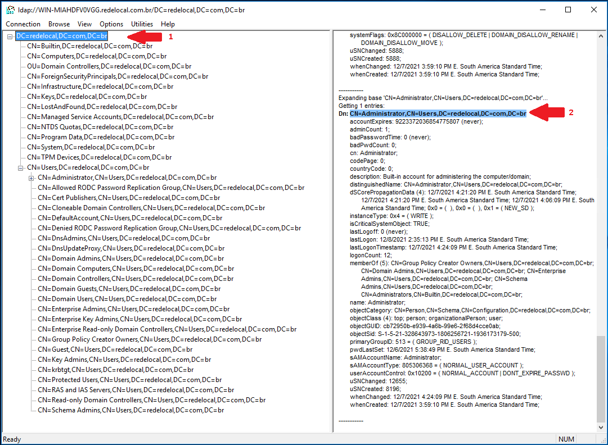
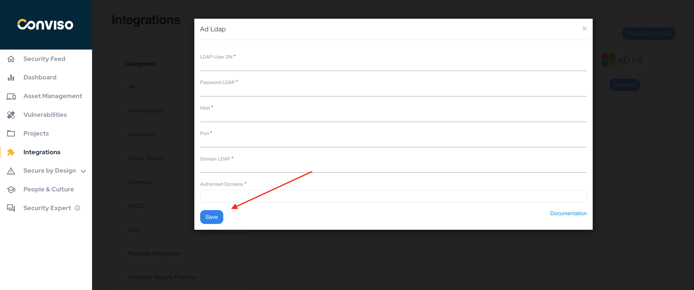

## Introduction

The LDAP integration aims to increase the security of users on the platform. With this feature enabled, managers will have full control of who should have access to Conviso Platform.

The impact will be positive for your company's support teams tasks, reducing common “forgot my password” calls by employees, customers and suppliers, allowing the process to flow more quickly.

:::note
While it is not recommended publishing your domain controllers on the Internet, you can use this SSO integration if you are using On Premises Conviso Platform or there is an IPSec VPN tunnel connecting Conviso to your infrastructure, with your domain controllers published on the tunnel.
:::

## LDAP Setup

:::note
While we are using Microsoft Active Directory / LDAP for creating this document, it is possible to use any LDAP implementation to configure SSO with Conviso Platform. If you are not using Microsoft Active Directory LDAP implementation, proceed with caution and do the proper corrections.  
:::

For this setup, the following data will be required:

1. LDAP User DN;

2. LDAP password;

3. Host;

4. Port;

5. LDAP Domain;

6. Authorized Domains.

:::note
In order to get access to the LDAP configuration, you need to be logged in to your Domain with Administrator privileges.
:::

1. For **LDAP User DN** and **LDAP password**, we strongly recommend that you create a service user account and grant the proper privileges to BIND to your LDAP implementation;

2. The **Host** data is the FQDN of your host where LDAP is served. For most of Microsoft (AD/LDAP) implementations, there are often more than 2 hosts (called Domain Controllers) that serve LDAP, so you can use your FQDN domain name as the Host, once any Domain Controller can respond to the requests. If you especify a single host on this field and this host become offline, you will loose the SSO feature and will be unable to logon at Conviso Platform, although you will still be able to login on your domain;

3. The **Port** will depend on your LDAP implementation and configuration. Microsoft **LDAP** listens on the default **389** port, while **LDAP Over SSL (LDAPS)** listens on the default **636** port. Check if your LDAP/LDAPS are using the default port or make the appropriate changes to this;

4. The **LDAP Domain** is your full DN domain name, like **DC=redelocal,DC=com,DC=br**;

5. The **Authorized Domains** are the domain name itself and all of your domain aliases that can be used for login.

## Obtaining Data from LDAP

In the next steps, we will use the LDP.EXE tool (available with Microsoft Windows Server 2008 R2 and later implementations) to show on how to get all data needed.

First, open the LDP.EXE tool:

Next, choose **Connection** at the menu bar, and then choose **Connect...**:

You will be prompted to provide **Server** and **port** data. These are the same data you will be using at Conviso Platform LDAP SSO integration. Note that for **LDAPS** connections, the default port is **636** and you must check the **SSL** checkbox:

Now we have to bind to LDAP. Choose **Connection** at the menu bar, and then choose **Bind...** 

You will be prompted to provide **User**, **Password** and **Domain** data for this connection. The credentials used must be the same you are using at Conviso Platform LDAP SSO integration (change accordingly if you are using a service user account):

After you are bound to LDAP, go to **View** at the menu bar and select **Tree**:

A floating window will be shown. At **Base DN**, select your Domain DN (in our exemple, **DC=redelocal,DC=com,DC=br**):

Now, expand the tree at the left panel, and the expand the DN that starts with **CN=Users**. This is where the user you used to bind to LDAP is stored. If you are using a custom service user account, expand the tree until you find its OU.

From the left panel, you can extract the **LDAP Domain** (1); from the right panel, you can extract the data for the **LDAP User DN** (2).

Now we have all data required to fill the integration form at Conviso Platform:

Click on the **Save** button to store your LDAP SSO integration configuration.

