## Introduction
In this tutorial, you'll learn how to integrate Conviso Platform SSO with Microsoft Entra ID. When you integrate Conviso Platform SSO with Microsoft Entra ID, you can:
- Control in Microsoft Entra ID who has access to Conviso Platform SSO.
- Enable your users to be automatically signed-in to Conviso Platform SSO with their Microsoft Entra accounts.
- Manage your accounts in one central location.

### Prerequisites
To get started, you need the following items:
- A Microsoft Entra subscription. If you don't have a subscription, you can get a [free account](https://azure.microsoft.com/free/).
- Conviso Platform SSO single sign-on (SSO) enabled subscription.

## Usage
This section provides a comprehensive guide on using the Conviso Platform SSO Application, covering installation and assigning user permissions. 

- [Introduction](#introduction)
  - [Prerequisites](#prerequisites)
- [Usage](#usage)
- [Installing the Conviso Platform SSO Application](#installing-the-conviso-platform-sso-application)
- [Performing Conviso Platform setup](#performing-conviso-platform-setup)
- [Test in Microsoft Entra ID](#test-in-microsoft-entra-id)
- [Assigning users to the Conviso Platform SSO Application](#assigning-users-to-the-conviso-platform-sso-application)
- [Setup Group Mapping Integration](#setup-group-mapping-integration)
- [Setup Role Mapping Integration](#setup-role-mapping-integration)
  - [On the Entra ID side](#on-the-entra-id-side)
  - [On the Conviso Platform side](#on-the-conviso-platform-side)
  - [What happens on each login](#what-happens-on-each-login)
- [Email Field Mapping in SAML 2.0 for Microsoft Entra ID](#email-field-mapping-in-saml-20-for-microsoft-entra-id)
  - [How this works:](#how-this-works)
- [Support](#support)
- [Resources](#resources)

Following these steps, you can efficiently configure and manage user access to the Conviso Platform, ensuring a streamlined and secure experience for your enterprise customers.

## Installing the Conviso Platform SSO Application
To install the Conviso Platform SSO application, follow these steps:

1. Sign in to the [Microsoft Entra admin center](https://entra.microsoft.com/) as at least a [Cloud Application Administrator](https://learn.microsoft.com/en-us/entra/identity/role-based-access-control/permissions-reference#cloud-application-administrator).

2. Browse to **Identity** > **Applications** > **Enterprise applications** > **New application**:

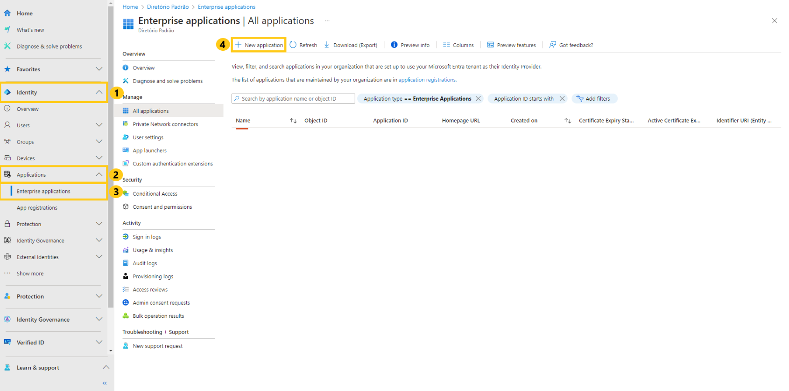

3. In the **Add from the gallery** section, type **Conviso Platform SSO** in the search box.

4. Select **Conviso Platform SSO** from results panel and then add the app, clicking on **Create**. Wait a few seconds while the app is added to your tenant.

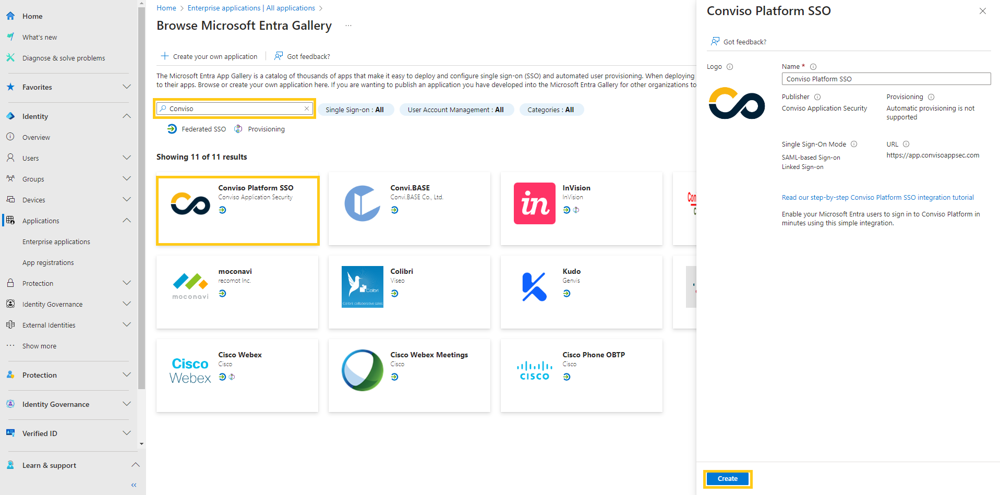

5. You will be redirected to Conviso Platform SSO application's **Overview** page.

6. In the left navigation pane, select **Single Sign-On**.

7. On the **Select a single sign-on method** page, choose **SAML**.

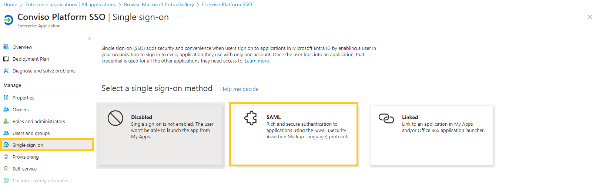

8. The **Basic SAML Configuration** must be edited as it is a requirement by Microsoft. Select **Edit**, then **Save** with the following data:
   - **Identifier (Entity ID)**: `https://auth.app.convisoappsec.com/realms/conviso-platform`
   - **Reply URL (Assertion Consumer Service URL)**: `https://auth.app.convisoappsec.com/realms/conviso-platform/broker/azure_{YOUR_COMPANY_ID}/endpoint`
   - **Sign on URL**: `https://app.convisoappsec.com/spa/auth/login`
 - Close the pop-up window.

:::note
Replace `{YOUR_COMPANY_ID}` in the Reply URL with your actual company identifier.
:::

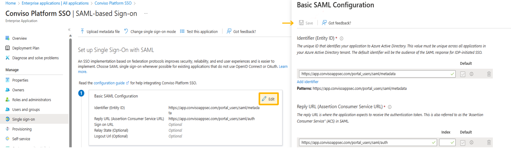

1. In the **Attributes & Claims** section, make sure that the `name` (http://schemas.xmlsoap.org/ws/2005/05/identity/claims/name) is mapped to the attribute corresponding to the email the user uses to log in:

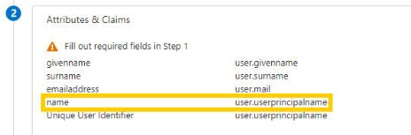

:::note
The `user.userprincipalname` attribute is not mandatory. Just make sure you're using the email the user uses to log in.
:::

10.  Now, find the **Certificate (Base64)** and download it.

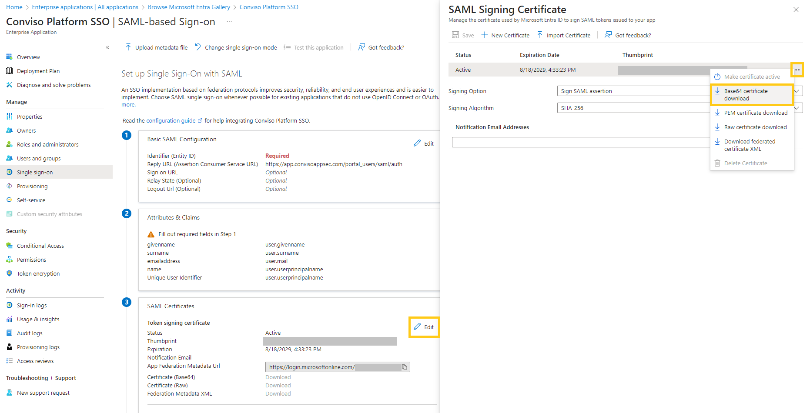

11. Along with the certificate, you need the **Login URL** and the **Microsoft Entra Identifier**.

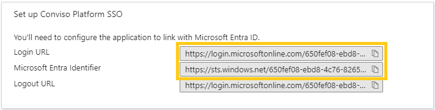

12. Conviso Platform uses the **Certificate (Base64)**, **Login URL**, and **Microsoft Entra Identifier** as credentials to communicate with Microsoft Entra.

## Performing Conviso Platform setup
To set up the Conviso Platform, follow these steps:

1. Log in to the Conviso Platform.

2. In the left navigation pane, click on **Integrations**.

3. From the Integrations panel, select the **Identity Management** category, find the **Entra ID** card and click **Connect**.

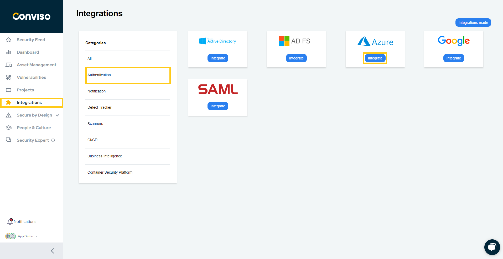

4. Fill out the **Credentials** step with the corresponding information obtained previously. Enter the domain name and all domain aliases used by your organization to log in at the **Authorized Domains** field. Click **Continue** to save your SSO configuration.
- **Authorized Domains example: company.com**

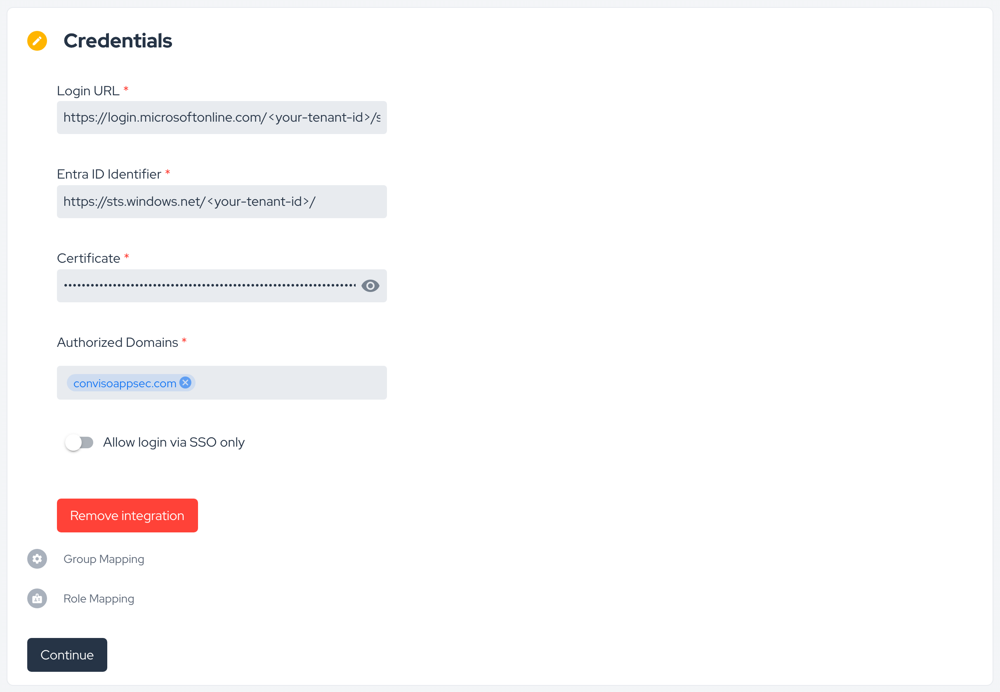

The two steps that follow — **Group Mapping** and **Role Mapping** — are optional, and each is covered in its own section below. Once the integration is saved you can come back at any time and jump straight to a step by clicking its title.

The next step is to assign which Microsoft Entra users will use SSO to access the Conviso Platform.

## Test in Microsoft Entra ID

Before testing the SSO integration, ensure you are logged out of the Conviso Platform.

The SSO test process is mandatory in the Microsoft Entra ID provider. Follow these steps to test the integration:

1. In the **Single sign-on** page, click **Test this application**.

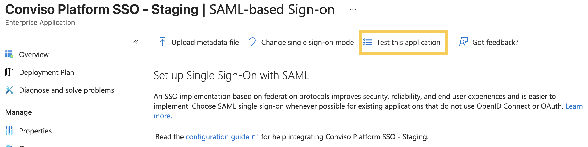

2. Click **Test sign in**.

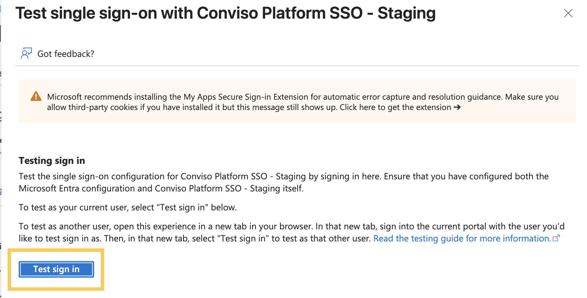

3. You will be redirected to the new Conviso login page. Click **SSO access**.

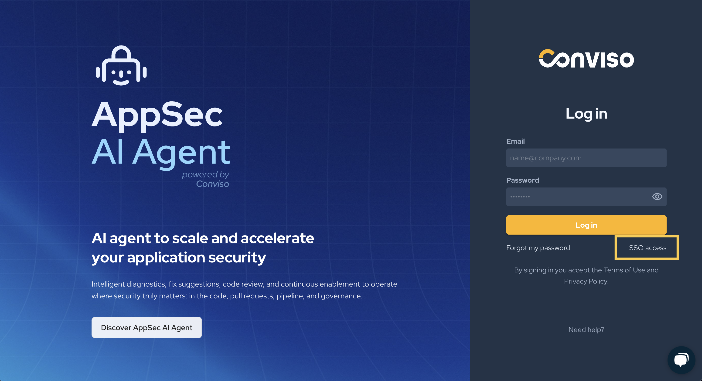

4. Enter your provider email and click **Log in**.

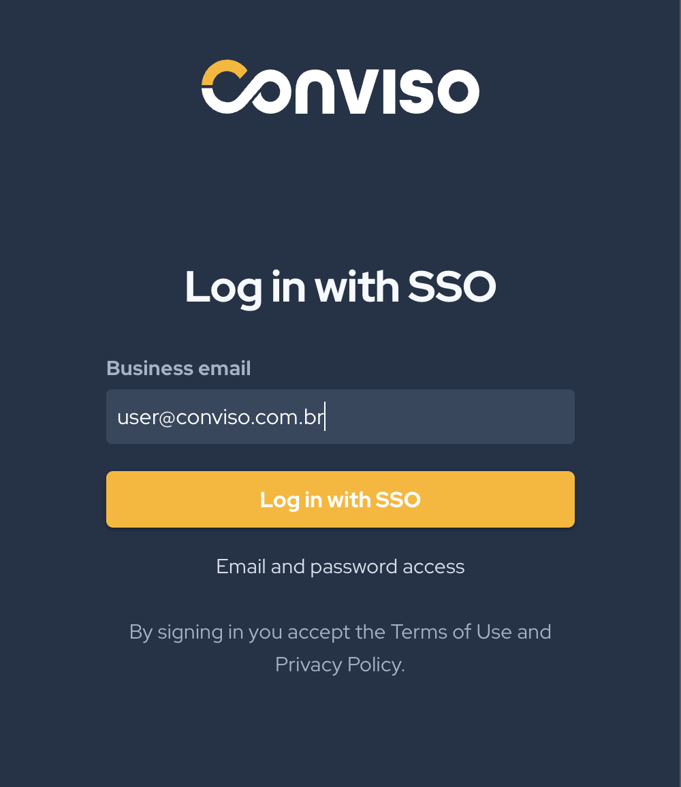

The test will verify that the SSO configuration is working correctly between Microsoft Entra ID and the Conviso Platform.

## Assigning users to the Conviso Platform SSO Application
To assign users to the Conviso Platform SSO application, follow these steps:

1. After configuring the Microsoft Entra ID in the Conviso Platform, you must permit users to use the SSO. Go back to your Microsoft Entra Portal. In the **Enterprise Applications | All applications page**, select your recently configured Conviso Platform SSO application. If it doesn't show your new application, refresh the page.

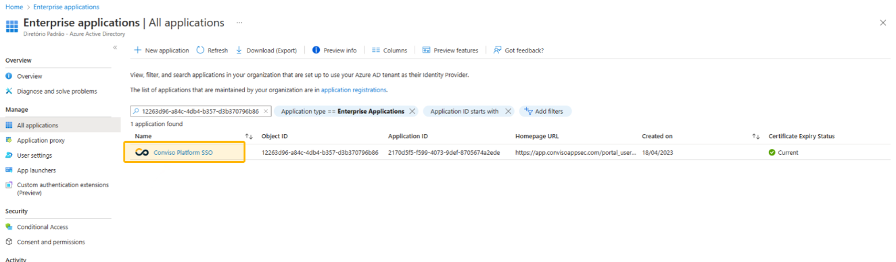

2. In the left navigation pane within the application's page, select **Users and Groups**.

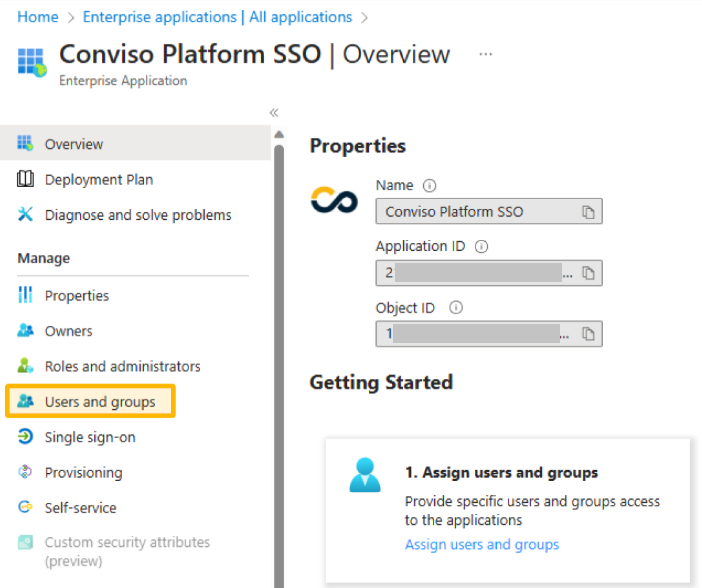

3. Search for and click the **Add user/group** button.

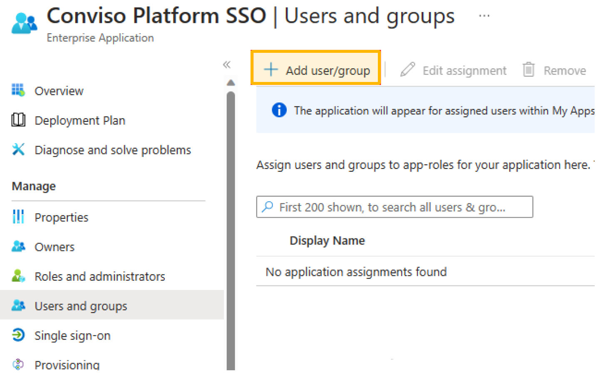

4. Under **Users**, click **None Selected**. A window will appear displaying all your Microsoft Entra users. Select the desired users by checking the boxes next to their names.

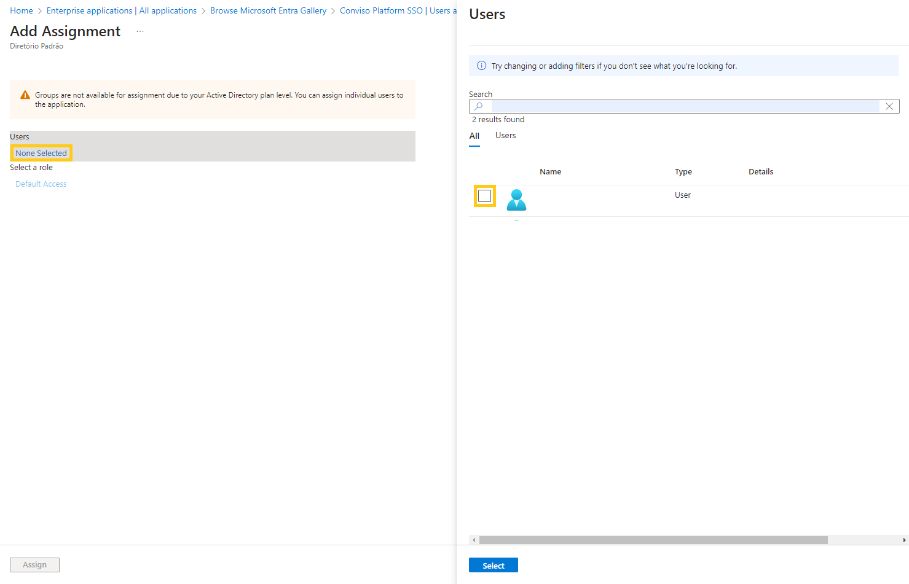

5. After selecting the users, click **Select** and then **Assign**.

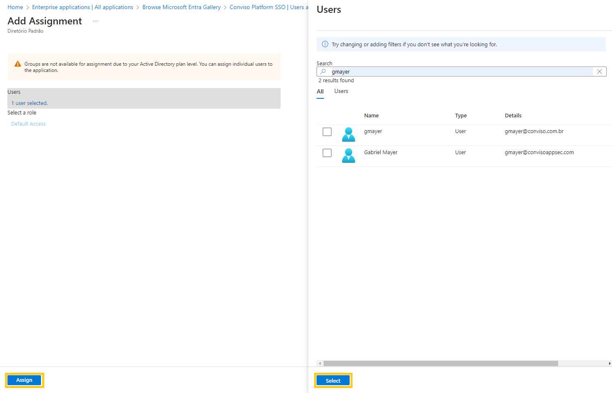

Finally, you can view the Microsoft Entra ID users with access to the Conviso Platform.

:::note
Users must be invited to the Conviso Platform beforehand to be able to log in.
:::

## Setup Group Mapping Integration

To enable integration with group mapping support in Entra ID, follow the steps below:

1. Within the Conviso Platform SSO application, ensure that the fields highlighted below are created.

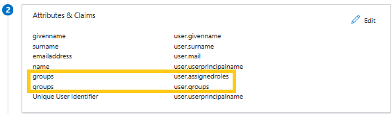

:::note
Make sure that the claim `name` is mapped to the attribute corresponding to the email the user uses to log in.
:::

:::caution
Three settings on the Entra ID side decide whether group mapping works at all, and getting any of them wrong fails silently — the mapping saves, no error appears, and the user simply never joins the Team:

- **The group claim has to be enabled.** Under **Single sign-on → Attributes & Claims**, add a group claim if there is none.
- **It has to be named `groups`, with an empty namespace.** Tick *Customize the name of the group claim* and set the name to `groups`. Entra ID's default name is the long `http://schemas.microsoft.com/ws/2008/06/identity/claims/groups`, which does not match.
- **The source has to include your group types.** *Security groups* omits Microsoft 365 groups entirely. *Groups assigned to the application* is the recommended option: it keeps the claim small and avoids the limit below.

Entra ID stops sending the group claim once a user belongs to more than 150 groups, replacing it with a link the platform cannot follow. If your users are in many groups, prefer App Roles — see [Role Mapping](#setup-role-mapping-integration).
:::

2. Assign users to the Entra ID group.

3. [Create a Team](../platform/user-management.md) in the Conviso Platform, specifying the desired Profile and Access Type for the group's users.

4. Retrieve the Entra ID group ID.

5. In the Entra ID integration page within the Conviso Platform, open the **Group Mapping** step, select the Team you created and associate it with the Entra ID group ID.

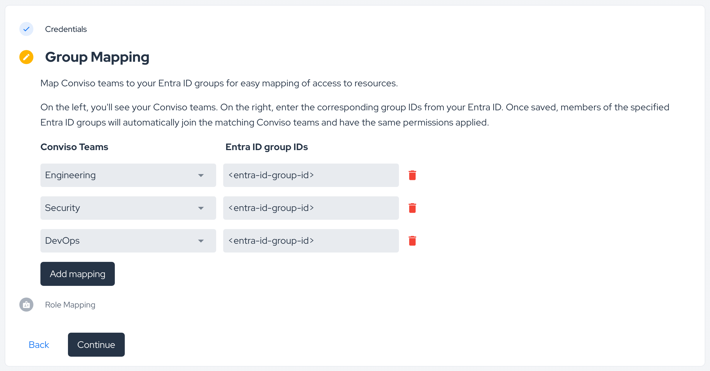

6. Click **Continue**.

This setup simplifies user management, as permissions and access will be managed through the Team, while users are managed via Entra ID.

:::note
Users must be invited to the Conviso Platform beforehand to be able to log in.
:::

## Setup Role Mapping Integration

Group mapping decides which **Team** a user joins. Role mapping decides which **access profile** the user gets — that is, what they are allowed to do once inside the company. The two are independent: you can use either, or both.

Roles travel as an Entra ID **App Role**, so a user's profile is granted in Entra ID and applied on every login to the Conviso Platform.

### On the Entra ID side

1. In the [Microsoft Entra admin center](https://entra.microsoft.com/), browse to **Identity** > **Applications** > **App registrations** and open the registration behind your Conviso Platform SSO application.

2. Select **App roles** > **Create app role** and create one role for each access profile you intend to grant. Fill in:
   - **Display name**: any label — it is what appears when you assign the role.
   - **Allowed member types**: **Users/Groups**.
   - **Value**: the string that is actually sent in the assertion, and the one you will map in the Conviso Platform. Choose something stable, such as `conviso-admin`.
   - **Description**: any text.

3. Go back to **Enterprise applications** > **Conviso Platform SSO** > **Users and groups** and assign each user (or group) to the role you created. A user with no role assigned asserts no role.

4. In **Single sign-on** > **Attributes & Claims**, add a claim:
   - **Name**: `roles`
   - **Namespace**: leave it **empty**
   - **Source**: Attribute
   - **Source attribute**: `user.assignedroles`

:::caution
The claim has to be named exactly `roles` with an empty namespace. Entra ID also emits App Roles under its own default name, `http://schemas.microsoft.com/ws/2008/06/identity/claims/role`, which the Conviso Platform does not read. Without the claim above, no role reaches the platform, and — once you have declared at least one mapping — every user is treated as carrying no role. See [What happens on each login](#what-happens-on-each-login).
:::

### On the Conviso Platform side

1. Log in to the Conviso Platform, go to **Integrations** > **Authentication** > **Azure** and open your integration.

2. Open the **Role Mapping** step.

3. For each App Role, type the role **Value** exactly as you set it in Entra ID and select the access profile it should grant. Use **Add mapping** to declare more than one mapping.

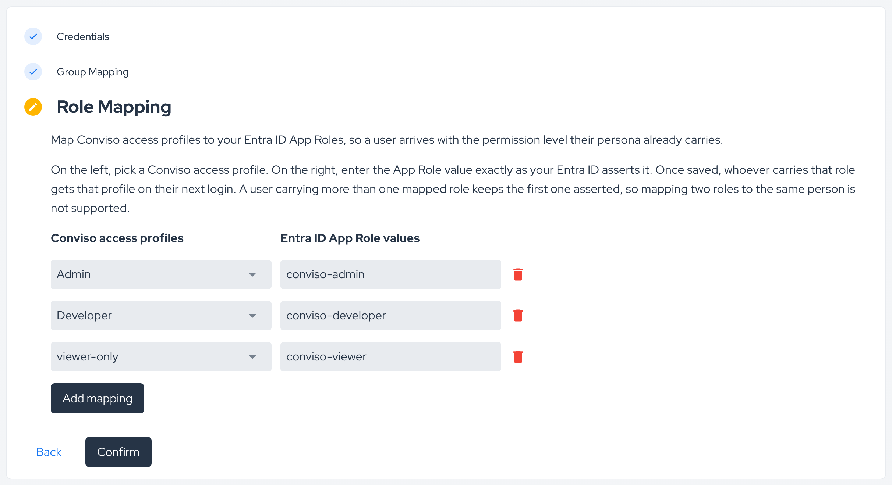

4. Click **Confirm**.

The comparison ignores case and surrounding spaces, so `Conviso-Admin` matches `conviso-admin`. Everything else has to match character for character.

### What happens on each login

Declaring the first mapping is what hands the access profiles of that company over to Entra ID. From then on, every SSO login re-evaluates the user's profile:

- **A role that matches a mapping** — the user gets the mapped access profile, replacing whatever profile they had.
- **No role, or only roles that match nothing** — the user is set to **Viewer Only**. Profiles granted manually in the Conviso Platform do not survive the next login, so an operator who needs to override a profile has to change it in Entra ID.
- **More than one matching role** — one of them is applied, and there is no guarantee of which: the order of a multivalued claim is not defined, so it may differ between logins. Assign a single mapped role per user.

While a company has **no** mapping declared, nothing changes: access profiles keep being managed entirely in the Conviso Platform.

:::note
An access profile says what a user can do; it does not by itself grant access to the company. Users must be invited to the Conviso Platform beforehand to be able to log in.
:::

:::note
Role mapping is available for SAML integrations.
:::

You are now ready to go. To log in again with an email from the domain specified in the integration, use the **SSO Access** option on the [Conviso Platform website](https://app.convisoappsec.com/).

Note: Also consult the [Microsoft Documentation](https://learn.microsoft.com/en-us/entra/identity/saas-apps/appsec-flow-sso-tutorial) for further guidance. There you will find a similar tutorial to help you.

## Email Field Mapping in SAML 2.0 for Microsoft Entra ID
When configuring the Microsoft Entra ID SSO integration via SAML, it's essential to ensure that the email field is correctly mapped. The email configured in your Microsoft Entra ID identity provider must match the email of the logged-in user on the Conviso Platform to ensure proper authentication.

To do this, in the **Attributes & Claims** section, make sure that the `name` (http://schemas.xmlsoap.org/ws/2005/05/identity/claims/name) is mapped to the attribute corresponding to the email the user uses to log in:

:::note
The `user.userprincipalname` attribute is not mandatory. Just make sure you're using the email the user uses to log in.
:::

### How this works:
During the SSO authentication process, the email is used as the primary identifier to map the user's identity in the Conviso Platform. This means the email value provided by the Microsoft Entra ID identity provider in the SAML Assertion must match exactly with the user's email in Conviso. If it doesn't match, login may fail.

Therefore, when configuring Microsoft Entra ID as the identity provider, make sure the email field is mapped correctly and matches the email associated with the user's account in the Conviso Platform.

## Support
If you have any questions or need help using our product, please don't hesitate to contact our [support team](mailto:support@convisoappsec.com).

## Resources

- [Microsoft Entra SSO tutorial](https://learn.microsoft.com/en-us/entra/identity/saas-apps/appsec-flow-sso-tutorial)
- [Conviso Platform](https://app.convisoappsec.com/)
