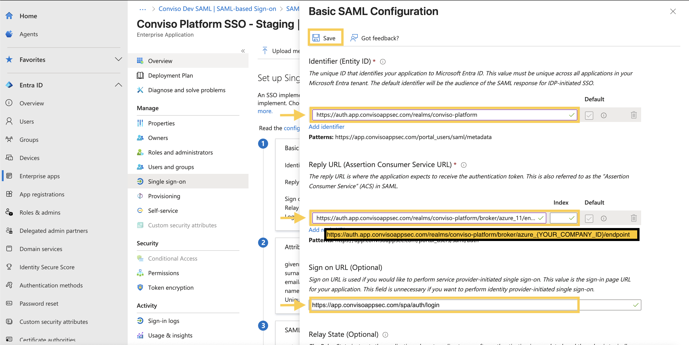
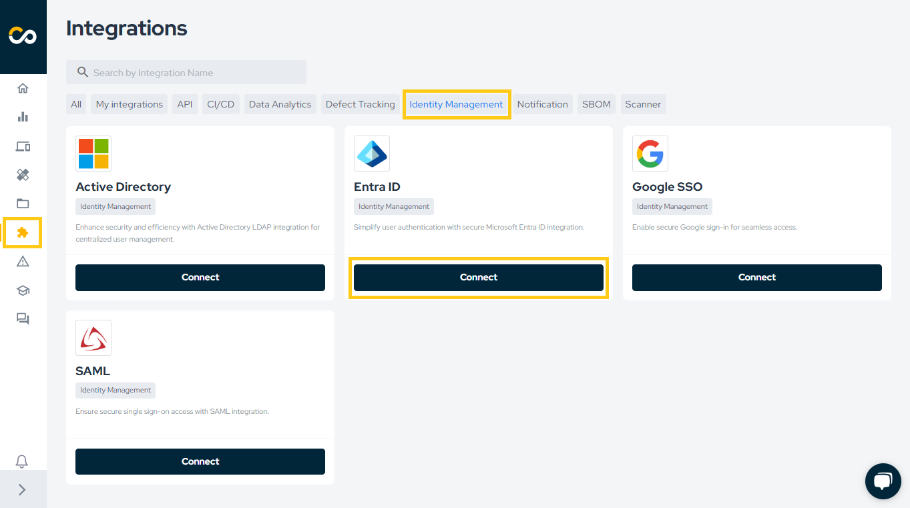
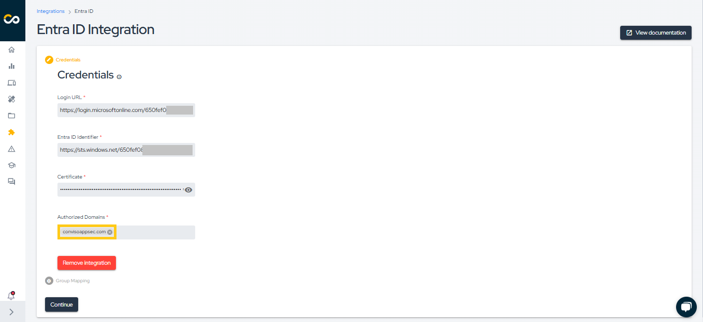
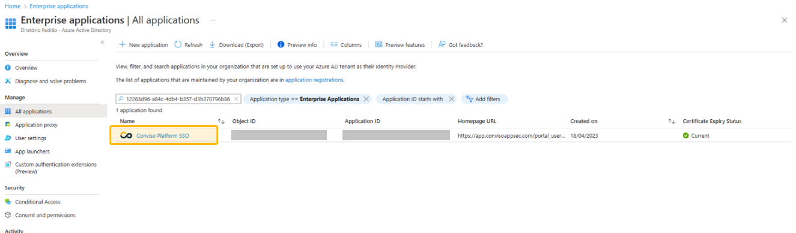

## Introduction
In this tutorial, you'll learn how to integrate Conviso Platform SSO with Microsoft Entra ID. When you integrate Conviso Platform SSO with Microsoft Entra ID, you can:
- Control in Microsoft Entra ID who has access to Conviso Platform SSO.
- Enable your users to be automatically signed-in to Conviso Platform SSO with their Microsoft Entra accounts.
- Manage your accounts in one central location.

### Prerequisites
To get started, you need the following items:
- A Microsoft Entra subscription. If you don't have a subscription, you can get a [free account](https://azure.microsoft.com/free/).
- Conviso Platform SSO single sign-on (SSO) enabled subscription.

## Usage
This section provides a comprehensive guide on using the Conviso Platform SSO Application, covering installation and assigning user permissions. 

- [**Installing the Conviso Platform SSO Application**](#installing-conviso-platform-sso-application)
- [**Performing Conviso Platform setup**](#conviso-platform-setup)
- [**Assigning users to the Conviso Platform SSO application**](#assigning-users)

Following these steps, you can efficiently configure and manage user access to the Conviso Platform, ensuring a streamlined and secure experience for your enterprise customers.

## Installing the Conviso Platform SSO Application
To install the Conviso Platform SSO application, follow these steps:

1. Sign in to the [Microsoft Entra admin center](https://entra.microsoft.com/) as at least a [Cloud Application Administrator](https://learn.microsoft.com/en-us/entra/identity/role-based-access-control/permissions-reference#cloud-application-administrator).

2. Browse to **Identity** > **Applications** > **Enterprise applications** > **New application**:

3. In the **Add from the gallery** section, type **Conviso Platform SSO** in the search box.

4. Select **Conviso Platform SSO** from results panel and then add the app, clicking on **Create**. Wait a few seconds while the app is added to your tenant.

5. You will be redirected to Conviso Platform SSO application's **Overview** page.

6. In the left navigation pane, select **Single Sign-On**.

7. On the **Select a single sign-on method** page, choose **SAML**.

8. The **Basic SAML Configuration** must be edited as it is a requirement by Microsoft itself. Select **Edit**, then **Save** with the data already filled in and close the pop-up window.

9. Now, find the **Certificate (Base64)** and download it.

10. Along with the certificate, you need the **Login URL** and the **Microsoft Entra Identifier**.

11. Conviso Platform uses the **Certificate (Base64)**, **Login URL**, and **Microsoft Entra Identifier** as credentials to communicate with Microsoft Entra.

## Performing Conviso Platform setup
To set up the Conviso Platform, follow these steps:

1. Log in to the Conviso Platform.

2. In the left navigation pane, click on **Integrations**.

3. From the Integrations panel, select **Authentication**, and choose **Azure**. Click the **Integrate** button.

4. Fill out the form with the corresponding information obtained previously. Enter the domain name and all domain aliases used by your organization to log in at the **Authorized Domains** field. Click the Save button after completing the form to save your SSO configuration.
- **Authorized Domains example: company.com**

The next step is to assign which Microsoft Entra users will use SSO to access the Conviso Platform.

## Assigning users to the Conviso Platform SSO Application
To assign users to the Conviso Platform SSO application, follow these steps:

1. After configuring the Microsoft Entra ID in the Conviso Platform, you must permit users to use the SSO. Go back to your Microsoft Entra Portal. In the **Enterprise Applications | All applications page**, select your recently configured Conviso Platform SSO application. If it doesn't show your new application, refresh the page.

2. In the left navigation pane within the application's page, select **Users and Groups**.

3. Search for and click the **Add user/group** button.

4. Under **Users**, click **None Selected**. A window will appear displaying all your Microsoft Entra users. Select the desired users by checking the boxes next to their names.

5. After selecting the users, click **Select** and then **Assign**.

Finally, you can view the Microsoft Entra ID users with access to the Conviso Platform.

:::note
Users must be invited to the Conviso Platform beforehand to be able to log in.
:::

## Setup Group Mapping Integration

To enable integration with group mapping support in Entra ID, follow the steps below:

1. Within the Conviso Platform SSO application, ensure that the fields highlighted below are created.

2. Assign users to the Entra ID group.

3. [Create a Team](../platform/user-management.md) in the Conviso Platform, specifying the desired Profile and Access Type for the group's users.

4. Retrieve the Entra ID group ID.

5. In the Entra ID integration page within the Conviso Platform, select the Team you created and associate it with the Entra ID group ID.

6. Click **Save**.

This setup simplifies user management, as permissions and access will be managed through the Team, while users are managed via Entra ID.

:::note
Users must be invited to the Conviso Platform beforehand to be able to log in.
:::

You are now ready to go. To log in again with an email from the domain specified in the integration, use the **SSO Access** option on the [Conviso Platform website](https://app.convisoappsec.com/).

Note: Also consult the [Microsoft Documentation](https://learn.microsoft.com/en-us/entra/identity/saas-apps/appsec-flow-sso-tutorial) for further guidance. There you will find a similar tutorial to help you.

## Support
If you have any questions or need help using our product, please don't hesitate to contact our [support team](mailto:support@convisoappsec.com).

## Resources
By exploring our content, you'll find resources to help you to understand the benefits of the Conviso Platform integrations:

[AppSec: Integrations with CI/CD tools through Conviso Platform:](https://bit.ly/3ODN0jw) Follow this article to understand how we can integrate your main tools within a single platform.

[Security Precautions in Kubernetes for Cloud scenarios – IaaS (Infrastructure as a Service):](https://bit.ly/3qaizqR) What is the importance of using Kubernetes in a Cloud environment? And what are the security practices that we need to apply for this context?

