

## Introduction

The integration between Conviso Platform and Microsoft Teams helps those managing activities stay informed by sending real-time alerts directly to the development team or management channel. This integration provides six types of alerts with the following benefits:
1. A notification can be sent when the Risk Score of an asset decreases;
2. A notification can be sent when the Risk Score of an asset increases;
3. A notification can be sent when a vulnerability is fixed;
4. A notification can be sent when a new asset is created;
5. A notification can be sent when a vulnerability is identified.

## Conviso Platform integration with Microsot Teams

In this guide, we will walk you through integrating Conviso Platform with Microsoft Teams, enabling you to receive notifications for each action taken in Conviso Platform.

:::note
You must have Workspace Admin privileges in Azure to create this integration.
:::

### Creating an Incoming Webhook

First, ensure you have a channel created on Microsoft Teams to receive Conviso notifications. Next, create an Incoming Webhook by following these steps:
1. In the New Teams client, select **Teams** and navigate to the channel where you want to add an Incoming Webhook;
2. Select **More options** on the right side of the channel name;
3. Select Manage channel:

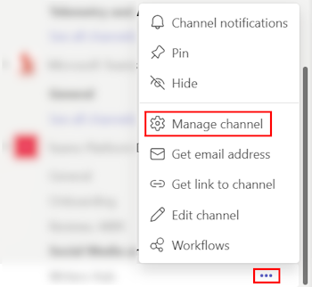

4. Select **Edit**:

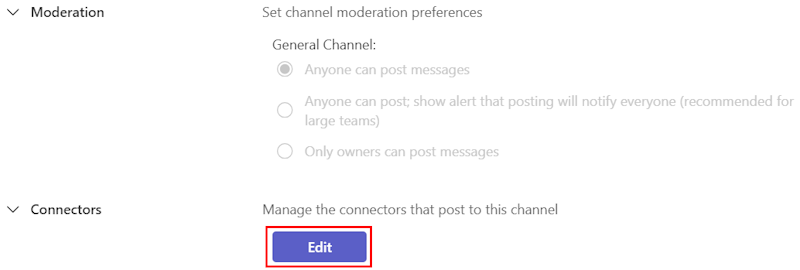

5. Search for **Incoming Webhook** and select **Add**:

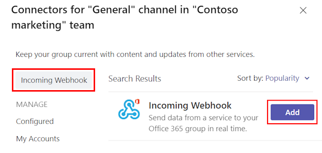

6. Select **Add**:

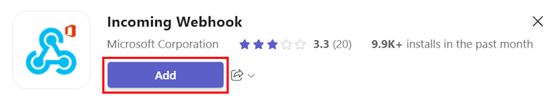

:::note
If you’ve already added an Incoming Webhook, the **Configure** option appears. Select **Configure** to create an Incoming Webhook.
:::

7. Provide a name for the webhook and upload an image if necessary.

8. Select **Create**:

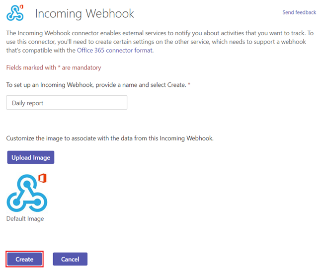

9. Copy and save the unique webhook URL present in the dialog. The URL maps to the channel and you can use it to send information to Teams.

10. Select **Done**. The webhook is now available in the Teams channel.

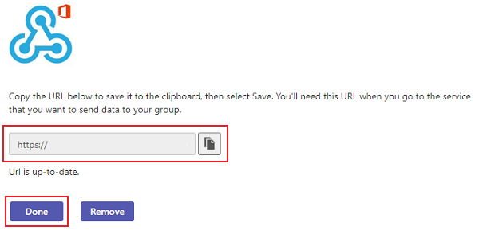

Now, with the webhook created, an alert will be sent to your channel notifying members that the connection has been established:

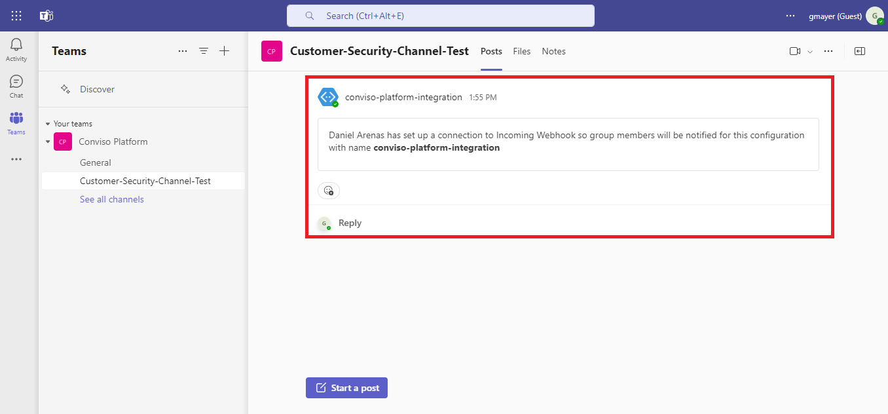

### Integrating Conviso Platform with Microsoft Teams

1. With your Incoming Webhook created, login to Conviso Platform, go to the **Integrations** section (1), click on **Notification** (2), and then click **Integrate** (3):

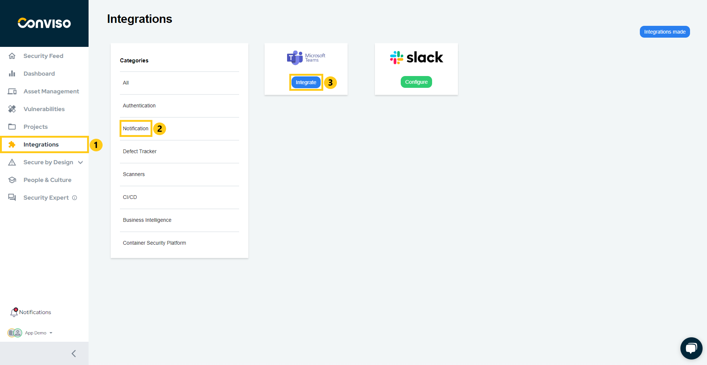

2. Paste your Incoming Webhook URL and click **Continue**:

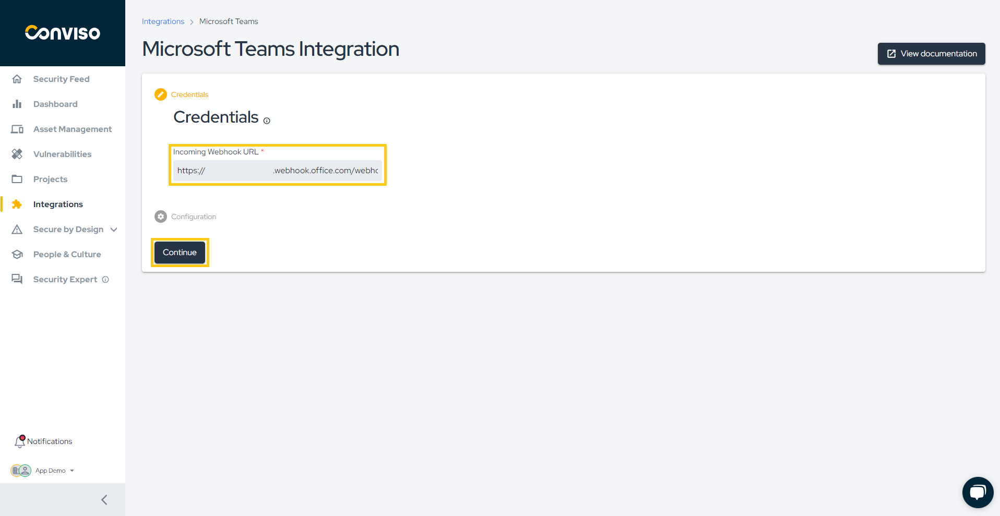

3. Click on **Settings** (4) and select which notifications you want to receive. In this example, only the "**New Asset Creation**" notification will be enabled (5):

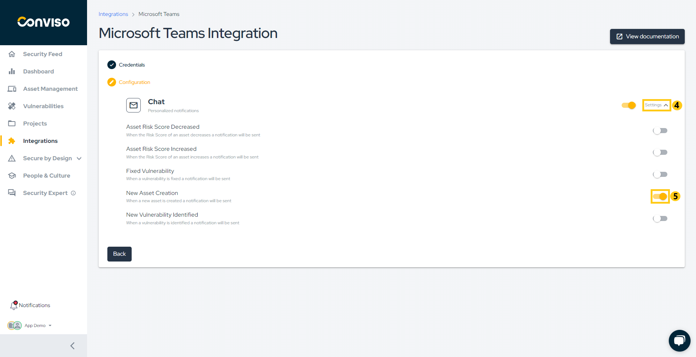

Your notification preferences will be automatically saved.

With the "**New Asset Creation**" notification enabled, each new asset created within your company will trigger a notification in Microsoft Teams:

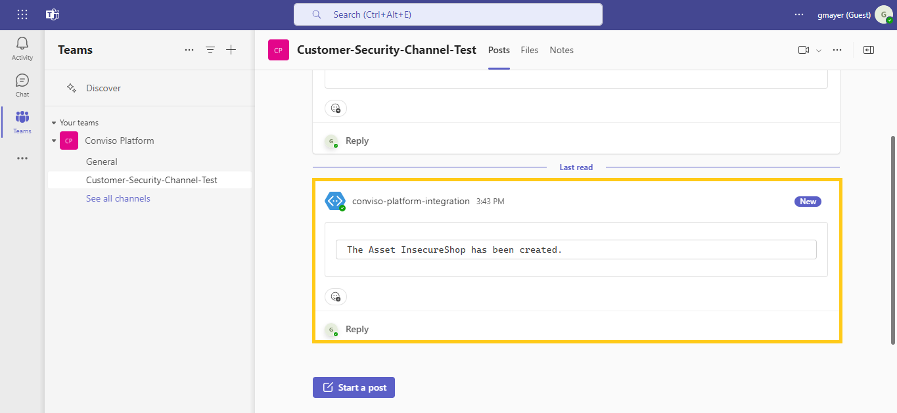

<!--If you have any questions about how the Conviso Platform notifications work, refer to our guide.-->

## Support
If you have any questions or need help using our product, please don't hesitate to contact our [support team](mailto:support@convisoappsec.com).

## Resources
By exploring our content, you'll find resources to help you to understand the benefits of the Conviso Platform integrations:

