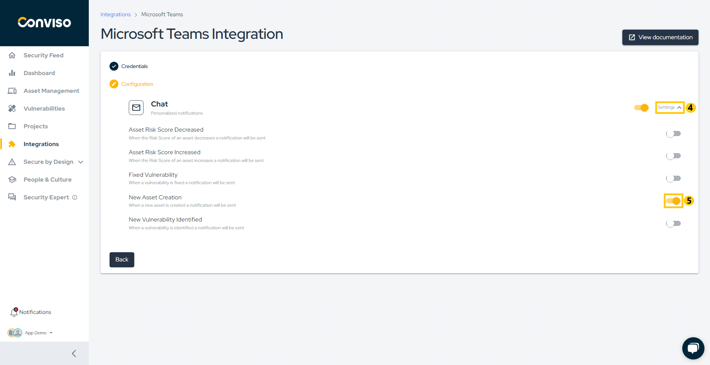
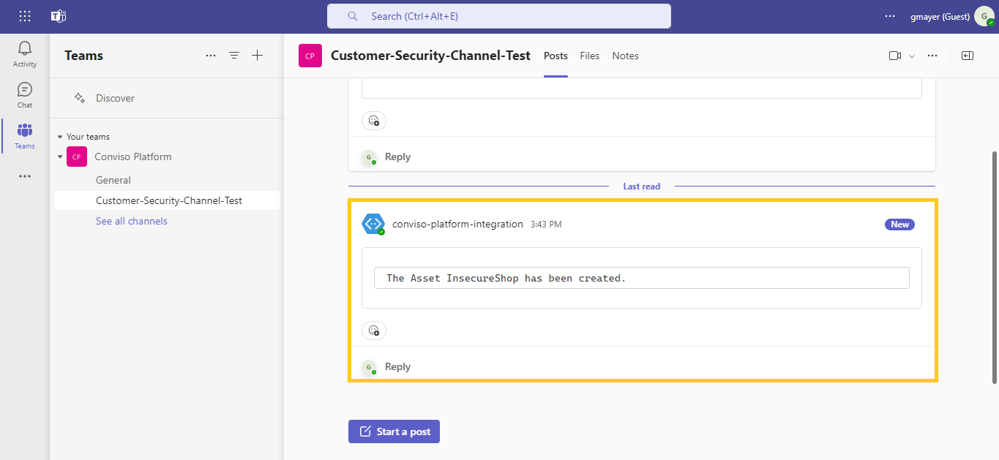

## Introduction

The integration between Conviso Platform and Microsoft Teams helps those managing activities stay informed by sending real-time alerts directly to the development team or management channel. This integration provides five types of alerts with the following benefits:
1. A notification can be sent when the Risk Score of an asset decreases;
2. A notification can be sent when the Risk Score of an asset increases;
3. A notification can be sent when a vulnerability is fixed;
4. A notification can be sent when a new asset is created;
5. A notification can be sent when a vulnerability is identified.

:::caution The old Incoming Webhook no longer exists
Microsoft retired Microsoft 365 Connectors — the feature behind the **Incoming Webhook** option in a
Teams channel — between **May 18 and May 22, 2026**. The app can no longer be added to a channel,
and URLs in the `https://<tenant>.webhook.office.com/webhookb2/...` format stopped delivering
messages.

Webhooks are now created with the **Workflows** app, as described below. If your notifications
stopped arriving, go to [Replacing a webhook that stopped
working](#replacing-a-webhook-that-stopped-working).
:::

## Conviso Platform integration with Microsoft Teams

In this guide, we will walk you through integrating Conviso Platform with Microsoft Teams, enabling you to receive notifications for each action taken in Conviso Platform.

:::note
You need permission to use the **Workflows** app and to post to the target channel. The Teams
webhook trigger does not require a premium Power Automate license, but Power Automate can be
restricted at tenant level — if **Workflows** is missing, ask your Microsoft 365 administrator.
:::

### Creating a webhook with the Workflows app

First, ensure you have a channel created on Microsoft Teams to receive Conviso notifications. Then
create the webhook — the steps below follow Microsoft's [Create incoming webhooks with Workflows for
Microsoft Teams](https://support.microsoft.com/en-us/office/create-incoming-webhooks-with-workflows-for-microsoft-teams-8ae491c7-0394-4861-ba59-055e33f75498):

1. In Microsoft Teams, select **More options** (**…**) next to the channel that will receive the
   notifications, then select **Workflows**:

<!-- SCREENSHOT 1 — capture: Microsoft Teams, channel "More options (…)" menu open
     Expected state: the channel context menu with the Workflows entry visible.
     Replace this comment with:

-->

2. Search for and select the **Send webhook alerts to a channel** template:

<!-- SCREENSHOT 2 — capture: Workflows template picker filtered by "webhook"
     Expected state: the "Send webhook alerts to a channel" template highlighted.
     Replace this comment with:

-->

3. Name the workflow — `Conviso Platform notifications`, for example — confirm the Microsoft Teams
   connection is signed in, and select **Next**;

4. Confirm the **Team** and the **Channel**, then select **Save**:

<!-- SCREENSHOT 3 — capture: Workflows template configuration step
     Expected state: the Team and Channel selectors filled in, before selecting Save.
     Replace this comment with:

-->

5. Copy the webhook URL from the workflow details page. You can come back to this page and copy it
   again at any time, from the **Workflows** app:

<!-- SCREENSHOT 4 — capture: workflow details page showing the generated webhook URL
     Expected state: the URL field and its copy button visible. Blur the signature (sig=) segment.
     Replace this comment with:

-->

:::note The URL no longer points to `webhook.office.com`
Workflows URLs are Power Automate URLs — much longer than the old connector URL and hosted on
`logic.azure.com` or `powerplatform.com`. That is expected. Paste it exactly as copied, query string
included.
:::

:::caution Add a co-owner
A workflow belongs to the user who created it, not to the channel. If that user leaves the
organization the flow is orphaned and notifications stop. On the workflow details page, add someone
else under **Owners**.
:::

### Integrating Conviso Platform with Microsoft Teams

1. With your webhook created, login to Conviso Platform, go to the **Integrations** section (1), click on **Notification** (2), and then click **Integrate** (3):

2. Paste the webhook URL and click **Continue**. The field is named **Incoming Webhook URL** and its
   placeholder still shows the old format — paste your Workflows URL there:

3. Click on **Settings** (4) and select which notifications you want to receive. In this example, only the "**New Asset Creation**" notification will be enabled (5):

Your notification preferences will be automatically saved.

With the "**New Asset Creation**" notification enabled, each new asset created within your company will trigger a notification in Microsoft Teams:

<!--If you have any questions about how the Conviso Platform notifications work, refer to our guide.-->

### Replacing a webhook that stopped working

If the integration was set up before the retirement, the URL saved in Conviso Platform is dead and
nothing reaches Teams. To restore it:

1. Create a new webhook with the **Workflows** app, as described
   [above](#creating-a-webhook-with-the-workflows-app);
2. In Conviso Platform, open **Integrations** → **Notification** → **Microsoft Teams**, replace
   **Incoming Webhook URL** with the new URL and click **Continue**.

Your notification preferences are preserved — there is no need to enable the events again. The old
Incoming Webhook can be removed from the channel, since it no longer does anything.

## Troubleshooting

**Nothing arrives in the channel.** In the **Workflows** app, check that the flow is **On** — flows
are turned off automatically after long periods without use. The flow's run history tells you where
the problem is: no runs at all means the URL saved in Conviso Platform is not the one the flow
listens on.

**The notification arrives without buttons.** Workflows accepts both Adaptive Card and Message Card
payloads, but does not render buttons from a Message Card. The notification text is delivered in
full.

## Support
If you have any questions or need help using our product, please don't hesitate to contact our [support team](mailto:support@convisoappsec.com).
