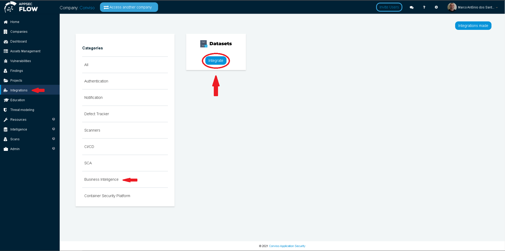
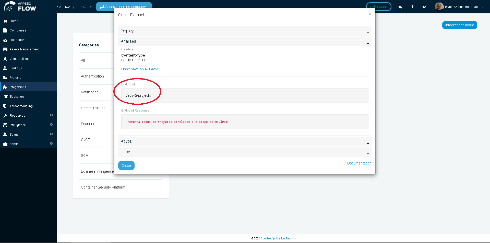
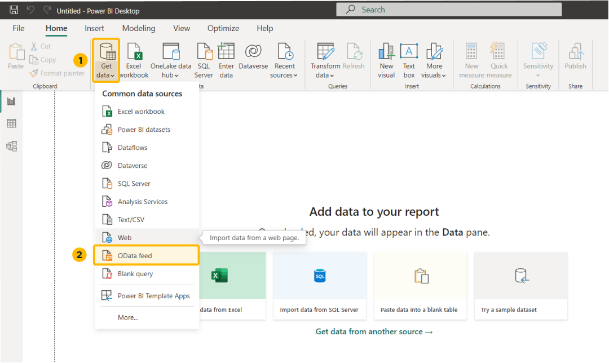
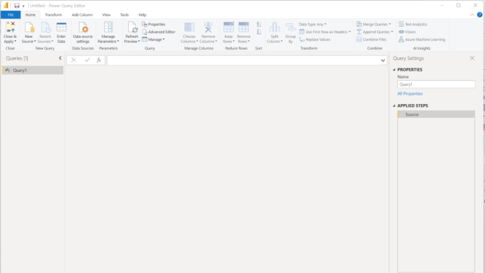
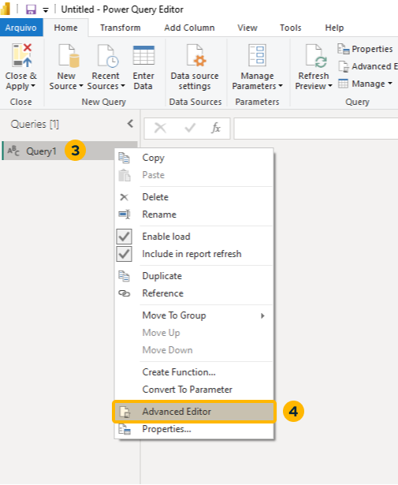
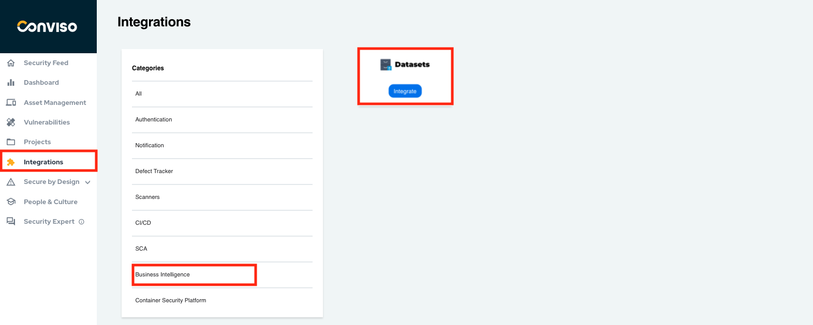

<div style={{textAlign: 'center'}}>


</div>

## Introduction

Through the Business Intelligence integration, it is possible to optimize time by easily issuing customized reports, in addition to allowing data to be extracted and consumed on BI platforms.

## Endpoints

To use this feature, access the menu **Integrations** and then **Business Intelligence** at the right panel and click at the **Integrate** button:

<div style={{textAlign: 'center'}}>



</div>

To analyze data on your BI platform, there are 4 types of endpoints that allow the user to generate .JSON file and feed the BI tool: 

- Deploys

- Projects

- Assets

- Users

<div style={{textAlign: 'center'}}>



</div>

To create a connector with the BI tool, just copy the **Conviso Platform URL** (https://app.convisoappsec.com/), the **Endpoint**, and your **x-api-key** (you can generate your x-api-key by following the instructions [here](../../api/generate-apikey)) and insert the parameters at the BI tool you are using.

## PowerBI Setup

Open PowerBI Desktop. Click on the **Get Data** button and then on **Web** menu option:

<div style={{textAlign: 'center'}}>



</div>

At the **Web** floating window, choose the **Advanced** option:

<div style={{textAlign: 'center'}}>



</div>

Fill the form with proper data.

1. At the **URL Parts**, paste the URL ```https://app.convisoappsec.com/api/v2/projects```;

2. At the **HTTP Request Header Parameters**, choose **Accept** for the first field and click on **Add Header** button;

3. At the new field, type ```x-api-key``` and paste your API Key at the blank field to the right.

4. Click on **OK** button to save.

<div style={{textAlign: 'center'}}>



</div>

After the configuration is stored, we are able to connect Conviso Platform to PowerBI. This allows creating dashboards of projects, where the dashboard model varies according to the user's need.

<div style={{textAlign: 'center'}}>



</div>


