## Introduction

Integrating the Conviso Platform and PowerBI offers a powerful solution for optimizing your time and enhancing your data analysis capabilities. 

With this integration, you can quickly generate customized reports and extract data for consumption on BI platforms, enabling you to make informed decisions based on real-time information.

## Usage

Access the **Integrations (1)** menu in the Conviso Platform. Navigate to the **Business Intelligence (2)** section in the right panel. Click on the "**Integrate**" **(3)** button.

<div style={{textAlign: 'center'}}>


</div>


There are four types of endpoints available to generate a JSON file and feed the BI tool:
* **Deploys:** Returns a JSON with all company deployments.
* **Projects:** Returns all projects linked to the user's scope.
* **Assets:**  Returns all company assets.
* **Users:** Returns a JSON with all company users.

<div style={{textAlign: 'center'}}>


</div>

To create a connector with your BI tool, you will need the following information:
* **Conviso Platform URL:** Use the URL ```https://app.convisoappsec.com/```.
* **Endpoint:** Select one of the four available endpoints mentioned above.
* **x-API-key:** Generate your API Key by following the instructions provided [here](../api/generate-apikey.md).

## PowerBI Setup

Follow these steps to set up PowerBI Desktop:

**Step 1 -** Open PowerBI Desktop and click on the **“Get Data”(1)**  button, then select **“Web”(2)**:
<div style={{textAlign: 'center'}}>


</div>

**Step 2 -** In the Web floating window, choose the **”Advanced”** option:
<div style={{textAlign: 'center'}}>


</div>

**Step 3 -** Fill out the form with the correct data and save it to connect:
* In the **URL Parts (1)** field, paste the URL: ```https://app.convisoappsec.com/api/v2/projects```
* In the **HTTP Request Header Parameters**, choose **“Accept”(2)** for the first field and click on the **Add Header button (3)**.
* In the **new field(4)**, type ```x-API-key``` and paste your API Key in the blank field to the right.

Click **“OK”** to save:
<div style={{textAlign: 'center'}}>

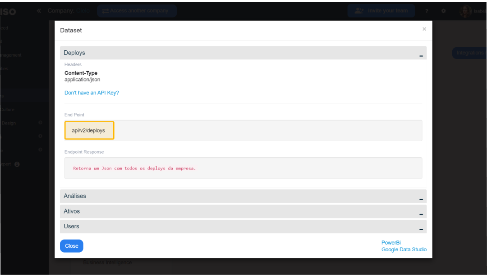

</div>

And click **“Connect”**:

<div style={{textAlign: 'center'}}>

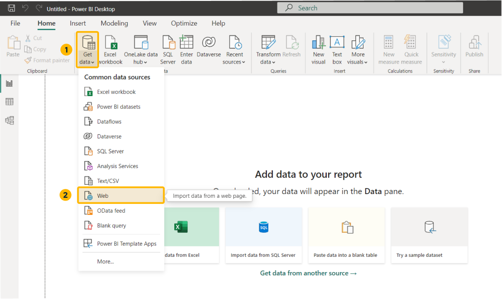

</div>

After storing the configuration, you can connect the Conviso Platform to PowerBI. This allows you to create dashboards of projects tailored to your specific needs.
<div style={{textAlign: 'center'}}>

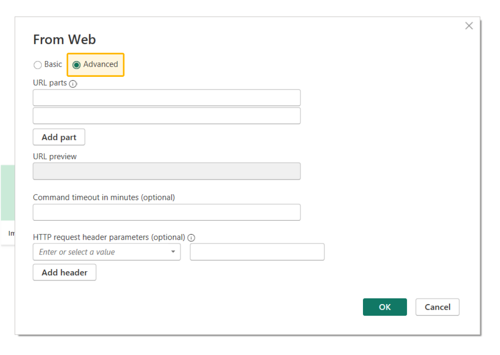

</div>


## Using Pagination​ in PowerBI 

Pagination in PowerBI allows you to retrieve data from the Conviso Platform in smaller, manageable chunks or pages, rather than loading all the data at once. 

This is particularly useful when dealing with large datasets or when there are API limitations on how much data can be retrieved in a single request.

**To implement pagination in PowerBI, follow these steps:**

**Step 1 - **Add the URL part with the parameter ?page=1 to your URL when adding the Power Query in** “Get Data”**. This indicates that you want to retrieve the data for the first page.

<div style={{textAlign: 'center'}}>

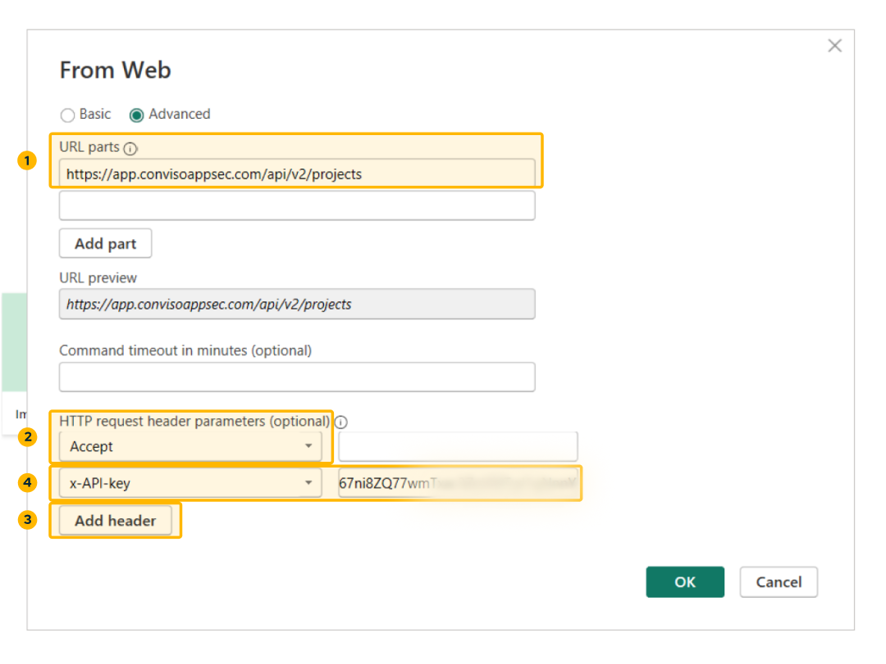

</div>


**Step 2 -** Click **"Advanced Editor"** in the header menu **“Home”**:

<div style={{textAlign: 'center'}}>

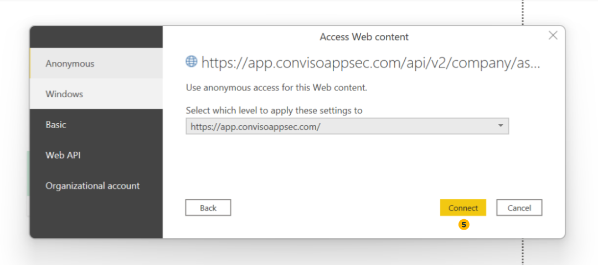

</div>

**Step 3 -** Edit the first and second lines of code by creating a function that takes the page number as a parameter. 

This function allows you to specify the page number while fetching data dynamically.

<div style={{textAlign: 'center'}}>

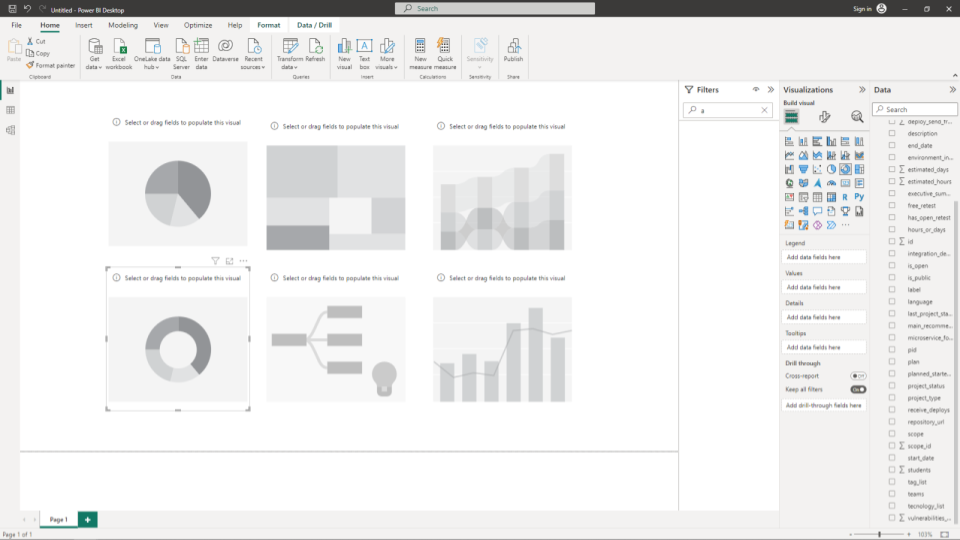

</div>

Here's an example of how the code should look:
<div style={{textAlign: 'center'}}>

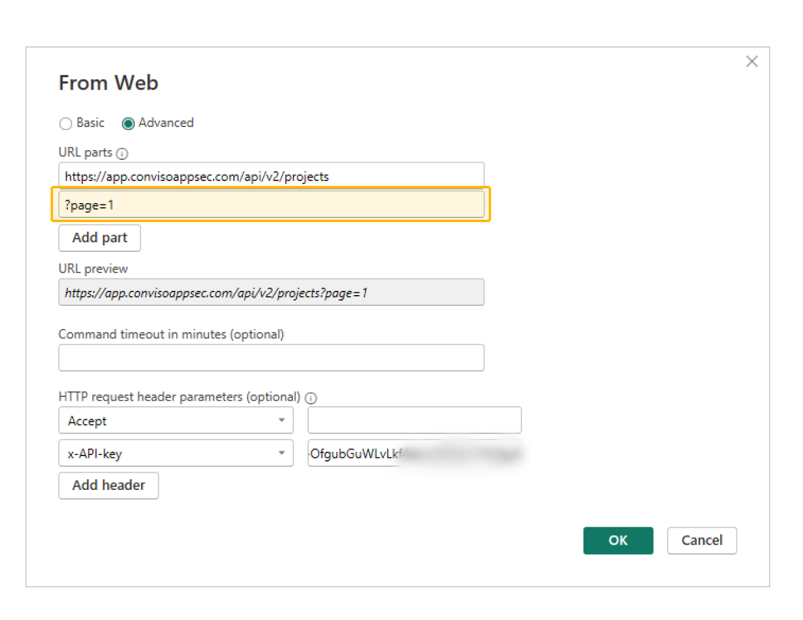

</div>

We change the initial part by incrementing ```(page as text) =>```**(1)** and editing the page part ```"?page="&page&""``` **(2).**

**Step 4 -** With the function in place, you can now perform pagination by invoking the function with different page numbers, allowing you to retrieve and analyze data from subsequent pages:
<div style={{textAlign: 'center'}}>

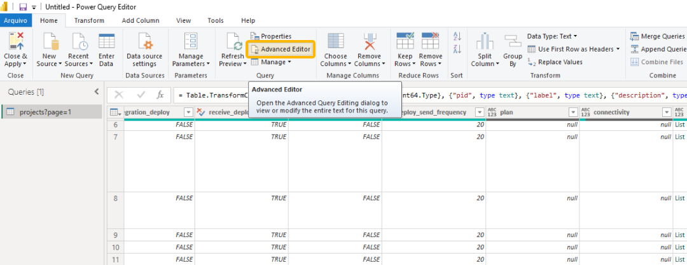

</div>

Implementing pagination ensures you can efficiently handle and process large volumes of data from the Conviso Platform within PowerBI, enabling you to create comprehensive reports and visualizations based on the complete dataset.

## Paginating Multiple Pages to a Table​ in PowerBI  

Paginating multiple pages to a table in PowerBI allows you to retrieve and consolidate data from various pages of the Conviso Platform API into a single table. T

his is particularly useful when the data you need spans multiple pages and you want to combine it for comprehensive analysis and reporting within PowerBI.

**To implement Paginating Multiple Pages to a Table​ in PowerBI, follow these steps:**

**Step 1 -** After following the previous steps for ["Using pagination"](#using-pagination), select the **"Enter Data" (1)** option to see the **“Create Table” (2)** window:
<div style={{textAlign: 'center'}}>

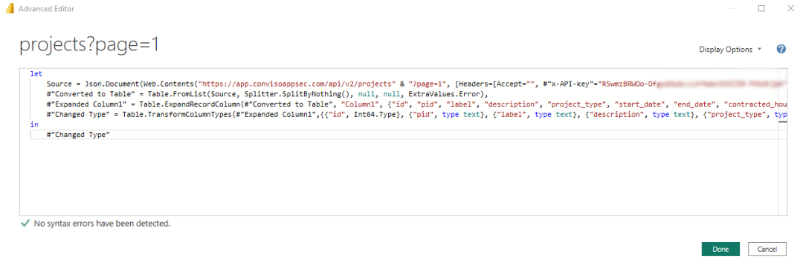

</div>

**Step 2 -** Configure the opened table as shown below. Note that it is set to capture 10 pages using the page variable:

<div style={{textAlign: 'center'}}>

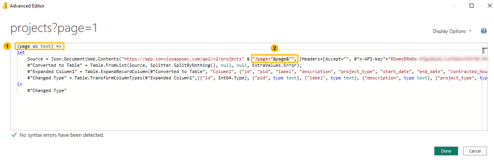

</div>


**Step 3 -** After confirmation, the table will appear below. Change the **"type" (1)** to **"Text"(2)** as shown in the following steps:

<div style={{textAlign: 'center'}}>

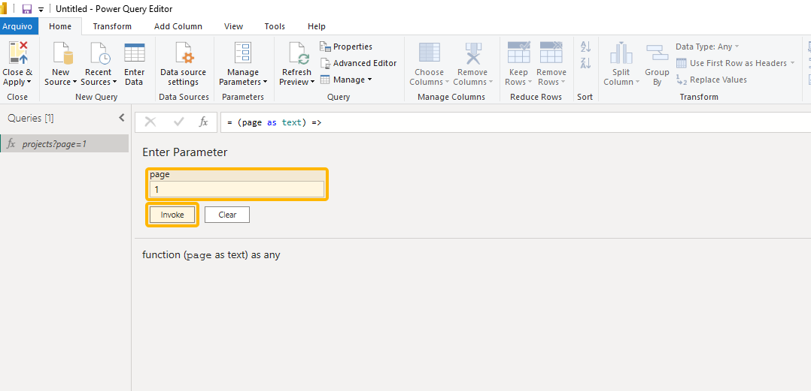

</div>

Then a confirmation window will appear, click **"Replace current"** to confirm.

**Step 4**- In **"Options" (1)** configure an **"Invoke Custom Function" (2)** for the table: 
<div style={{textAlign: 'center'}}>

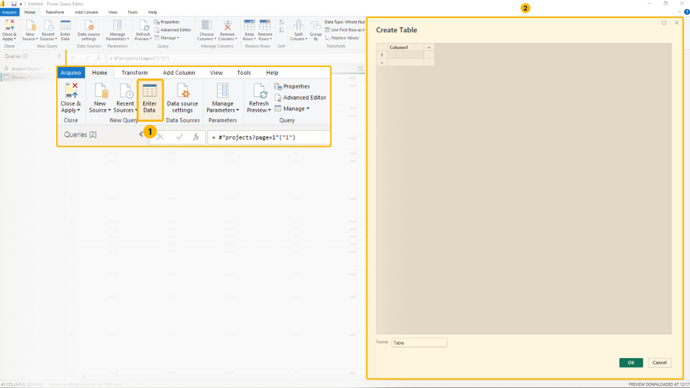

</div>

**Step 5 -**  **Then configure the fields as described below:**
<div style={{textAlign: 'center'}}>

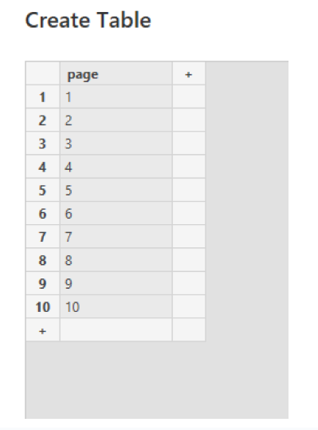

</div>


Example in this image:

* **New column name:** ```projects?page=1```
* **Function query:** ```projects?page=1```
* **page:** ```page```

**Step 6 -** Another table will appear, allowing you to choose the specific attributes or columns you want to retrieve from the API. Click on the **table settings (1)**, select the desired attributes, and **confirm (2):**

<div style={{textAlign: 'center'}}>

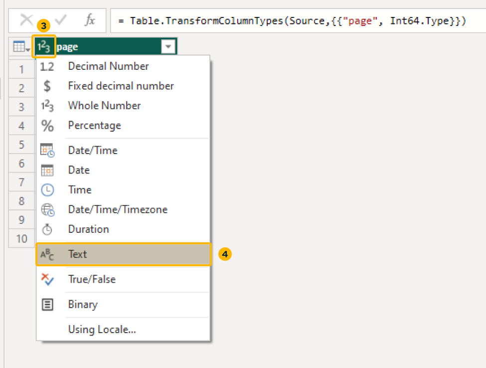

</div>

Done! With this, you can perform pagination of the 10 pages (as configured) of the API in a table:
<div style={{textAlign: 'center'}}>

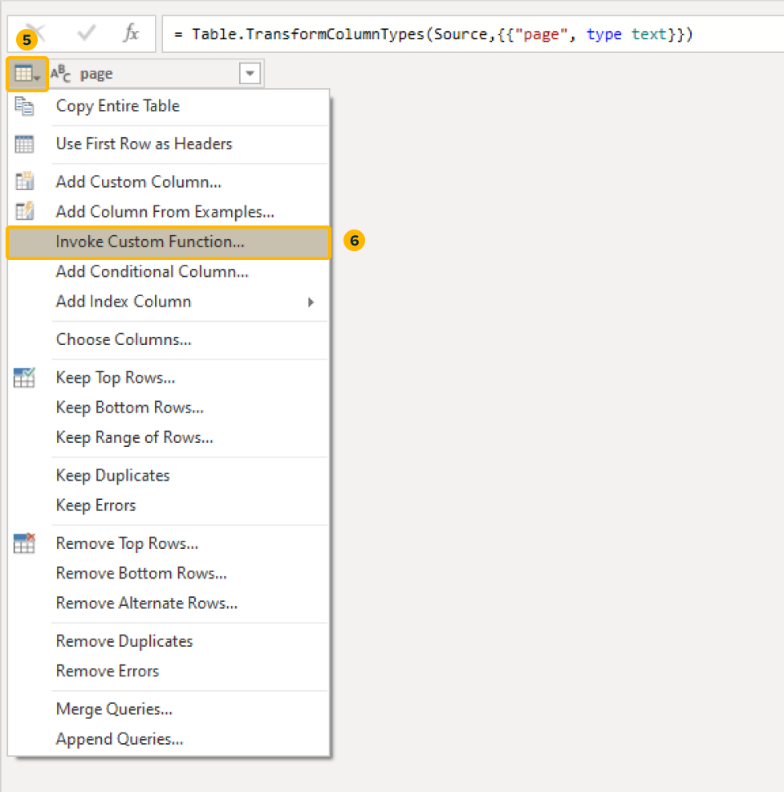

</div>

You can seamlessly retrieve and consolidate data from the Conviso Platform API within PowerBI by paginating multiple pages to a table. 

This simplifies data analysis, enhances reporting capabilities, and lets you gain valuable insights from a complete dataset.

## Support

If you have any questions or need help using our product, please don't hesitate to contact our support team.
Resources

By exploring our content, you'll find resources to help you understand the importance of security applications data:

[The importance of a platform for managing an AppSec program:](https://bit.ly/42JEfrq) We invite you to learn why an AppSec management platform is essential for companies that want to keep their applications safe and secure.