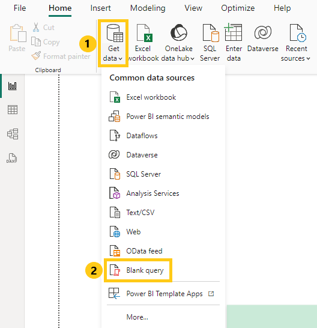
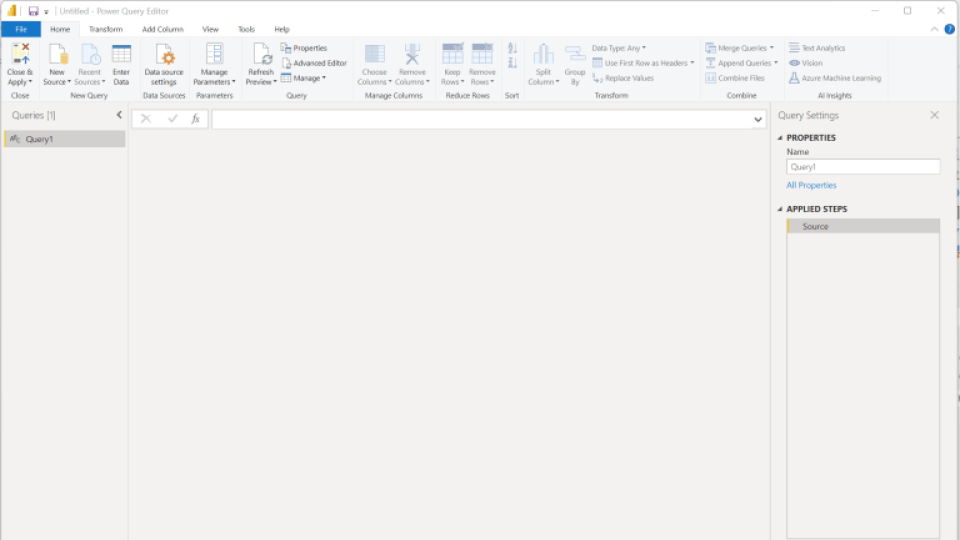
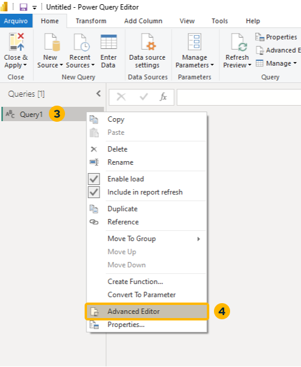
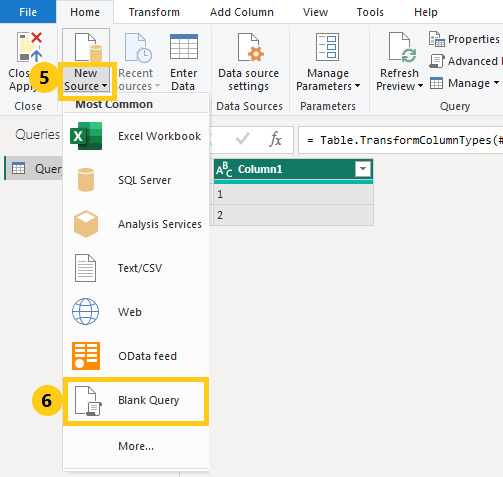
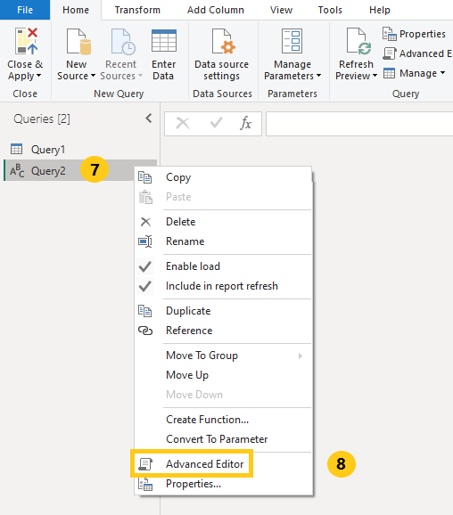
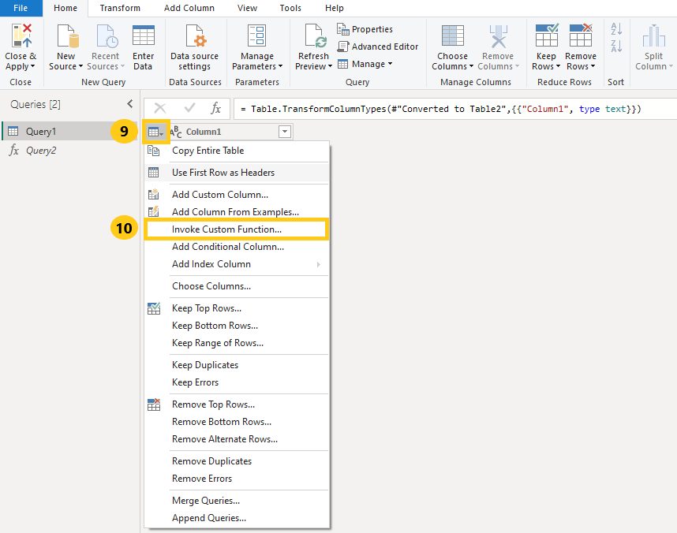
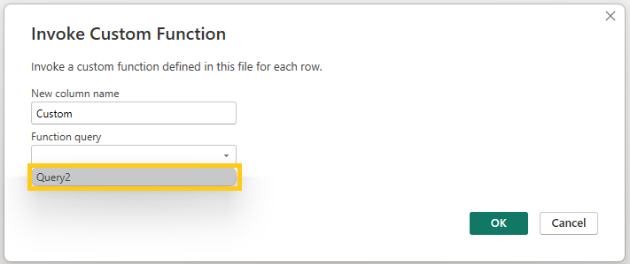
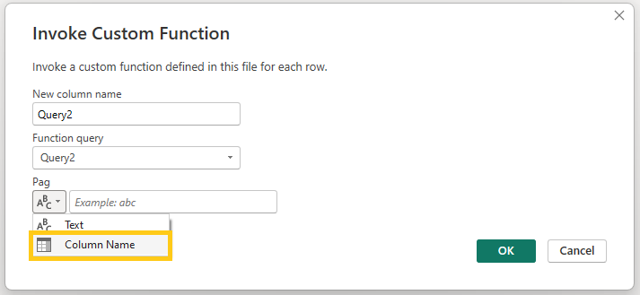
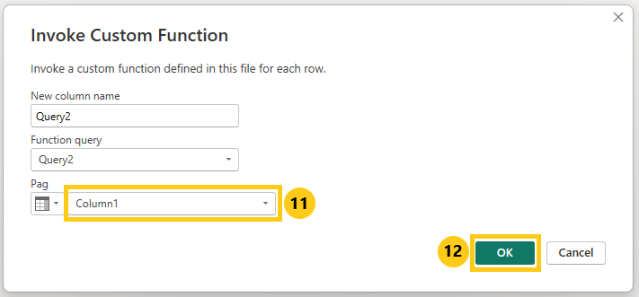
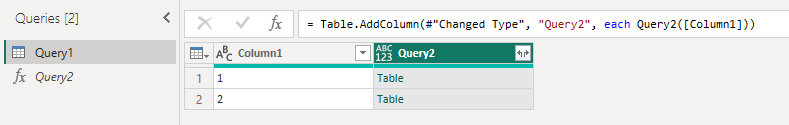

<div style={{textAlign: 'center'}}>


</div>

## Introduction

Integrating the Conviso Platform and PowerBI offers a powerful solution for optimizing your time and enhancing your data analysis capabilities.

With this integration, you can quickly generate customized reports and extract data for consumption on BI platforms, enabling you to make informed decisions based on real-time information.

## Usage

Follow these steps to integrate Conviso Platform with Power BI Desktop:

**Step 1 -** In the main **Home**, access the **Get data (1)** icon and then select the **Blank query (2)** option:

<div style={{textAlign: 'center'}}>



</div>

**Step 2 -** On the sidebar to your left, you will see the created query:

<div style={{textAlign: 'center'}}>



</div>

**Step 3 -** Right click on **Query1 (3)** and  select **Advanced editor (4)**:

<div style={{textAlign: 'center'}}>



</div>

**Step 4 -** Retrieve the pagination metadata.  Using the query for the data you want to retrieve, with the same filters, recover only the totalPages field from the metadata:

```
let
    Source = Web.Contents(
        "https://app.convisoappsec.com/graphql",
        [
            Headers=[
                #"Method"="POST",
                #"Content-Type"="application/json",
                #"x-api-key"="<YOUR_CONVISO_API_KEY>"
            ],
            Content=Text.ToBinary("{""query"": "" { assets( companyId: "<YOUR_CONVISO_COMPANY_ID>", page: 1, limit: 10, search: {} ) { metadata { totalPages } } } ""}")
        ]
    ),
    JSONContent = Json.Document(Source),
    #"Converted to Table" = Record.ToTable(JSONContent),
    #"Expanded Value" = Table.ExpandRecordColumn(#"Converted to Table", "Value", {"assets"}, {"Value.assets"}),
    #"Expanded Value.assets" = Table.ExpandRecordColumn(#"Expanded Value", "Value.assets", {"metadata"}, {"Value.assets.metadata"}),
    #"Expanded Value.assets.metadata" = Table.ExpandRecordColumn(#"Expanded Value.assets", "Value.assets.metadata", {"totalPages"}, {"Value.assets.metadata.totalPages"}),
    #"Removed Columns" = Table.RemoveColumns(#"Expanded Value.assets.metadata",{"Name"}),
    #"Renamed Columns" = Table.RenameColumns(#"Removed Columns",{{"Value.assets.metadata.totalPages", "totalPages"}}),
    totalPages = #"Renamed Columns"{0}[totalPages],
    pageList = List.Numbers(1, totalPages),
    #"Converted to Table2" = Table.FromList(pageList, Splitter.SplitByNothing(), null, null, ExtraValues.Error),
    #"Changed Type" = Table.TransformColumnTypes(#"Converted to Table2",{{"Column1", type text}})
in
    #"Changed Type"
```

The response will be a list ordered from 1 to the total number of pages you've obtained:

Please make sure to replace the following details with your own:

**CONVISO_API_KEY:** Generate your ```x-api-key``` by following the instructions provided [here](/docs/platform/security-feed.md#generate-api-key).

<!--**COMPANY_ID:** Obtain your company id by navigating to the "Companies" section under "Settings" in the Conviso Platform.-->

**YOUR QUERY:** Configure the desired query in the ```Content``` line. You can find a detailed description of all available queries at this [link](/docs/api/api-overview.md).

Once you have pasted the code, the data will be loaded within seconds.

**Step 5 -** Add a New Blank Query Source. Click **New Source (5)** and then **Blank Query (6)**:

<div style={{textAlign: 'center'}}>



</div>

**Step 6 -**  Right click on **Query2 (7)** and select **Advanced editor (8)**:

<div style={{textAlign: 'center'}}>



</div>

**Step 7 -** In the Advanced editor, paste the following code for a query and click **Done**:

```
(Pag as text) => let
    Source = Web.Contents(
        "https://app.convisoappsec.com/graphql",
        [
            Headers=[
                #"Method"="POST",
                #"Content-Type"="application/json",
                #"x-api-key"="<YOUR_CONVISO_API_KEY>"
            ],
            Content=Text.ToBinary("{""query"": "" { assets(companyId: "<YOUR_COMPANY_ID>", page: " & Pag & ", limit: 10, search: {}) { collection { id name businessImpact riskScore { current { value } } } } } ""}")
        ]
    ),
    JSONContent = Json.Document(Source),
    #"Converted to Table" = Record.ToTable(JSONContent)
in
    #"Converted to Table"
```

**Step 8 -** Go back to the **Query1** and click on the **Calendar icon (9)** and **Invoke Custom Function (10)**:

<div style={{textAlign: 'center'}}>



</div>

**Step 9 -** Select **Query2**:

<div style={{textAlign: 'center'}}>



</div>

**Step 10 -** Select **Column Name**:

<div style={{textAlign: 'center'}}>



</div>

**Step 11 -** Select **Column 1 (11)** and click **OK (12)**:

<div style={{textAlign: 'center'}}>



</div>

<div style={{textAlign: 'center'}}>



</div>

**Step 12 -** Follow the steps shown in the gif below to visualize your information::

<div style={{textAlign: 'center'}}>


</div>

## Support

If you have any questions or need help using our product, please don't hesitate to contact our support team.
