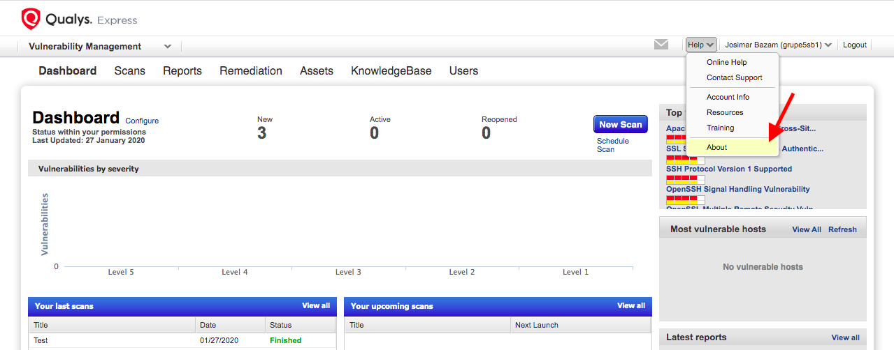
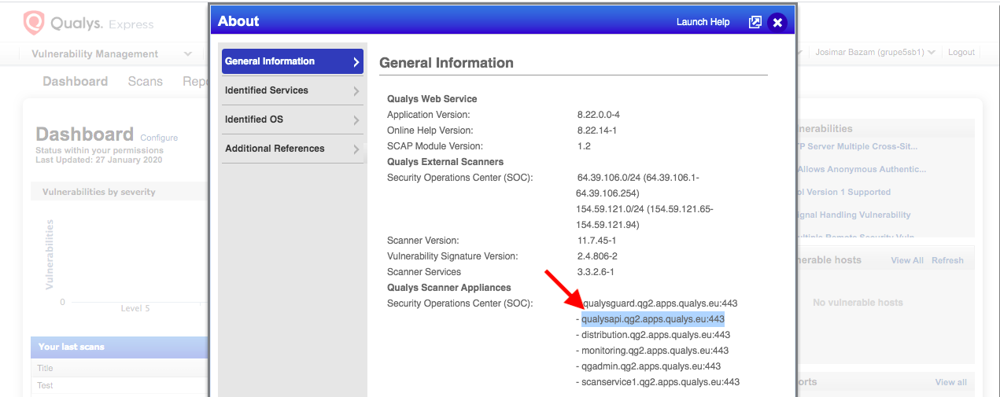
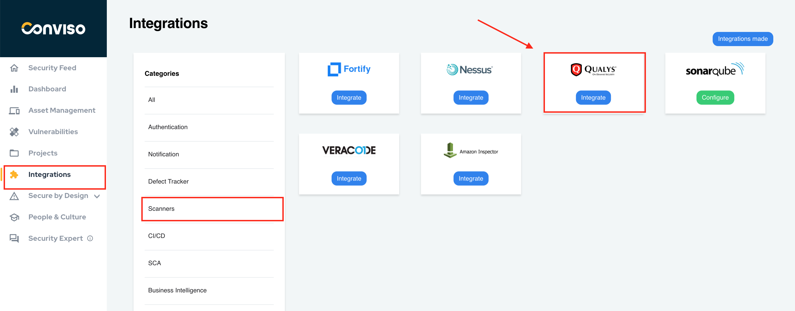
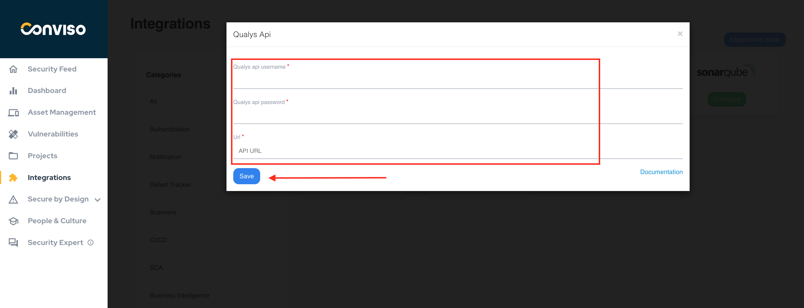
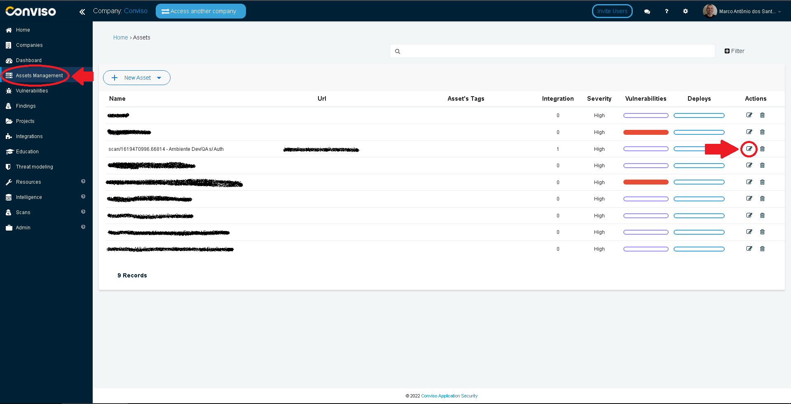
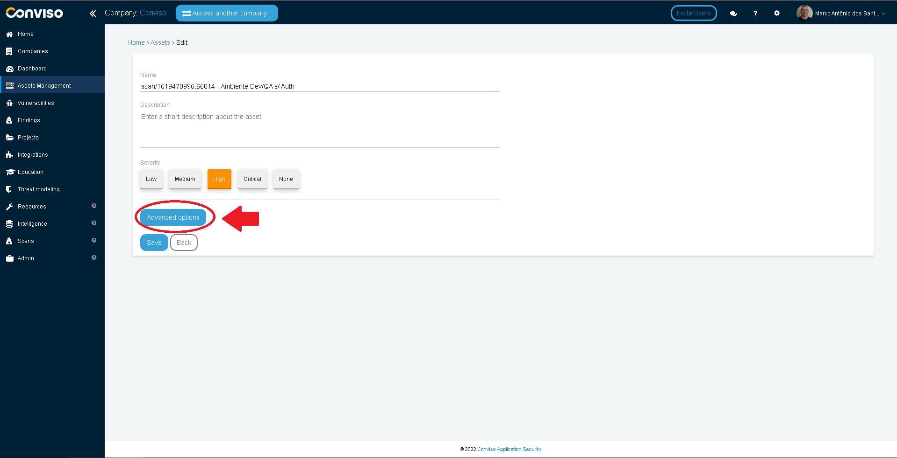
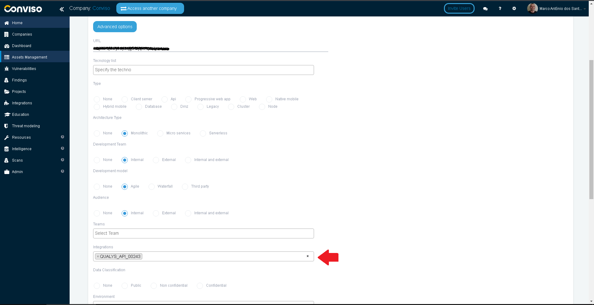
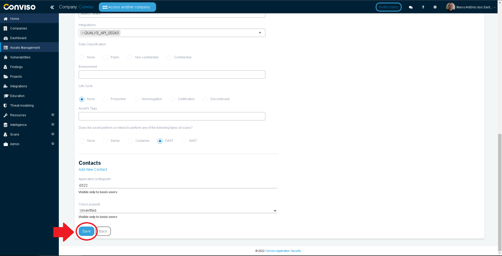
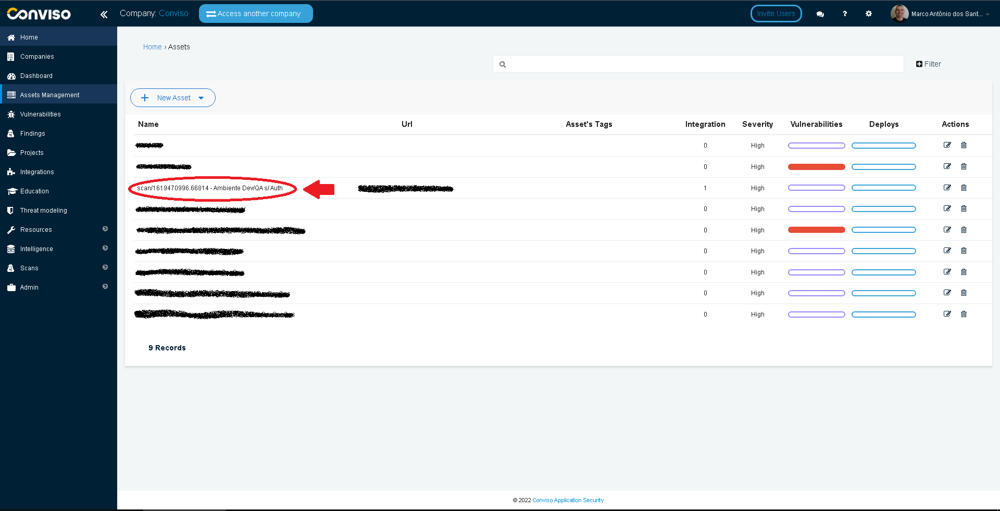
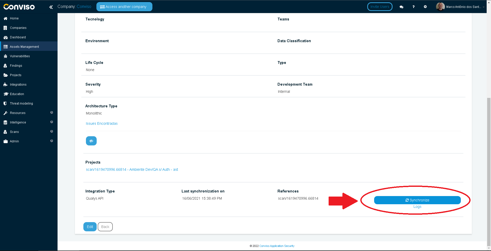

<div style={{textAlign: 'center'}}>


</div>

:::note
First time using Qualys? Please refer to the [following documentation](https://www.qualys.com/documentation/)
:::

## Introduction

Consolidate vulnerabilities: From a single console, you can consolidate and apply analysis of vulnerabilities identified by scan, develop action plans for the treatment of vulnerabilities.

The integration allows the import of issues (vulnerabilities) found in Qualys to Conviso Platform, allowing the user to take advantage of Conviso Platform full potential for vulnerability management.

## Requirements

For configuring Qualys and Conviso Platform integration, you will need:

- Qualys Username;

- Qualys Password;

- Qualys API URL.

## Retrieving Qualys API URL

Login to your Qualys instance with your Qualys **Username** and **Password**;

At the top bar menu, click on **Help**, then click on **About**, at the drop-down list:

<div style={{textAlign: 'center'}}>



</div>

On the **About** window opened, select and copy the **Qualys API URL** (the second one on the list, beggining with ```qualysapi```): 

<div style={{textAlign: 'center'}}>



</div>

## Conviso Platform Setup

Log in to the [Conviso Platform](https://app.convisoappsec.com);

On the main menu to the left, click on **Integrations**. At the panel to the right, click on the **Scanners** option, then click on the **Integrate** button on the **Qualys** card:

<div style={{textAlign: 'center'}}>



</div>

Fill the **Qualys API Username**, **Qualys API Password** and **URL** with the data retrieved from the preceeding section on this document. When done filling all the required fields, click on the **Save** button to store your Qualys integration configuration settings:

<div style={{textAlign: 'center'}}>



</div>

## Connecting Conviso Platform Assets to Qualys

On the main menu to the left, click on **Assets Management**. Then, on the asset you want to integrate with Qualys, select the **Edit** icon to its right: 

<div style={{textAlign: 'center'}}>



</div>

Click on the **Advanced Options** button to expand the asset's properties:

<div style={{textAlign: 'center'}}>



</div>

On the **Integrations** section of the asset's properties, type ```QUALYS``` to narrow your search and then select the Qualys integration you just created in the preceeding section:

<div style={{textAlign: 'center'}}>



</div>

After selecting the Qualys Integration for your asset, scroll down to the end of the form and click on the **Save** button, to store your new configuration settings for the asset:

<div style={{textAlign: 'center'}}>



</div>

## Importing Qualys Issues

On the **Assets Management**, click on the asset you want to import issues from Qualys:

<div style={{textAlign: 'center'}}>



</div>

Scroll down to the end of the form, then click on the **Synchronize** button to start importing the Qualys issues for the asset:

<div style={{textAlign: 'center'}}>



</div>

The imported issues will be found on the **Findings** Menu.