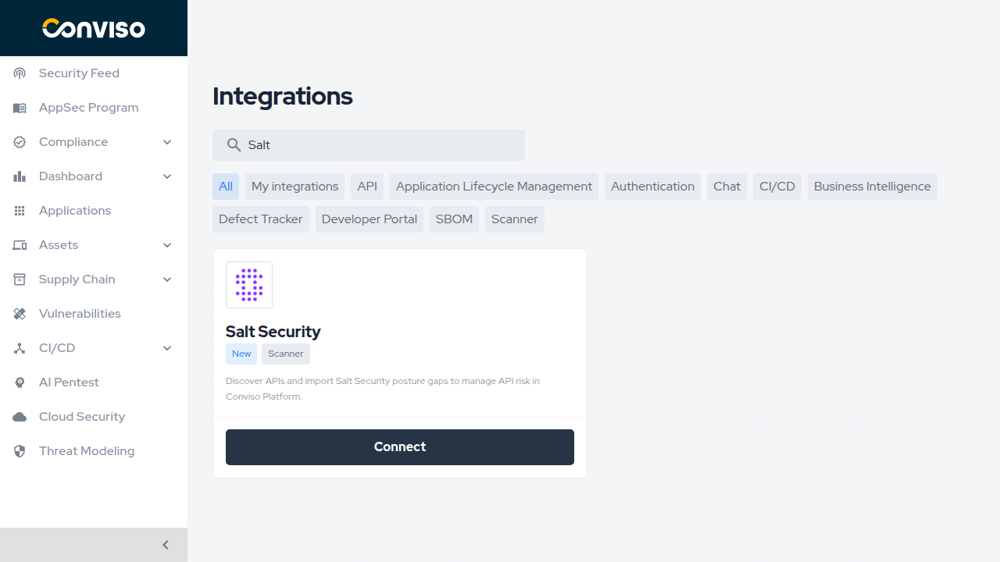
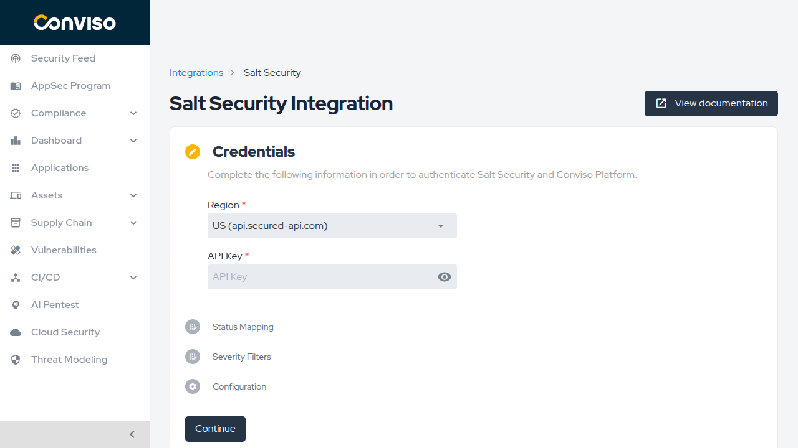
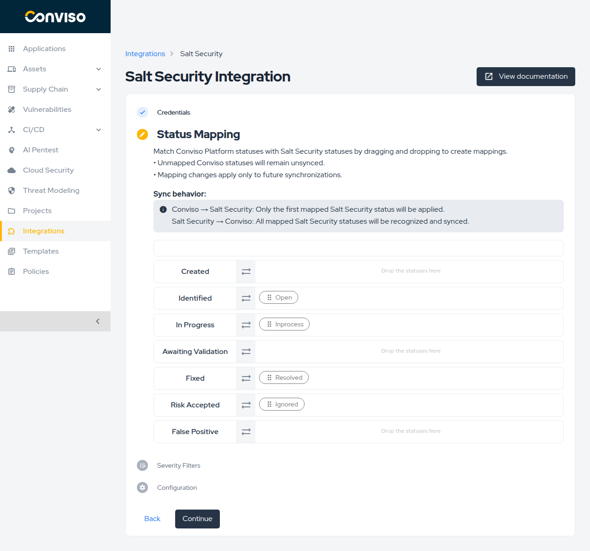
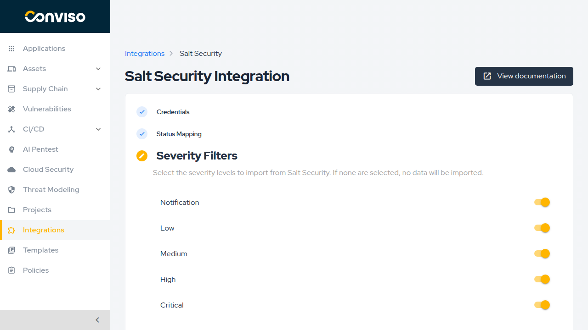
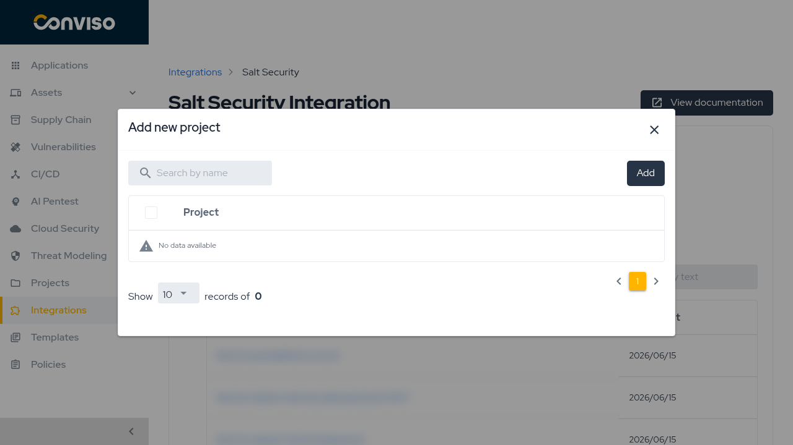
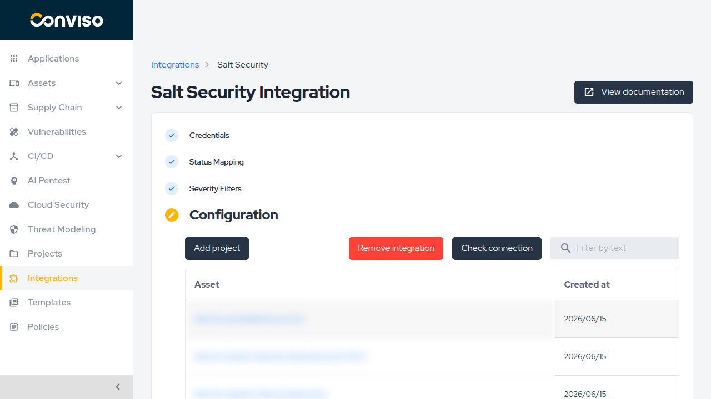
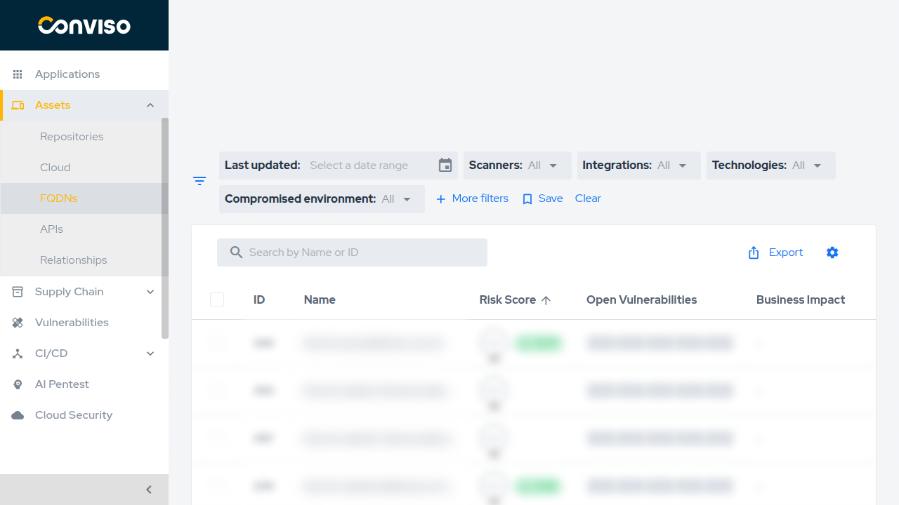
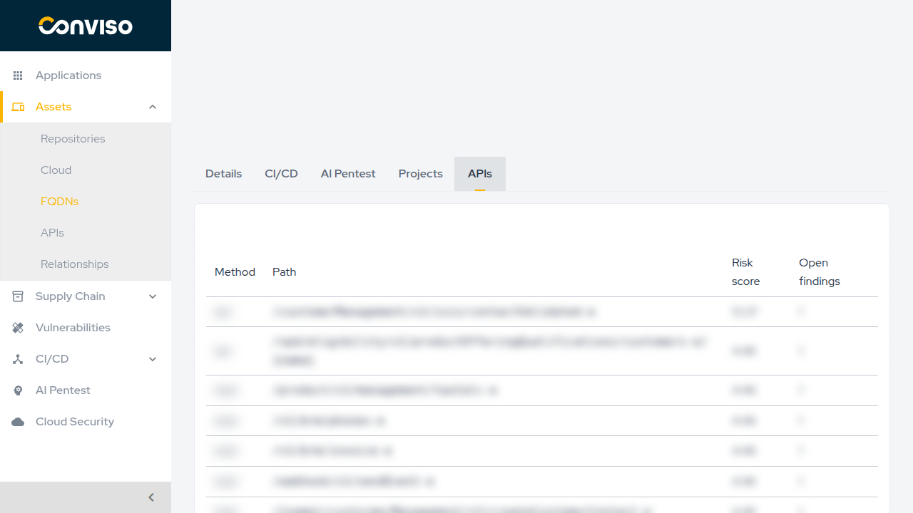
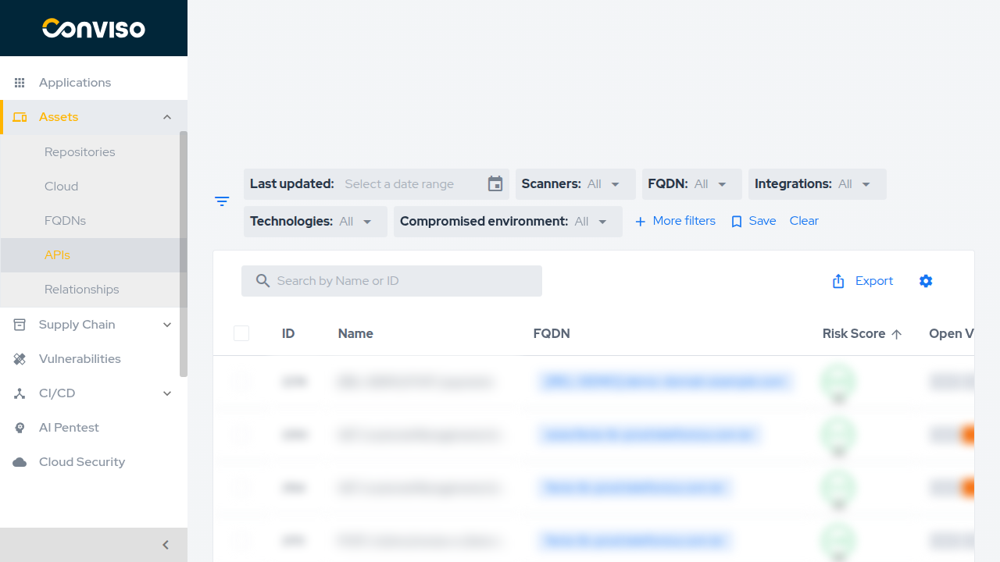
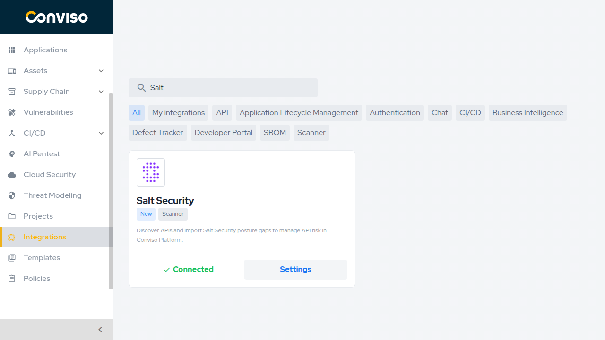

## Introduction

The Salt Security integration connects your Salt Security tenant to Conviso Platform in a **bidirectional** sync:

- **Inbound (Salt → Conviso):** Salt discovers your APIs and detects posture gaps (API vulnerabilities). Conviso imports discovered APIs as assets and posture gaps as issues, keeping them up to date via webhooks and manual sync.
- **Outbound (Conviso → Salt):** When you update an issue status in Conviso (e.g., mark as Fixed or Risk Accepted), that change is written back to the corresponding posture gap in Salt Security automatically.

### Asset model

Salt Security surfaces two levels of assets in Conviso Platform:

| Asset type | Conviso section | Description |
|---|---|---|
| **FQDN** (Domain) | Assets → FQDNs | One per Salt-discovered host. Acts as the sync anchor. |
| **API** (Endpoint) | Assets → APIs | One per endpoint (method + path) under a domain. Issues (posture gaps) attach here. |

Each FQDN asset has an **APIs** tab that lists all its child API endpoint assets. API assets link back to their parent domain via a breadcrumb.

## Prerequisites

- An active Salt Security account with at least one configured environment.
- A Salt Security **API key** (Dashboard → Settings → Access → API Keys). The key must have `perm-viewer` scope for read operations and `perm-executor` for write-back.
- Your Salt tenant **region**: US (`api.secured-api.com`) or EU (`api.secured-api-eu.com`).
- A Conviso Platform account with permission to manage integrations.

## Setup

### 1. Find Salt Security in Integrations

In the left sidebar, click **Integrations**. Search for **Salt Security** and click **Connect** on the card.

<div style={{textAlign: 'center'}}>



</div>

### 2. Enter credentials

On the **Credentials** step:

1. Select your **Region** — US (`api.secured-api.com`) or EU (`api.secured-api-eu.com`).
2. Paste your Salt Security **API Key**.
3. Click **Continue**. Conviso validates the key before proceeding.

<div style={{textAlign: 'center'}}>



</div>

### 3. Configure Status Mapping

On the **Status Mapping** step, drag Salt Security statuses onto Conviso Platform status rows to define how statuses are translated between the two systems.

**Sync behavior:**
- **Conviso → Salt Security:** Only the *first* mapped Salt Security status in a row is applied on write-back.
- **Salt Security → Conviso:** All mapped Salt Security statuses in a row are recognized on inbound sync.

Unmapped Conviso statuses are not synced. Changes apply only to future synchronizations.

The default mapping is:

| Conviso status | Salt Security status |
|---|---|
| Identified | Open |
| In Progress | Inprocess |
| Fixed | Resolved |
| Risk Accepted | Ignored |

Click **Continue** when done.

<div style={{textAlign: 'center'}}>



</div>

### 4. Select Severity Filters

On the **Severity Filters** step, enable the severity levels you want to import from Salt Security. All levels are enabled by default: **Notification** (maps from Salt's *Info*), **Low**, **Medium**, **High**, and **Critical**.

> If no severity level is selected, no findings will be imported.

Click **Continue**.

<div style={{textAlign: 'center'}}>



</div>

### 5. Associate domains (Configuration step)

On the **Configuration** step, click **Add project** to open the domain picker. The picker lists all hosts discovered in your Salt Security environment. Select the domains you want to track in Conviso and click **Add**.

<div style={{textAlign: 'center'}}>



</div>

For each associated domain, Conviso:
- Creates an **FQDN** asset with `asset_type = domain`.
- Eagerly imports all endpoint assets under that domain as **API** assets (`asset_type = api`).
- Links the domain to any Salt Security **labels** as Conviso Applications and asset tags.

After adding domains, the first sync runs automatically. Depending on the number of endpoints and posture gaps, this may take a few minutes.

<div style={{textAlign: 'center'}}>



</div>

## Viewing assets

### FQDNs

Go to **Assets → FQDNs** to see all Salt Security-discovered domain assets. Each row shows the domain name, risk score, open vulnerabilities count, and business impact.

<div style={{textAlign: 'center'}}>



</div>

Click a domain to open its detail page. The **APIs** tab lists all child API endpoint assets under that domain, along with their method, path, risk score, and open findings count.

<div style={{textAlign: 'center'}}>



</div>

### APIs

Go to **Assets → APIs** to see all imported API endpoint assets across all associated domains. Each row shows the endpoint name, its parent FQDN, risk score, and open vulnerabilities. Use the **FQDN** filter to scope the list to a specific domain.

<div style={{textAlign: 'center'}}>



</div>

## Managing an existing integration

To update credentials, status mappings, severity filters, or add/remove domains, go to **Integrations**, search for **Salt Security**, and click **Settings** on the card.

<div style={{textAlign: 'center'}}>



</div>

The **Configuration** step shows all currently associated domains with their creation dates. From here you can:
- **Add project** — associate additional Salt Security domains.
- **Remove integration** — disconnect Salt Security entirely.
- **Check connection** — verify the API key is still valid.

## Real-time sync (Webhook)

Conviso provides a webhook endpoint that Salt Security can call whenever a posture gap changes. When a webhook fires, Conviso re-syncs only the affected domain rather than re-pulling all data.

Configure the webhook in your Salt Security dashboard under **Settings → Integrations → Custom Webhook** using the following template:

```json
{
  "company_id":    "<your Conviso company ID>",
  "webhook_token": "<your integration webhook token>",
  "reference":     "{{host}}",
  "event":         "{{eventType}}"
}
```

**Webhook URL:**
```
https://<your-conviso-host>/api/v3/integrations/scanners/salt_security/webhook
```

Find your `company_id` and `webhook_token` on the Salt Security integration settings page in Conviso Platform.

> **Note:** If the webhook template is misconfigured, real-time sync stops silently. Use **Sync integration** in the integration settings as a manual recovery path.

## Bidirectional status sync

Status changes flow in both directions automatically:

| Direction | Trigger | What happens |
|---|---|---|
| Salt → Conviso | Webhook or manual sync | Posture gap status mapped to Conviso issue status via Status Mapping table. |
| Conviso → Salt | Issue status change in Conviso | First mapped Salt status for that Conviso status is written back to Salt via `POST /v1/apigovern/posture/gaps`. |

## Troubleshooting

- **Invalid credentials:** Verify the API key was copied correctly and that the Salt region matches your tenant (US vs EU).
- **No domains listed in picker:** The API key may lack `perm-viewer` scope, or no hosts have been discovered yet in your Salt environment.
- **Zero findings after sync:** Salt's host filter may not match the stored domain reference. Use **Sync integration** to trigger a full re-pull. Check that severity filters include the relevant levels.
- **Domains in sync but findings missing:** Confirm the Salt API key has access to posture gaps in the selected environment.
- **Webhook not triggering re-sync:** Verify the template in Salt's dashboard matches the contract above (especially the `reference` and `webhook_token` fields).

## Support

If you have any questions or need help with our product, please contact our support team according to your SLA.

[](https://cta-service-cms2.hubspot.com/web-interactives/public/v1/track/redirect?encryptedPayload=AVxigLKtcWzoFbzpyImNNQsXC9S54LjJuklwM39zNd7hvSoR%2FVTX%2FXjNdqdcIIDaZwGiNwYii5hXwRR06puch8xINMyL3EXxTMuSG8Le9if9juV3u%2F%2BX%2FCKsCZN1tLpW39gGnNpiLedq%2BrrfmYxgh8G%2BTcRBEWaKasQ%3D&webInteractiveContentId=125788977029&portalId=5613826)
