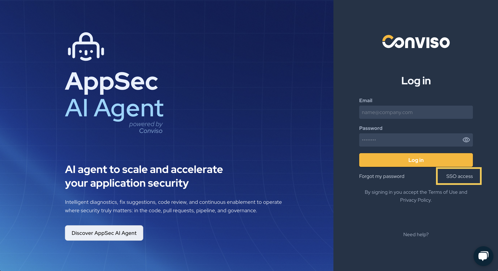
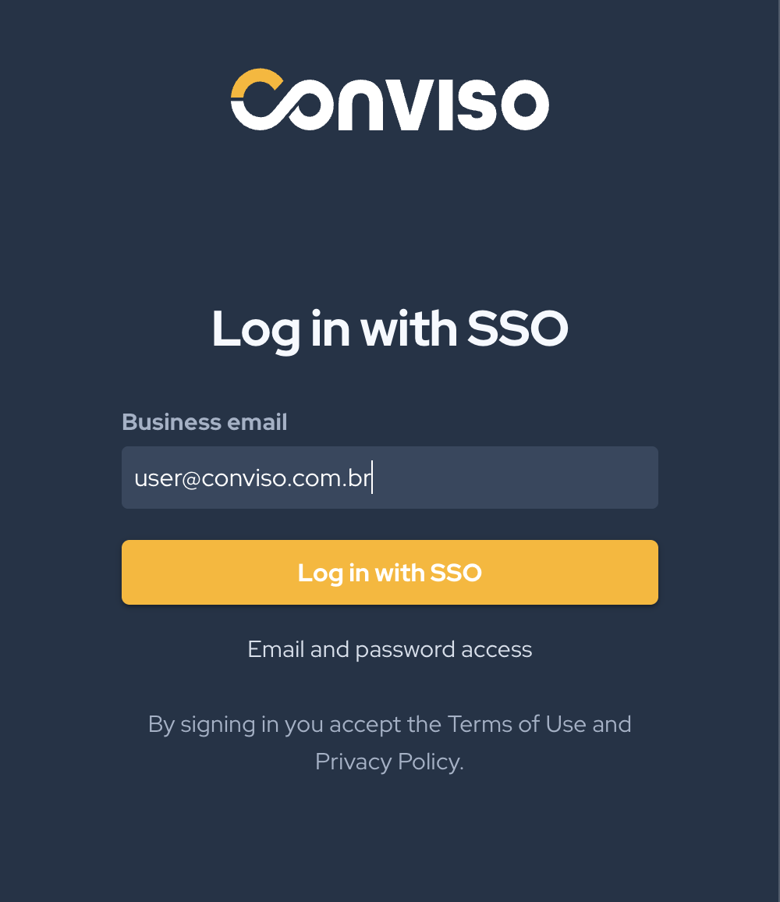

<div style={{textAlign: 'center'}}>


</div>

This document was written to assist you when configuring any SSO Authentication Provider to use the SAML 2.0 Protocol.

In order to retrieve the required information to configure SAML 2.0 integration at Conviso Platform, you will need:

- **SSO URL**;

- **Entity ID**;

- **Certificate**;

- **Authorized Domains and aliases**.

As these data are retrieved from different locations depending on the SSO implementation being used, a solid knowledge of the SSO platform and the necessary administrative privileges are required too.

## Oracle Authentication Manager

If you want to integrate Conviso Platform to your Oracle Authentication Manager, you can use [this video](https://www.youtube.com/watch?v=7ybg7pQyIS0) from Official Oracle YouTube Channel to help you on configuring your OAM Platform and finding the required Conviso Platform data to create this SSO integration.

## Required URLs to configure your SSO Provider

As there are different SSO provider implementations, below are the required Conviso URLs to configure your SSO Provider Application, labeled as the common known SSO implementations (your SSO Provider may use distinct label for it):

Use this URL for the **ACS URL** (on Google) or **Reply URL (Assertion Consumer Service URL)** (on Azure Active Directory): 
```https://auth.app.convisoappsec.com/realms/conviso-platform/broker/saml_{YOUR_COMPANY_ID}/endpoint```

Use this URL for the **Entity ID** (on Google or Azure Active Directory), **Data Source** (on ADFS):
```https://auth.app.convisoappsec.com/realms/conviso-platform```

Use this URL for the **Start URL** (on Google):
```https://app.convisoappsec.com```

:::note
Replace `{YOUR_COMPANY_ID}` in the Reply URL with your actual company identifier.
:::

## Conviso Platform SAML 2.0 SSO integration

Log in to Conviso Platform. At the left-side menu, click at **Integrations**. Then, at the left panel shown, choose **Identity Management**. Choose the **SAML** card and click on the **Connect** button, as shown below:

<div style={{textAlign: 'center'}}>


</div>

After retrieving the necessary data from your SSO platform, paste them to their correspondent fields at Conviso Platform. Remember to specify all of your configured Authentication Domains and their aliases at the **Authorized Domains** field. After pasting the retrieved data and configuring your authorized domains, click at the **Save** button, in order to finish and store the SAML SSO configuration:

<div style={{textAlign: 'center'}}>


</div>

## Test application

Before testing the SSO integration, ensure you are logged out of the Conviso Platform.

Follow these steps to test the integration:

<div style={{textAlign: 'center'}}>


</div>

1. Click this link: https://app.convisoappsec.com/spa/auth/login

2. You You will be redirected to the new Conviso login page. Click **SSO access**.

<div style={{textAlign: 'center'}}>



</div>

3. Enter your provider email and click **Log in**.

<div style={{textAlign: 'center'}}>



</div>

The test will verify that the SSO configuration is working correctly between SAML and the Conviso Platform.

### Email Field Mapping in SAML 2.0

When configuring the SSO integration via SAML, it is important to ensure that the **email field** is used correctly as the mapping parameter. The email configured in your SSO identity provider must match the **email of the logged-in user on the Conviso Platform** to ensure proper authentication.

### How this works:

During the SSO authentication process, the **email** is used as the primary identifier to map the user's identity in the Conviso Platform. This means the email value provided by the SSO identity provider in the **SAML Assertion** must match exactly with the user's email in Conviso. If not, login might fail.

Therefore, when configuring the identity provider (such as Oracle Authentication Manager or others), make sure the `email` field is mapped correctly and matches the email associated with the user's account in the Conviso Platform.

[](https://cta-service-cms2.hubspot.com/web-interactives/public/v1/track/redirect?encryptedPayload=AVxigLKtcWzoFbzpyImNNQsXC9S54LjJuklwM39zNd7hvSoR%2FVTX%2FXjNdqdcIIDaZwGiNwYii5hXwRR06puch8xINMyL3EXxTMuSG8Le9if9juV3u%2F%2BX%2FCKsCZN1tLpW39gGnNpiLedq%2BrrfmYxgh8G%2BTcRBEWaKasQ%3D&webInteractiveContentId=125788977029&portalId=5613826)