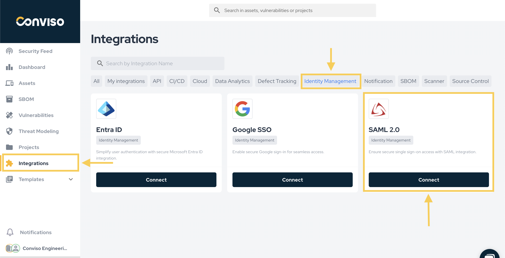
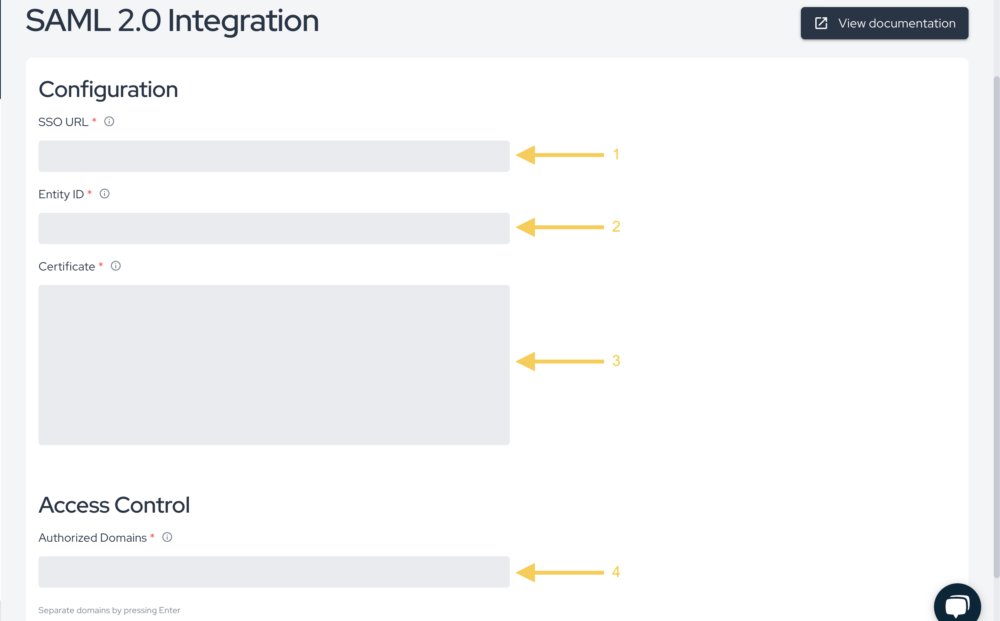

<div style={{textAlign: 'center'}}>


</div>

This document was written to assist you when configuring any SSO Authentication Provider to use the SAML 2.0 Protocol.

In order to retrieve the required information to configure SAML 2.0 integration at Conviso Platform, you will need:

- **SSO URL**;

- **Entity ID**;

- **Certificate**;

- **Authorized Domains and aliases**.

As these data are retrieved from different locations depending on the SSO implementation being used, a solid knowledge of the SSO platform and the necessary administrative privileges are required too.

## Oracle Authentication Manager

If you want to integrate Conviso Platform to your Oracle Authentication Manager, you can use [this video](https://www.youtube.com/watch?v=7ybg7pQyIS0) from Official Oracle Youtube Channel to help you on configuring your OAM Platform and finding the required Conviso Platform data to create this SSO integration.

## Required URLs to configure your SSO Provider

As there are different SSO provider implementations, below are the required Conviso URLs to configure your SSO Provider Aplication, labeled as the commom known SSO implementations (your SSO Provider may use distinct label for it):

Use this URL for the **ACS URL** (on Google) or **Reply URL (Assertion Consumer Service URL)** (on Azure Active Directory): 
```https://app.convisoappsec.com/portal_users/saml/auth```

Use this URL for the **Entity ID** (on Google or Azure Active Directory), **Data Source** (on ADFS):
```https://app.convisoappsec.com/portal_users/saml/metadata```

Use this URL for the **Start URL** (on Google):
```https://app.convisoappsec.com```

## Conviso Platform SAML 2.0 SSO integration

Log in to Conviso Platform. At the left-side menu, click at **Integrations**. Then, at the left panel shown, choose **Authentication**. Choose the **SAML** card and click on the **Integrate** button, as shown below:

<div style={{textAlign: 'center'}}>



</div>

After retrieving the necessary data from your SSO platform, paste the to their correspondent fields at Conviso Platform. Remember to specify all of your configured Authentication Domains and their aliases at the **Authorized Domains** field. After pasting the retrieved data and configuring your authorized domains, click at the **Save** button, in order to finish and store the SAML SSO configuration:

<div style={{textAlign: 'center'}}>



</div>
