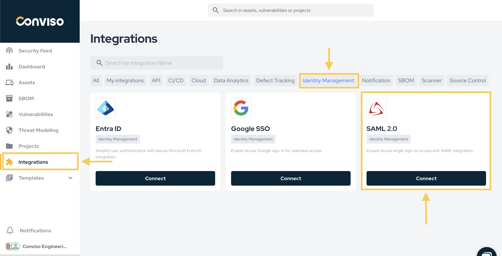
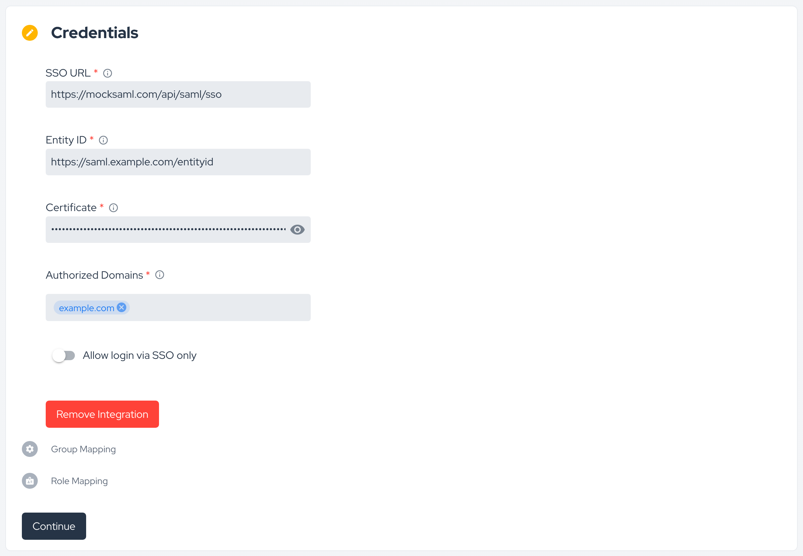
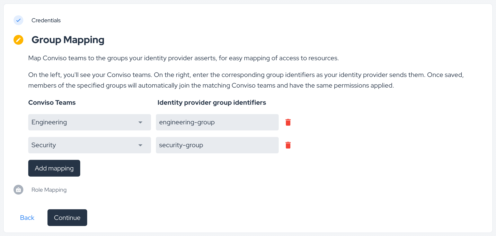
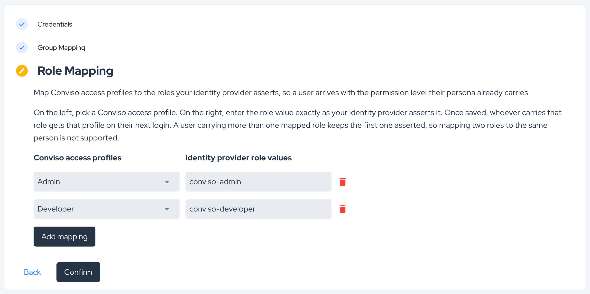
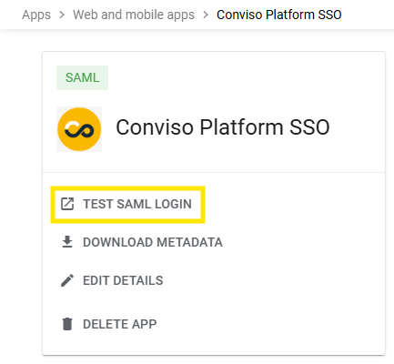

<div style={{textAlign: 'center'}}>


</div>

This document was written to assist you when configuring any SSO Authentication Provider to use the SAML 2.0 Protocol.

In order to retrieve the required information to configure SAML 2.0 integration at Conviso Platform, you will need:

- **SSO URL**;

- **Entity ID**;

- **Certificate**;

- **Authorized Domains and aliases**.

As these data are retrieved from different locations depending on the SSO implementation being used, a solid knowledge of the SSO platform and the necessary administrative privileges are required too.

## Oracle Authentication Manager

If you want to integrate Conviso Platform to your Oracle Authentication Manager, you can use [this video](https://www.youtube.com/watch?v=7ybg7pQyIS0) from Official Oracle YouTube Channel to help you on configuring your OAM Platform and finding the required Conviso Platform data to create this SSO integration.

## Required URLs to configure your SSO Provider

As there are different SSO provider implementations, below are the required Conviso URLs to configure your SSO Provider Application, labeled as the common known SSO implementations (your SSO Provider may use distinct label for it):

Use this URL for the **ACS URL** (on Google) or **Reply URL (Assertion Consumer Service URL)** (on Azure Active Directory): 
```https://auth.app.convisoappsec.com/realms/conviso-platform/broker/saml_{YOUR_COMPANY_ID}/endpoint```

Use this URL for the **Entity ID** (on Google or Azure Active Directory), **Data Source** (on ADFS):
```https://auth.app.convisoappsec.com/realms/conviso-platform```

Use this URL for the **Start URL** (on Google):
```https://app.convisoappsec.com```

:::note
Replace `{YOUR_COMPANY_ID}` in the Reply URL with your actual company identifier.
:::

## Conviso Platform SAML 2.0 SSO integration

Log in to Conviso Platform. At the left-side menu, click at **Integrations**. Then, at the left panel shown, choose **Authentication**. Choose the **SAML 2.0** card and click on the **Connect** button, as shown below:

<div style={{textAlign: 'center'}}>



</div>

After retrieving the necessary data from your SSO platform, paste them to their correspondent fields at Conviso Platform. Remember to specify all of your configured Authentication Domains and their aliases at the **Authorized Domains** field. After pasting the retrieved data and configuring your authorized domains, click at the **Continue** button, in order to finish and store the SAML SSO configuration:

<div style={{textAlign: 'center'}}>



</div>

## Setup Group Mapping Integration

Group mapping puts a user in a Conviso **Team** based on the groups your identity provider asserts. Once a mapping exists, every SSO login applies it: the user joins the mapped Teams, and loses the mapped Teams their groups no longer include.

### What your identity provider has to send

The Conviso Platform reads a SAML attribute named exactly **`groups`**, with no namespace. Each value is a group identifier — whatever string your provider uses to name a group, as long as it is stable.

How you configure that depends entirely on your provider; what does not change is the contract:

| | |
| --- | --- |
| Attribute name | `groups` |
| Namespace | none |
| Value | one group identifier per value, multivalued |

:::caution
An attribute under any other name is not read, and the mapping fails silently: it saves, no error appears, and the user simply never joins the Team. Providers that prefix attributes with a namespace by default — Microsoft Entra ID sends `http://schemas.microsoft.com/ws/2008/06/identity/claims/groups`, for instance — have to be told to send the bare name.
:::

### On the Conviso Platform side

1. [Create a Team](../platform/user-management.md) in the Conviso Platform, specifying the desired Profile and Access Type for the group's users.

2. Retrieve the group identifier as your provider sends it.

3. In the SAML 2.0 integration page, open the **Group Mapping** step, select the Team you created and associate it with that identifier. Use **Add mapping** to declare more than one.

<div style={{textAlign: 'center'}}>



</div>

4. Click **Continue**.

## Setup Role Mapping Integration

Group mapping decides which **Team** a user joins. Role mapping decides which **access profile** the user gets — what they are allowed to do once inside the company. The two are independent: you can use either, or both.

### What your identity provider has to send

| | |
| --- | --- |
| Attribute name | `roles` |
| Namespace | none |
| Value | the role value, matched against what you type in the Conviso Platform |

The comparison ignores case and surrounding spaces. Everything else has to match character for character.

### On the Conviso Platform side

1. Open the **Role Mapping** step of the integration.

2. For each role, type the value exactly as your provider asserts it and select the access profile it should grant. Use **Add mapping** to declare more than one.

<div style={{textAlign: 'center'}}>



</div>

3. Click **Confirm**.

### What happens on each login

Declaring the first mapping is what hands the access profiles of that company over to your identity provider. From then on, every SSO login re-evaluates the user's profile:

- **A role that matches a mapping** — the user gets the mapped access profile, replacing whatever profile they had.
- **No role, or only roles that match nothing** — the user is set to the global **viewer-only** profile. Profiles granted manually in the Conviso Platform do not survive the next login, so an operator who needs to override a profile has to change it in the identity provider.
- **More than one matching role** — one of them is applied, and there is no guarantee of which: the order of a multivalued attribute is not defined, so it may differ between logins. Assign a single mapped role per user.

While a company has **no** mapping declared, nothing changes: access profiles keep being managed entirely in the Conviso Platform.

:::note
An access profile says what a user is allowed to do; it is not what gives them access to the company's data. That comes from an invite or from a Team the user joined through group mapping. A user mapped only by role logs in with the mapped profile and still sees nothing until they have access.
:::

## Test application

Before testing the SSO integration, ensure you are logged out of the Conviso Platform.

Follow these steps to test the integration:

<div style={{textAlign: 'center'}}>



</div>

1. Click this link: https://app.convisoappsec.com/spa/auth/login

2. You You will be redirected to the new Conviso login page. Click **SSO access**.

<div style={{textAlign: 'center'}}>


</div>

3. Enter your provider email and click **Log in**.

<div style={{textAlign: 'center'}}>


</div>

The test will verify that the SSO configuration is working correctly between SAML and the Conviso Platform.

### Email Field Mapping in SAML 2.0

When configuring the SSO integration via SAML, it is important to ensure that the **email field** is used correctly as the mapping parameter. The email configured in your SSO identity provider must match the **email of the logged-in user on the Conviso Platform** to ensure proper authentication.

### How this works:

During the SSO authentication process, the **email** is used as the primary identifier to map the user's identity in the Conviso Platform. This means the email value provided by the SSO identity provider in the **SAML Assertion** must match exactly with the user's email in Conviso. If not, login might fail.

Therefore, when configuring the identity provider (such as Oracle Authentication Manager or others), make sure the `email` field is mapped correctly and matches the email associated with the user's account in the Conviso Platform.

[](https://cta-service-cms2.hubspot.com/web-interactives/public/v1/track/redirect?encryptedPayload=AVxigLKtcWzoFbzpyImNNQsXC9S54LjJuklwM39zNd7hvSoR%2FVTX%2FXjNdqdcIIDaZwGiNwYii5hXwRR06puch8xINMyL3EXxTMuSG8Le9if9juV3u%2F%2BX%2FCKsCZN1tLpW39gGnNpiLedq%2BrrfmYxgh8G%2BTcRBEWaKasQ%3D&webInteractiveContentId=125788977029&portalId=5613826)