<div style={{textAlign: 'center'}}>


</div>

## Introduction

The integration of Conviso Platform with ServiceNow is done through an **API**, where we connect our product with ServiceNow, which allows the creation of issues, comments, and as well as a webhook for comments made in an issue.

ServiceNow's integration with Conviso Platform will benefit issue control management and vulnerability consolidation. With the integration performed, the customer can orchestrate vulnerability to ServiceNow.

Conviso Platform and ServiceNow have a two-way communication, that is, if a user adds comments in the ServiceNow discussion field, the added message will automatically appear in the Security Champions tab of the vulnerability. This allows a Conviso technician to interact with the development team that is making corrections.

Integration with Service Now must be performed in five steps:

- Get the Service Now instance;

- Create a Rest Message from Service Now;

- Create Script for Sending Comments;

- Configure Conviso Platform Integration;

- Enable Integration.

## Get the ServiceNow instance

After logging in to ServiceNow, click at the option **Manage** on the top menu bar, then select **Instance**. Your **Instance ID** and your **Instance URL** will be shown:

<div style={{textAlign: 'center'}}>

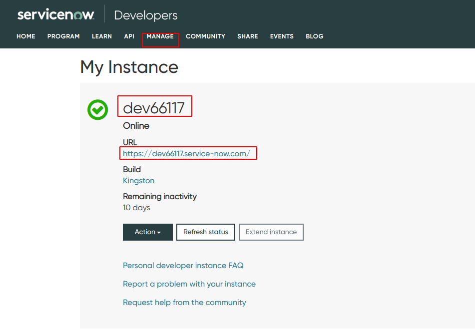

</div>

## Create a ServiceNow REST Message

By clicking on the url, you will be redirected to enter your instance login and password, which is different from the Service Now login and password:

<div style={{textAlign: 'center'}}>


</div>

After providing your instance credentials and clicking at **Login**, you will be redirected to the main page. Click on the **Search** box on the left side menu and fill it in with ```Rest Message```. At the left menu, click at the **REST Message** link and, after the new page is loaded, click on the **New** button:

<div style={{textAlign: 'center'}}>

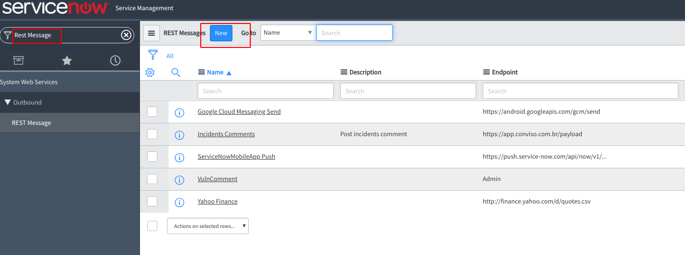

</div>

On the next screen, there are some required form fields that need attention:

- **Name**: Where a label of your choice should be filled in for the Rest Message;

- **EndPoint**: The endpoint of Conviso's API ([https://app.convisoappsec.com/payload)], where the request is sent to;

- **Basic auth profile**: Where login and password will be filled in to authenticate with the API;

- **Authentication type**: Where authentication type must be selected. In our example, it will be **Basic**.

<div style={{textAlign: 'center'}}>

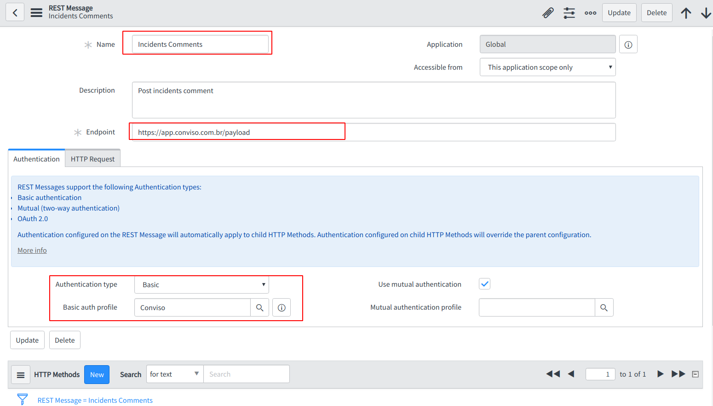

</div>

By clicking on the **Magnifying Glass** next to Basic auth profile, a modal will open, in which you should click on the **New** button:

<div style={{textAlign: 'center'}}>

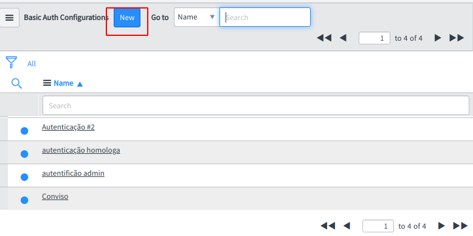

</div>

After the modal is reloaded, you can fill in the form fields.

- **Name**: Name of your choice for this authentication;

- **Username**: Email used to access Conviso Platform;

- **Password**: Password used to access Conviso Platform:

<div style={{textAlign: 'center'}}>

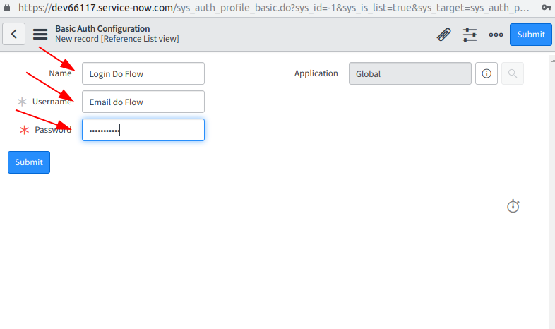

</div>

After filling in the form fields and submitting it, you will be redirected to the **Rest Message** registration screen again. Scrolling the screen, you should click on **New** button in the **HTTP Methods** section:

<div style={{textAlign: 'center'}}>


</div>

On the next screen, fill in the **HTTP method** and **Endpoint** fields as below, and then click on the **HTTP Request** tab:

<div style={{textAlign: 'center'}}>

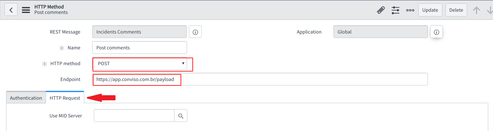

</div>

In the **HTTP Headers** section, fill in as in the image below:

- **Name**: ```Content-Type```, **Value**: ```application/json```;

- **Name**: ```Accept```, **Value**: ```application/json```:

<div style={{textAlign: 'center'}}>

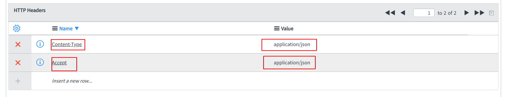

</div>

In the **HTTP Query Parameters** section fill in the variables that will be sent by the request:

- **Name**: ```comments_and_work_notes```, **Value**: ```comments_and_work_notes```;

- **Name**: ```sys_id```, **Value**: ```${sys_id}```:

<div style={{textAlign: 'center'}}>

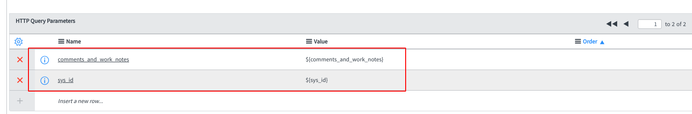

</div>

## Create Script for Sending Comments

Go to the **Search** box on the left side menu and type in **Business Rules**. Click on the link generated below with the same name. On the page that will be shown, click **New**.

<div style={{textAlign: 'center'}}>

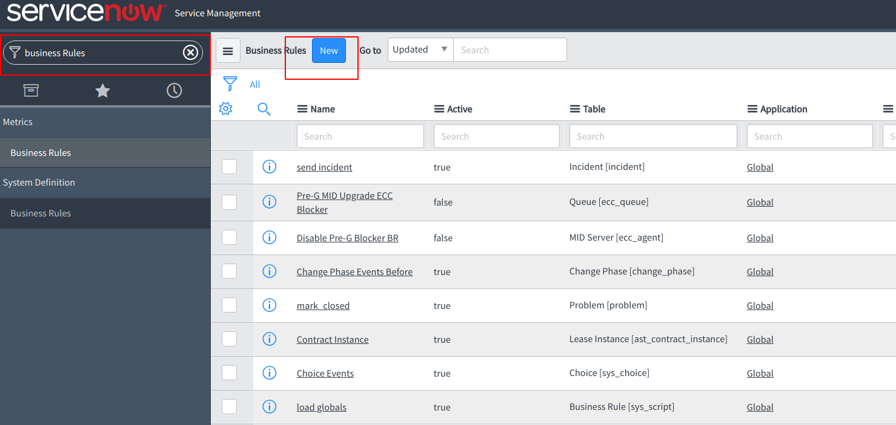

</div>

In the form you were redirected to, fill in some fields:

- **Table**: The table we want to trigger comments in the Incident case;

- Check the boxes **Active** and **Advanced**, to make this functionality active;

On the **When to run** tab, fill in the following fields:

- **When** with ```after```, to indicate that after comments are made, they should be sent to the API;

- Check the boxes **Insert** and **Update**, for the event to be fired when inserting or updating comments;

- **Filter Conditions**, with ```Additional comments```, to inform you that any comments made will be sent.

<div style={{textAlign: 'center'}}>

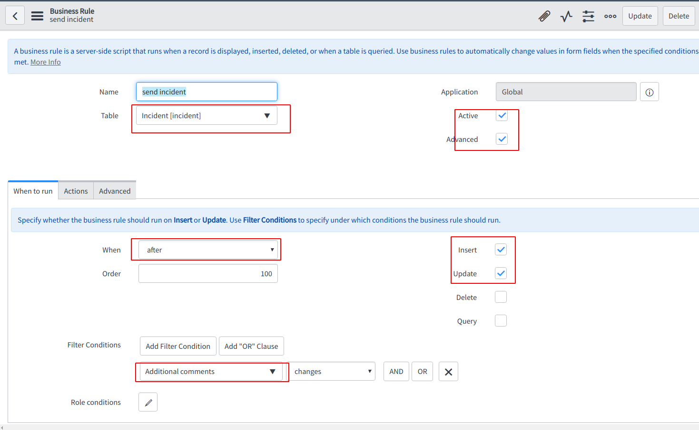

</div>

After filling in and saving the form, click on the **Advanced** tab to be able to paste the script below:

```
try {
    var r = new sn_ws.RESTMessageV2('Incidents Comments', 'Post comments');
    //override authentication profile
    //authentication type ='basic'/ 'oauth2'
    //r.setAuthentication(authentication type, profile name);
    var note = current.comments_and_work_notes.getJournalEntry(1);
    var splitNote = note.split("\n");
    var sendNote = "";
    for (var i=1; i< splitNote.length; i++) {
        sendNote += splitNote[i] + "\n";
}
    r.setStringParameterNoEscape("sys_id",current.sys_id);  r.setStringParameterNoEscape("comments_and_work_notes",sendNote);
    //set a MID server name if one wants to run the message on MID
    //r.setMIDServer('MY_MID_SERVER');
    //if the message is configured to communicate through ECC queue, either
    //by setting a MID server or calling executeAsync, one needs to set skip_sensor
    //to true. Otherwise, one may get an intermittent error that the response body is null
    //r.setEccParameter('skip_sensor', true);
    var response = r.execute();
    var responseBody = response.getBody();
    var httpStatus = response.getStatusCode();
}
catch(ex) {
    var message = ex.getMessage();
}
```

After clicking on **Advanced** tab, you will see a script field, which must be filled with a script that will automate the submission of comments. Copy and paste the script above.Below is an example of how it should look:

<div style={{textAlign: 'center'}}>

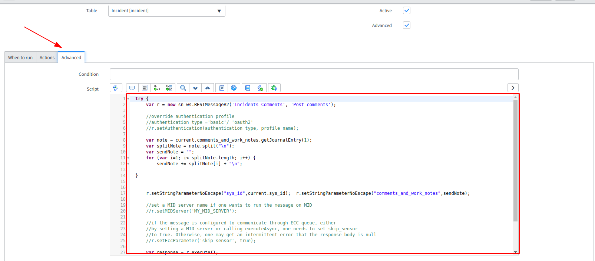

</div>

## Configure Conviso Platform Integration

Log in to the Conviso Platform. At the left Menu, choose **Integrations**. At the right panel, choose **Defect Tracker**, then click at the button **Integrate** on the ServiceNow card:

<div style={{textAlign: 'center'}}>

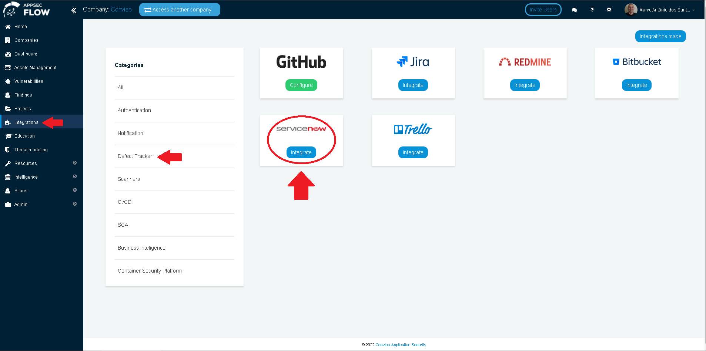

</div>

After clicking the **Integrate** button, a floating window will show ServiceNow required information. We will need 3 pieces of information:

- **Login**: Login used to log into the ServiceNow instance. It is not the same password used to log into ServiceNow;

- **Password**: Password used to log into the ServiceNow instance;

- **Instance**: A set of letters and numbers, usually in the format ```Dev###```, found on the screen shown in the first screenshot of this tutorial.

When done filling all the fields, click at the **Save** button to store your integration settings:

<div style={{textAlign: 'center'}}>

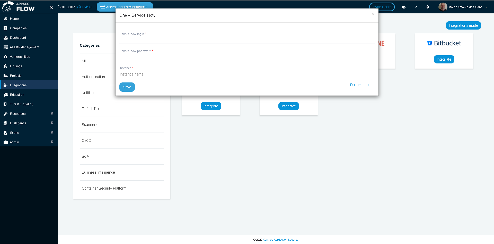

</div>

After saving the integration, we need to associate one or more assets with the ServiceNow integration. At the left menu, go to **Assets Management** and identify the asset that should be associated in the integration. Click on **Edit** icon to the right, as shown at the example below:

<div style={{textAlign: 'center'}}>


</div>

Look for the field **Integrations**, type ```ServiceNow``` to search for the integration and then click on the **Save** button:

<div style={{textAlign: 'center'}}>

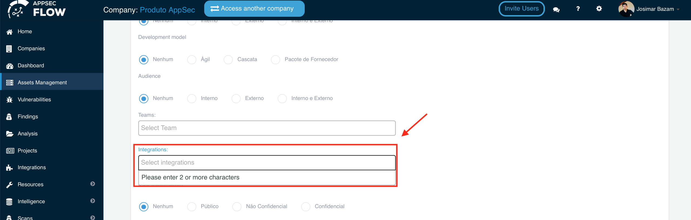

</div>

After saving, go to the left side menu **Vulnerabilities** and look for the vulnerability we want to create the issue in ServiceNow. Expand the drop-down list below the label **Actions** and select your ServiceNow integration:

<div style={{textAlign: 'center'}}>

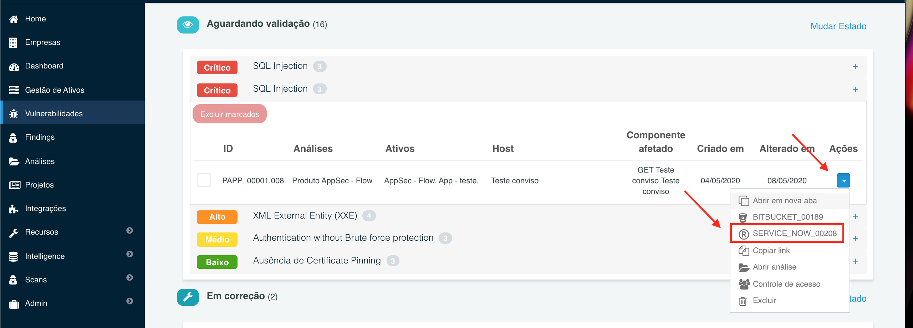

</div>
