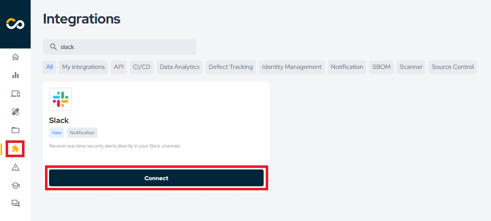
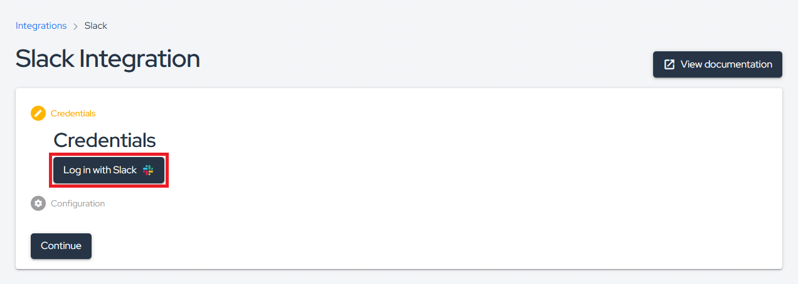
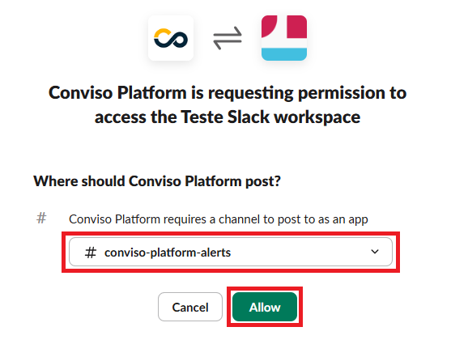
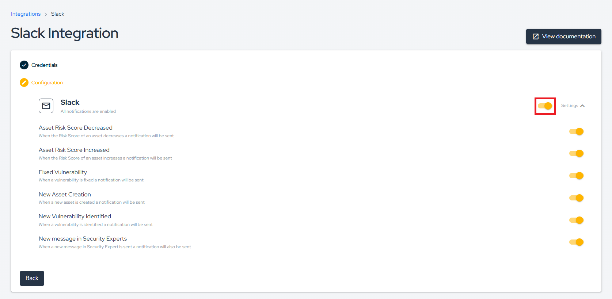
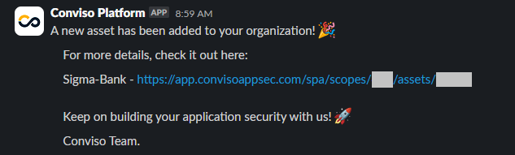

## Introduction

The integration of Conviso Platform with the Slack tool aims to help monitor those who are managing activities and don't want to miss anything at the timeline. This integration generates 3 types of alerts directly in the channel of the development team or the manager, with the benefits listed below:

1. When the Risk Score of an asset decreases, an alert is generated directly in the Slack channel;

2. When the Risk Score of an asset increases, an alert is generated directly in the Slack channel;

3. When a vulnerability is fixed, an alert is generated directly in the Slack channel;

4. When a new asset is created, an alert is generated directly in the Slack channel;

5. When a vulnerability is identified, an alert is generated directly in the Slack channel;

6. When a new message in Security Expert is sent, an alert is generated directly in the Slack channel.

## Conviso Platform integration with Slack

In this guide, we will integrate Conviso Platform with Slack, so that you can receive notification of each action taken in Conviso Platform. 

:::note
You must have Workspace Admin privileges on Slack in order to create this integration.
:::

To begin, access the **Integrations** page in the Conviso Platform, search for **"Slack"**, and click **Connect**:

Next, click on **Log in with Slack**:

Select the channel where Conviso Platform notifications will be sent (it can be public or private). Then, click **Allow**:

Back in the Conviso Platform, enable the notifications you want to send to the selected channel:

Below is an example of a notification sent to indicate that an Asset has been created:

With the integration complete, simply monitor the channel used in the integration to stay informed about the risks associated with your company.

## Support
If you have any questions or need help using our product, please don't hesitate to contact our [support team](mailto:support@convisoappsec.com).

## Resources
By exploring our content, you'll find resources to help you to understand the benefits of the Conviso Platform integrations:

