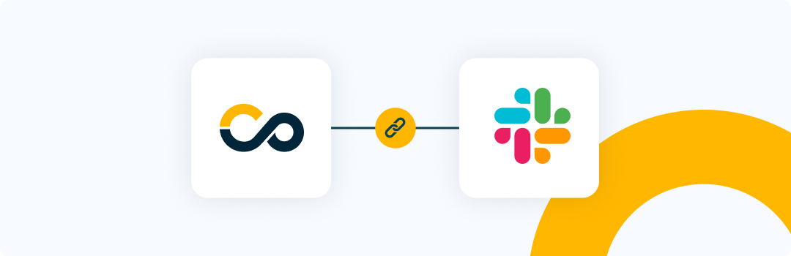
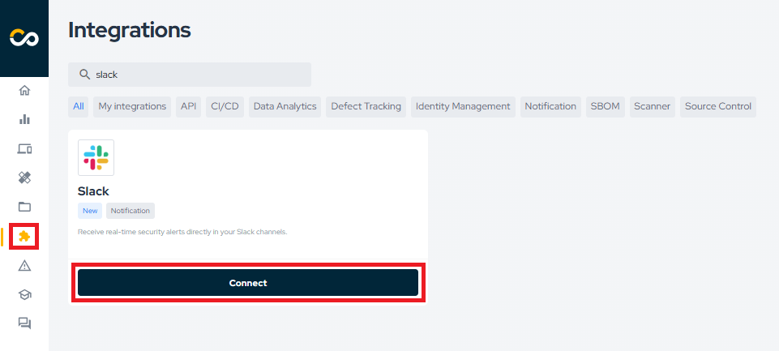
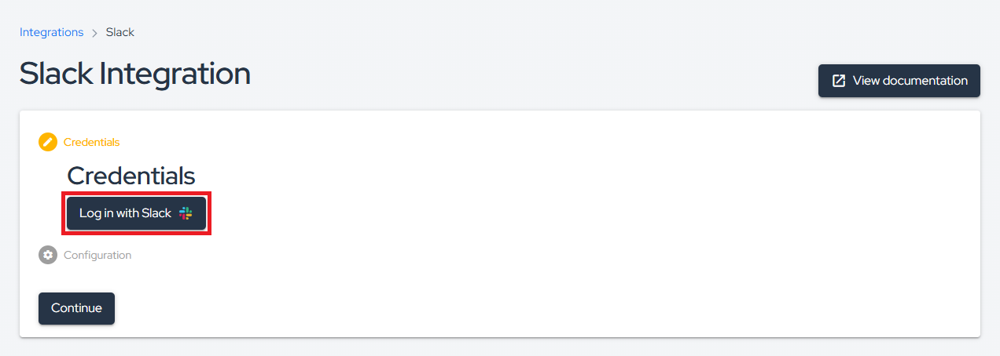
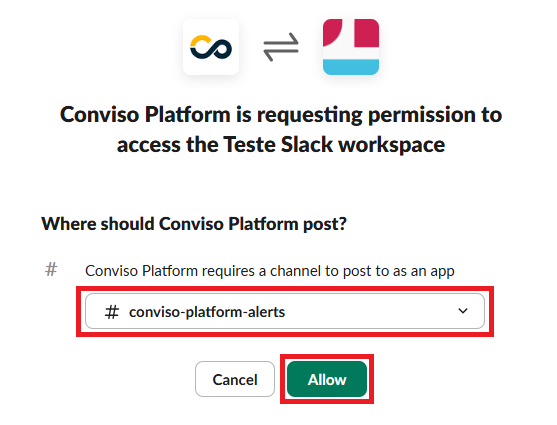

## Introduction

The integration of Conviso Platform with Slack keeps the development team or the manager's
channel up to date without anyone having to open the platform. Conviso Platform posts **one
message per day** — the Vulnerability Daily Digest — every morning at around 7:30 (Brasília
time), covering the previous day:

1. vulnerabilities that changed status, counted per status;

2. assets whose Risk Score changed;

3. assets created;

4. vulnerabilities that crossed the SLA **Approaching** or **Breached** threshold;

5. risk acceptances expiring today or in seven days.

A section only shows up when it has something to report, and every line links back to the
platform with the filters already applied. For the full description, see [Notifications
Center](../platform/notifications-center.md#vulnerability-daily-digest).

## Conviso Platform integration with Slack

In this guide, we will integrate Conviso Platform with Slack, so that you can receive notification of each action taken in Conviso Platform. 

:::note
You must have Workspace Admin privileges on Slack in order to create this integration.
:::

To begin, access the **Integrations** page in the Conviso Platform, search for **"Slack"**, and click **Connect**:

Next, click on **Log in with Slack**:

Select the channel where Conviso Platform notifications will be sent (it can be public or private). Then, click **Allow**:

Back in the Conviso Platform, enable the notifications you want to send to the selected channel:

<!-- SCREENSHOT 1 — capture: Integrations → Notification → Slack, Configuration step
     Expected state: the Slack section expanded via Settings, showing the current event list
     with Vulnerability Daily Digest enabled. The old capture (slack-img4) listed six retired
     events and was removed.
     Replace this comment with:

-->

From then on, the channel receives the daily digest every morning — a single message with one
section per kind of change, each linking back to the platform:

<!-- SCREENSHOT 2 — capture: the daily digest as posted in a Slack channel
     Expected state: a digest with several sections (status changes, risk score, new assets,
     SLA alerts) so the reader sees the real shape. Use demo data — the message carries
     vulnerability counts and company URLs. The old capture (slack-img5) showed a single
     per-event alert and was removed.
     Replace this comment with:

-->

:::note The channel receives your digest
The integration is connected by one account, and the digest only reports what its recipient can
see. So the numbers in the channel are the ones visible to whoever connected it — not the union
of everyone's access. If that account is deactivated or loses access to the company, the channel
goes quiet.
:::

With the integration complete, simply monitor the channel used in the integration to stay informed about the risks associated with your company.

## Support
If you have any questions or need help using our product, please don't hesitate to contact our [support team](mailto:support@convisoappsec.com).
