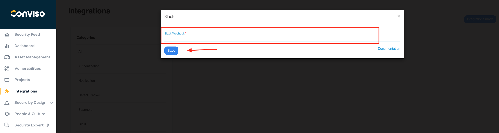
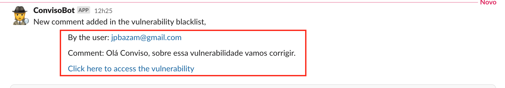

## Introduction

The integration of Conviso Platform with the Slack tool aims to help monitor those who are managing activities and don't want to miss anything at the timeline. This integration generates 3 types of alerts directly in the channel of the development team or the manager, with the benefits listed below:

1. When comments/questions are added in the Security Champions tab of an analysis, an alert is generated directly in the Slack channel;

2. When comments/questions are addedd to the vulnerability Security Champions tab;

3. When a new vulnerability is identified.

## Conviso Platform integration with Slack

In this guide, we will integrate Conviso Platform with Slack, so that you can receive notification of each action taken in Conviso Platform. 

:::note
You must have Workspace Admin privileges on Slack in order to create this integration.
:::

First, we need to create an "App" in Slack. Click on [Create App](https://api.slack.com/apps/new) to open the following screen, then select the **From Scratch** option:

A new floating window will open. Label the new application as you wish. ate the **App Name** field and select your Workspace where you want to create your application, from the drop-down list at **Pick a workspace to develop your app in** option. When done, click at the **Create App** button:

The following screen will be shown. Select the **Incoming Webhooks** card to continue:

At the **Incoming Webhooks** screen, turn on the switch next to the **Activate Incoming Webhooks**:

The card will be expanded, now showing the **Webhook URLs for your Workspace** section. Click at the button **Add New Webhook to Workspace** to continue:

A new screen will be shown. At the drop-down list, select the channel (or user) you want to receive the incoming messages. After selecting the desired channel, click on the **Allow** button :

The **Incoming Webhooks** screen will be shown again, now with the **Webhook URL** already filled in. Click on the **Copy** button to copy the webhook URL to your clipboard:

At the Conviso Platform, Click on **Integrations** at the left menu, then click on **Notifications** at the right panel and then click on the **Configure** button:

At the floating window shown, paste the previously copied webhook URL at the **Slack Webhook** field and click on the **Save** button to store your configuration:

After finishing the integration, we can add a test comment in the Security Champions tab of the Project, and a notification will be generated in the Slack channel with the same message added in Conviso Platform, as shown below:

**Slack Comments:**

**Security Champions at Conviso Platform:**

