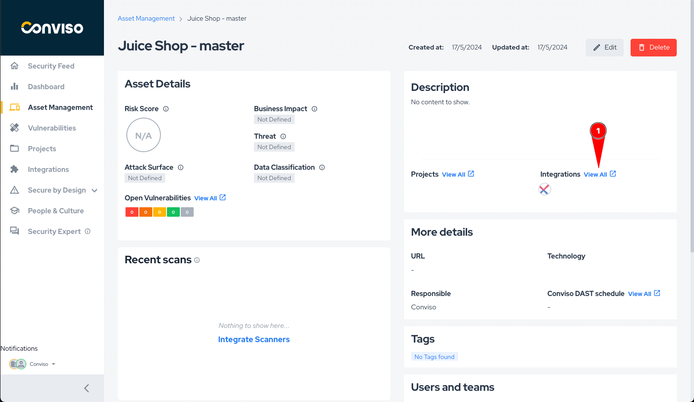
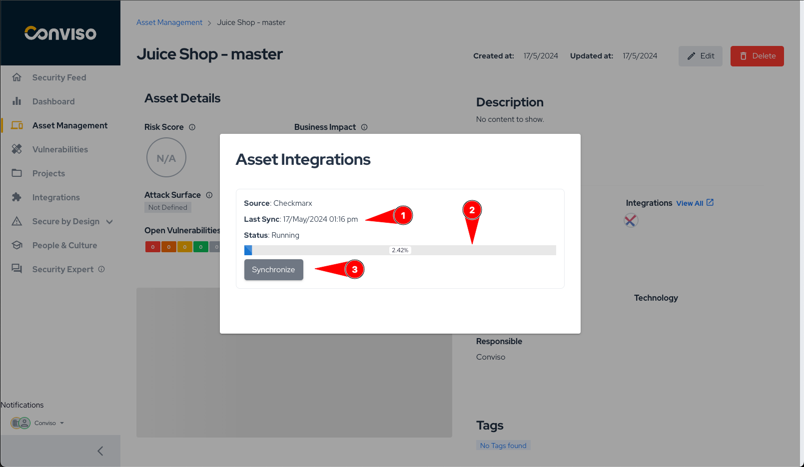

:::note
First time using SonarQube? Please refer to the [following documentation](https://docs.sonarsource.com/sonarqube).
:::

## Introduction

This integration consolidates scan results of applications in SonarQube with Conviso Platform, keeping both solutions synced in real time.

It supports a two-way integration regarding new vulnerabilities and status mapping, so every update in SonarQube will also update Conviso Platform, as well as updates in the triage of vulnerabilities within Conviso Platform vulnerability management.

Aggregating SonarQube results and other security tools with Conviso Platform will let you have a centralized view for a more efficient prioritization and security risk management of your applications. 

## Requirements

To integrate SonarQube with the Conviso Platform, you will need the following data:

- A user with the System Administrator permission in SonarQube
- User Token of the user with the permission
- URL where your SonarQube is available

## Conviso Platform Setup

To perform the integration between the two platforms, follow these steps after logging into the platform:

1. Click on the Integrations option in the side menu.
2. Click on Scanners category
3. Look for the SonarQube icon and then click on Integrate button.

A form similar to the image below will appear.

If you're not sure where to get the information below, follow our tutorial [here](#how-to-get-the-necessary-information-for-the-integration).

1. Fill the URL of your SonarQube.
2. Enter your user token from SonarQube.
3. Click on "Save."

After completing the steps, the following screen will appear.

On this screen, you can manage your integration, view and import projects, and test if your SonarQube connection is active.

1. Check if the communication with your SonarQube is active.
2. View this documentation.
3. Table containing all the assets in the Conviso Platform that you imported from SonarQube.
4. Add a new SonarQube project to the Conviso Platform.
5. Button to return to the integration credentials configuration.

## Importing Assets

To import a new project to the Conviso Platform, follow the steps below:
1. Click on Integration in the side menu.
2. Look for the Sonarcloud icon and then click on the Configure button.

This will take you to the integration configuration page.

Click on the Add Project button.

The Selection Form showing the projects registered in SonarQube will appear as shown in the image below:

1. You can use the search bar to filter by project name.
2. Select which projects to import.
3. Select which branch from project you want to import
4. Click on the Add button at the top of the form.

**Obs: Currently, when you select and import a project from SonarQube, an asset will be created for each branch that you choose to import.**

## General Information on Operation

In this section, we will address crucial information about the integration's operation. This includes details about the synchronization process, as well as the status mapping between the involved platforms.

### Status Mapping

When moving Vulnerabilities from one status to another, the Conviso platform will communicate and mark the Vulnerabilities in SonarQube according to the following mapping:

| Conviso Platform     | SonarQube                |
|----------------------|--------------------------|
| Identified           | ACKNOWLEDGED             |
| False positive       | SAFE                     |
| Fix accepted         | FIXED                    |

The modifications are bidirectional, meaning that when changes are made in the Conviso Platform, these changes will be replicated to SonarQube, and the same applies in reverse.

When changing the status in the Conviso Platform, these changes will be replicated immediately to SonarQube. However, if a change is first made in SonarQube, it will only be replicated to the Conviso Platform after a synchronization between the platforms is performed.

**Note: The only exception to these status changes is for the FIXED status in the Conviso Platform. In the case of FIXED, it is not allowed for a user to move it to FIXED when the issue was opened by a scanner like SonarQube. In this scenario, the tool itself should identify the changes and recognize that the issue has been removed. Therefore, in the next synchronization, those vulnerabilities that are no longer identified by SonarQube will be marked as FIXED in the Conviso Platform.**

**Note: When changing the vulnerability to an unmapped status, it will revert to the last mapped status when a synchronization occurs.**

### Synchronization

The synchronization of assets is automatically initiated every time a scan is successfully completed in SonarQube. You can also start a manual synchronization.

To check the status or start a manual synchronization, follow the steps below:

1. Go to the Assets Management page.
2. Click on the name of the asset that was imported.

On the asset's detail page, click on View All next to Integration, as shown in the image below:

A modal will appear as shown in the photo below:

In this modal, you will have the following information:
1. Time when the last synchronization was initiated.
2. Progress bar showing the progress of the synchronization if it is in progress.
3. Button to start a synchronization. A synchronization can only be initiated if the previous one has already finished.

## How to get the necessary information for the integration.

To get this information, you will need to log in to SonarQube and follow the steps below:

1. Click on your profile picture.
2. Click on My Account.

1. Upon entering the profile, click on the Security tab  
2. Choose a name to identify the Token and then click on Generate
3. Select **User Token** in type field
4. Choose to the token not expires, then click in generate

With this information, you can now create the integration in the Conviso Platform by following the steps mentioned above.

