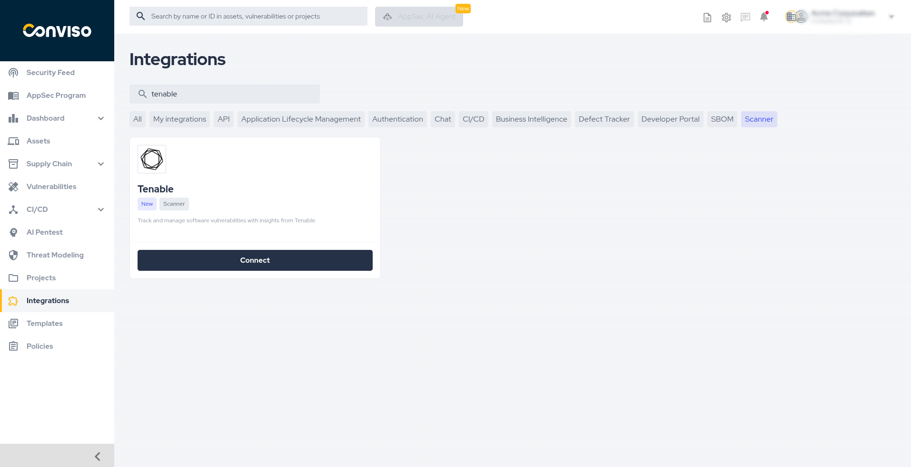
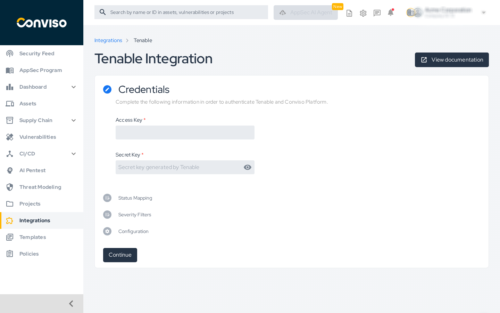
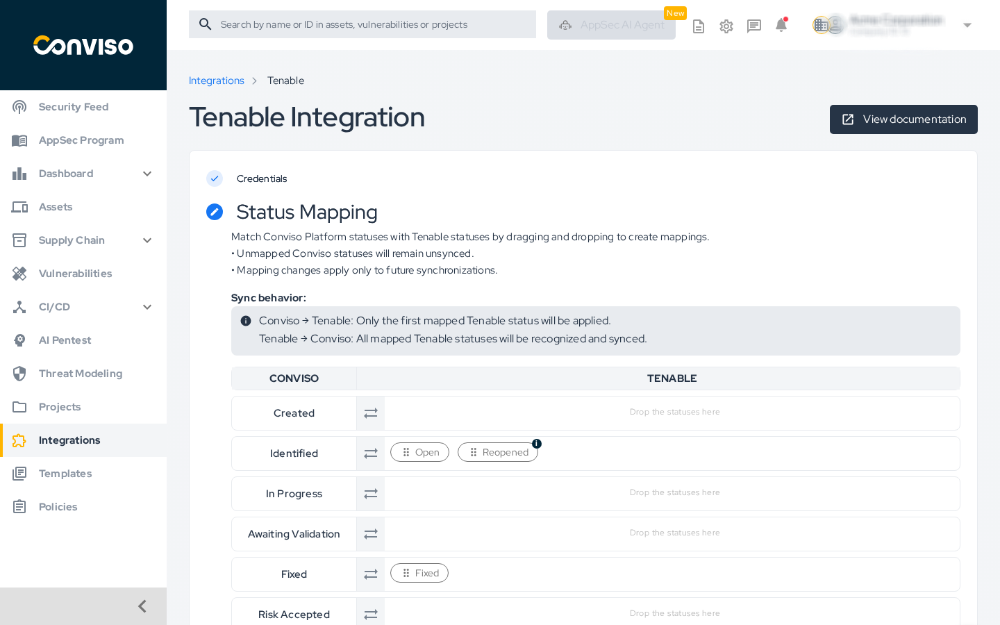
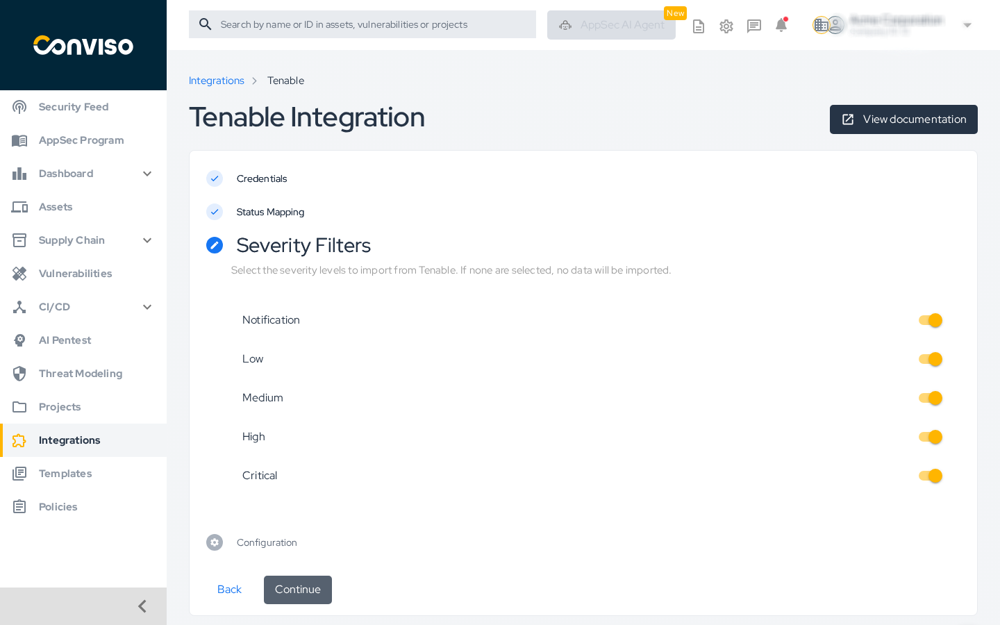
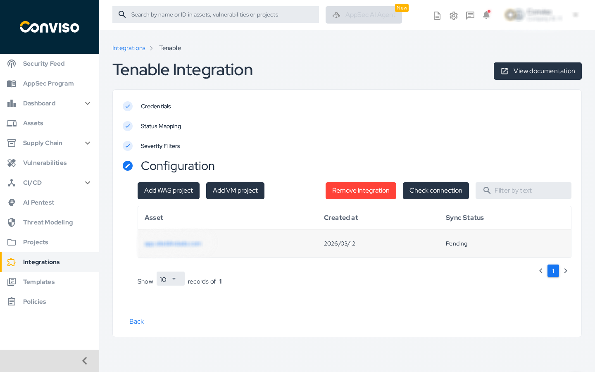
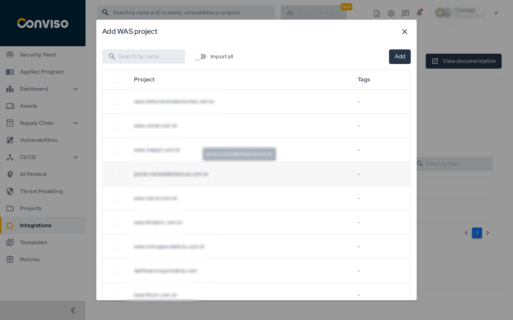
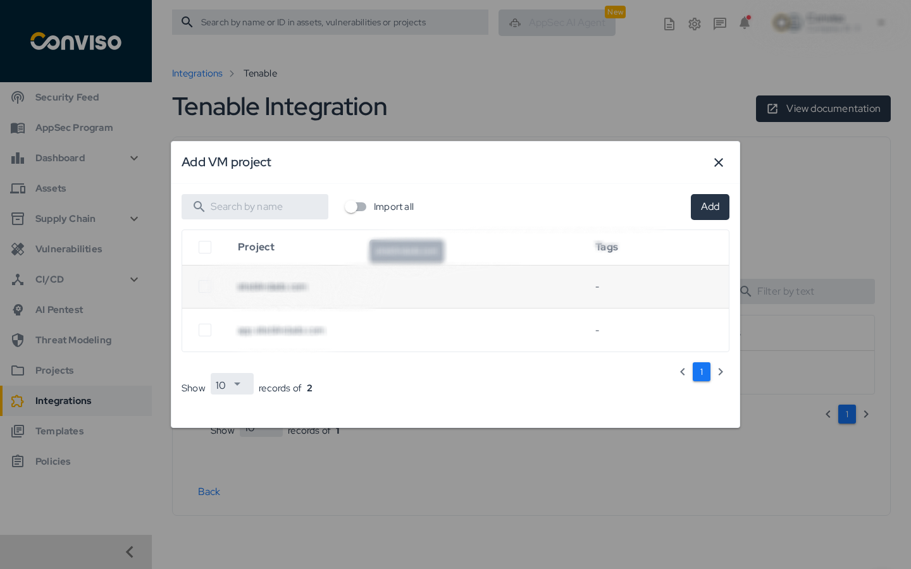

:::note
First time using Tenable? Please refer to the [following documentation](https://docs.tenable.com/).
:::

## Introduction

This integration enables the automatic import of vulnerabilities identified by Tenable into the Conviso Platform, allowing you to manage them using all Conviso Platform features. The integration supports both **WAS (Web Application Scanning)** and **VM (Vulnerability Management)** project types from Tenable.

## Objective

Configure the integration between your Tenable account and the Conviso Platform to synchronize vulnerabilities automatically.

## Prerequisites

- An active Tenable account.
- An **Access Key** and a **Secret Key** generated from your Tenable console.

## Steps

### 1. Access the Integrations page

In the left sidebar, click **Integrations**. Use the search bar to find **Tenable** and click the **Connect** button on the Tenable card.

### 2. Enter your credentials

On the **Credentials** step, enter your **Access Key** and **Secret Key** in the respective fields, then click **Continue**.

### 3. Configure Status Mapping

On the **Status Mapping** step, drag Tenable statuses from the available list and drop them onto the corresponding Conviso Platform status rows to define how statuses are synchronized between the two platforms.

**Sync behavior:**
- **Conviso → Tenable:** Only the first mapped Tenable status will be applied.
- **Tenable → Conviso:** All mapped Tenable statuses will be recognized and synced.

The default mapping is:
- **Identified** ← Open, Reopened
- **Fixed** ← Fixed

Unmapped Conviso statuses will remain unsynced. Mapping changes apply only to future synchronizations.

Click **Continue** when done.

### 4. Select Severity Filters

On the **Severity Filters** step, enable the severity levels you want to import from Tenable. All levels are enabled by default: **Notification**, **Low**, **Medium**, **High**, and **Critical**.

> If no severity level is selected, no data will be imported.

Click **Continue**.

### 5. Add projects

On the **Configuration** step, add the assets you want to monitor. Tenable supports two project types:

- Click **Add WAS project** to import Web Application Scanning assets.
- Click **Add VM project** to import Vulnerability Management assets.

In the modal that opens, use the **Search by name** field to find specific projects, or enable the **Import all** toggle to import all available projects. Select the desired projects and click **Add**.

After adding projects, the import process starts automatically. Depending on the number of assets, this may take a few minutes.

## Validation

To verify the integration is working correctly:

1. On the **Configuration** step, click **Check connection**.
2. A confirmation message should appear indicating the connection with Tenable is active.

## General Information on Operation

### Status Mapping

Status changes are bidirectional:

- Changes made in the Conviso Platform are immediately replicated to Tenable.
- Changes made in Tenable are replicated to the Conviso Platform only after the next synchronization cycle.

### Sync Status

The assets table on the Configuration step displays each imported asset with its **Sync Status** (e.g., Pending, Synced, Error). Use this table to monitor the synchronization state of each asset.

## Troubleshooting

- **Invalid credentials error:** Verify that the Access Key and Secret Key were copied correctly from your Tenable console and that the associated user has the required permissions.
- **No projects available:** Ensure the API keys have visibility over the relevant projects in Tenable. Check that the correct Tenable module (WAS or VM) is licensed and accessible.
- **Assets stuck in Pending:** The first synchronization may take several minutes. If the status does not change after a long period, click **Check connection** to verify the integration is still active.

## Support

If you have any questions or need help with our product, please contact our support team according to your SLA.

