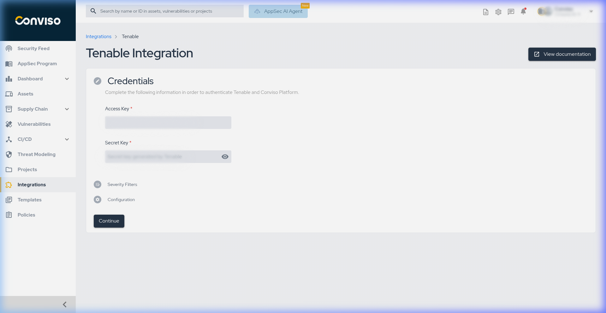
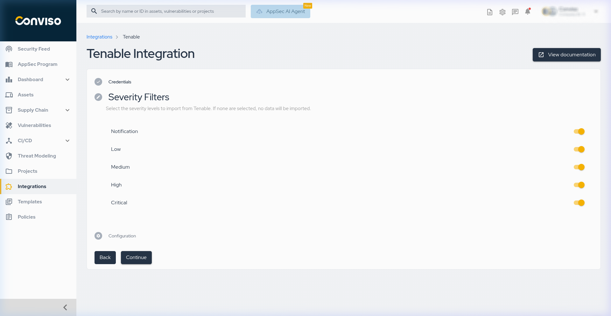
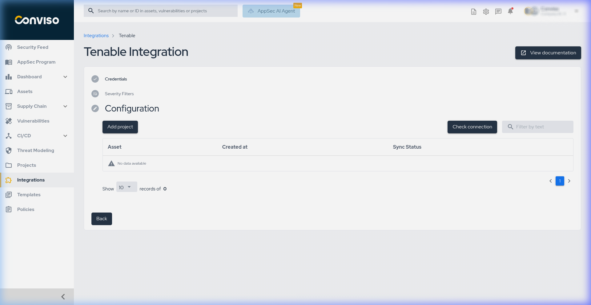
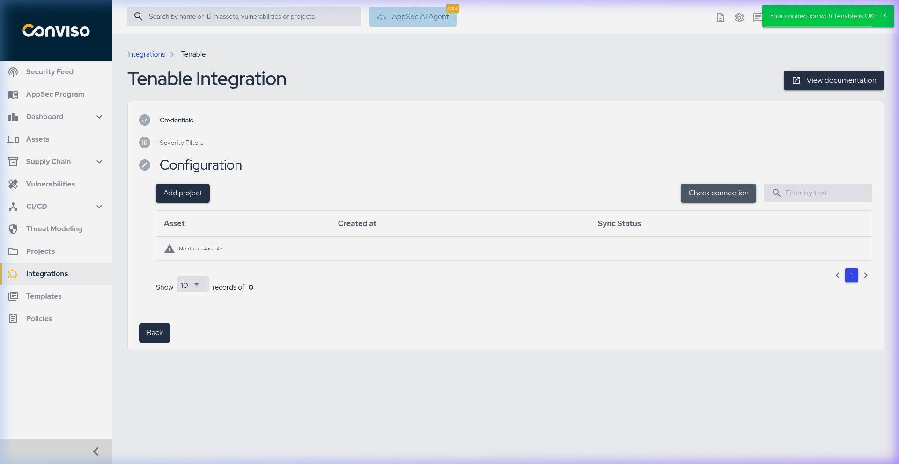
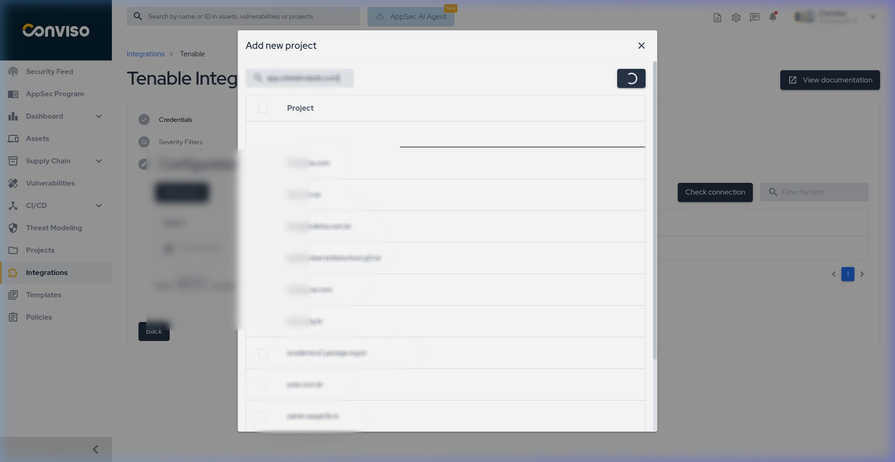
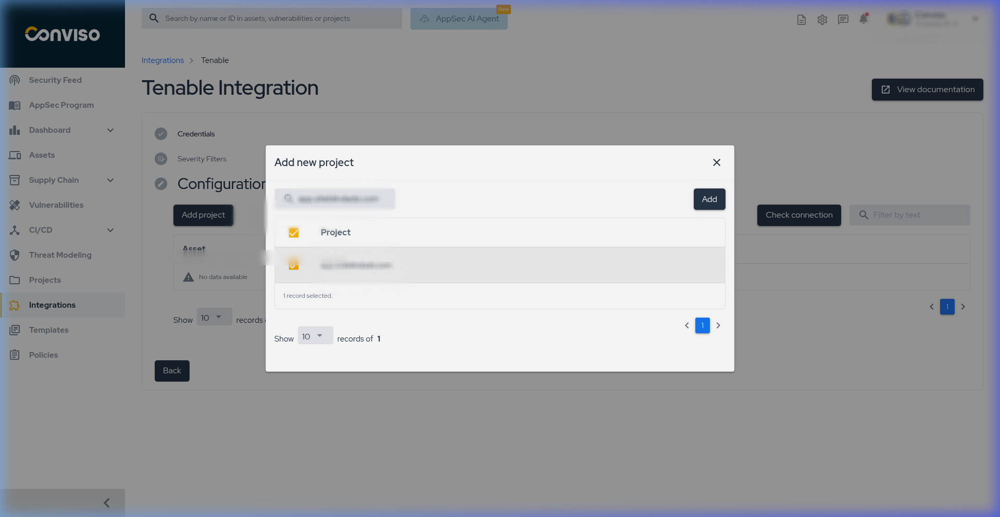
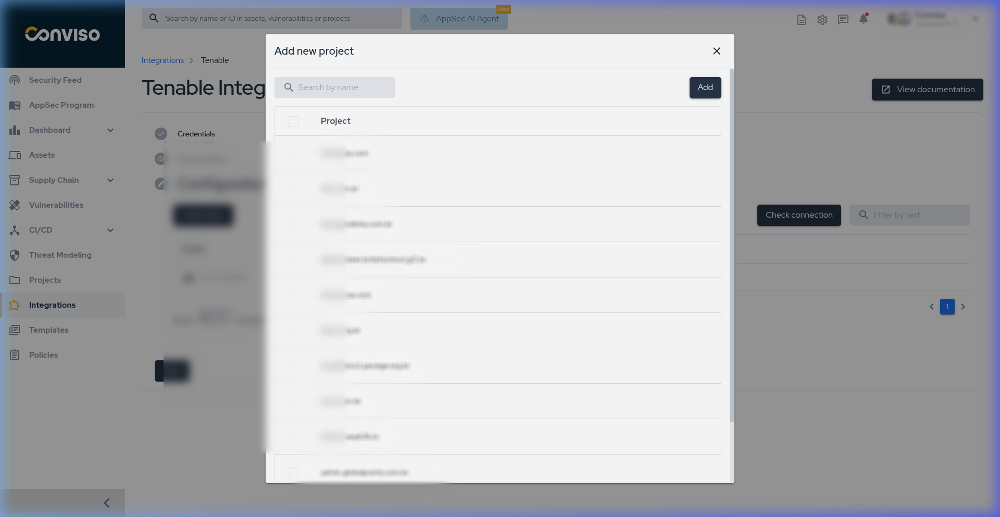

:::note
First time using Tenable? Please refer to the [following documentation](https://docs.tenable.com/).
:::

## Introduction

This integration enables the automatic import of issues (vulnerabilities) identified by Tenable into the Conviso Platform, allowing the user to leverage all the features of the Conviso Platform in managing these issues.

## Objective

The objective of this guide is to explain how to configure the integration between your Tenable instance and the Conviso Platform to allow for seamless vulnerability synchronization.

## Prerequisites

To integrate Tenable with the Conviso Platform, you will need the following:

- **Tenable Account**: An active account with access to generate API keys.
- **API Keys**: You must obtain an **Access Key** and a **Secret Key** from your Tenable console to authenticate the integration.

## Steps

After logging into the Conviso Platform, follow these steps to establish the connection:

1. In the sidebar menu, click **Integrations**.
2. Use the search bar to find **Tenable**.
3. Click the **Connect** button on the Tenable card.

4. In the Credentials section, enter your **Access Key** and **Secret Key** in the respective fields.

5. Click **Continue**.
6. On the Severity Filters screen, select which vulnerability severities you want to import from Tenable (e.g., Critical, High, Medium, Low).

7. Click **Continue**.

8. You will reach the Configuration screen. At this point, the platforms are connected.

## Validation

To verify that the integration was configured correctly:

1. On the Configuration screen, click the **Check connection** button.
2. An alert message reading "Your connection with Tenable is OK!" should appear in the top right corner.

Once validated, you can click **Add project** to start mapping your Tenable assets to your Conviso Platform projects.

## Importing Assets

To import projects from Tenable:

1. Click the **Add project** button on the configuration screen.
2. In the "Add new project" modal, use the search field to find the specific project you want to map.

3. Select the desired project from the list.

4. Click the **Add** button to map the project.

After this, the import process will be initiated.

## Troubleshooting

- **Connection Error**: If clicking "Check connection" results in an error, verify that the Access Key and Secret Key were copied correctly and and that they have the appropriate permissions within Tenable.
- **No Data Available**: If projects do not appear when attempting to add them, ensure the API keys have visibility over the relevant projects/assets in Tenable.

## Support

If you have any questions or need help with our product, please contact our support team according to your SLA.

