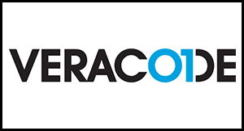
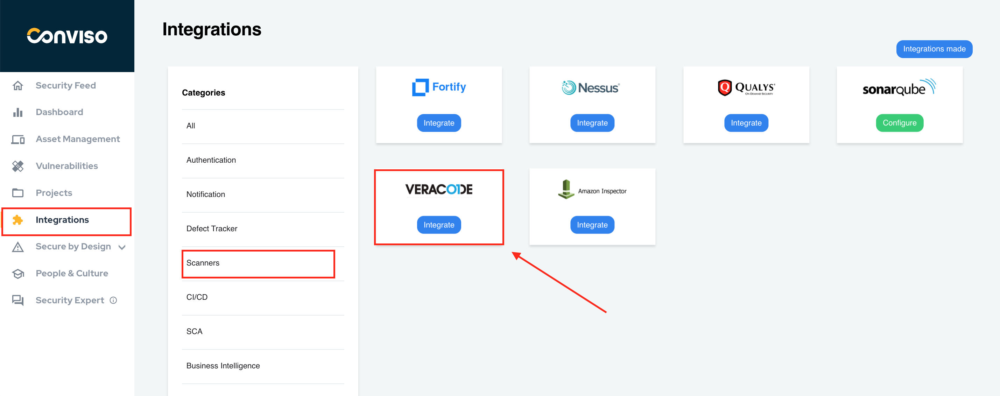
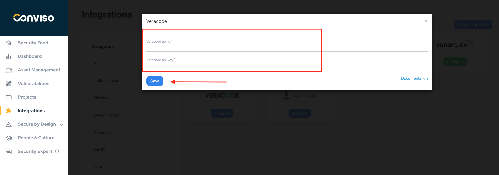
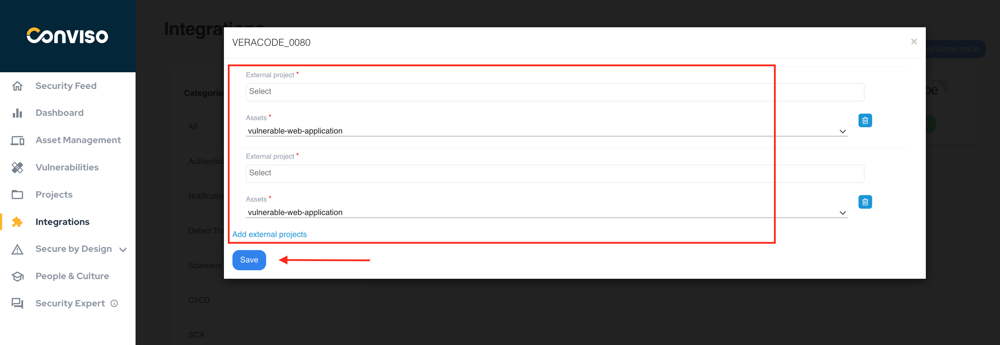
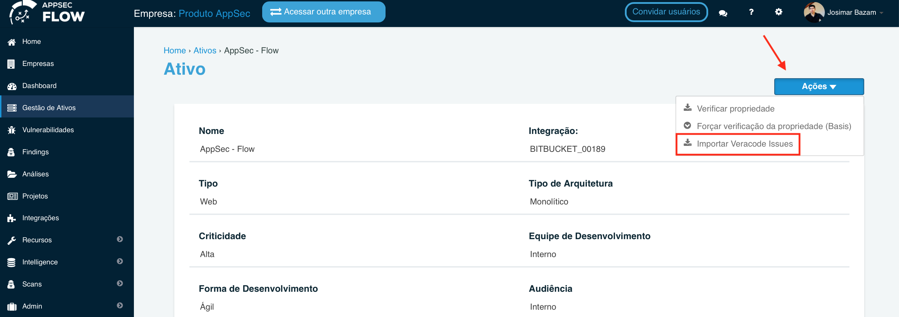
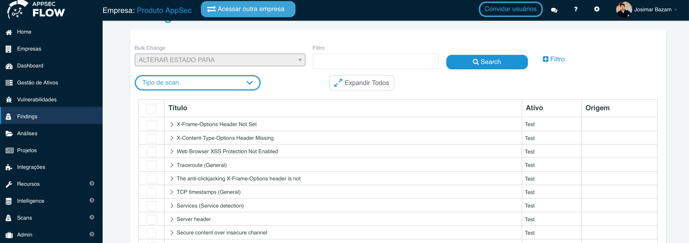

:::note
First time using Veracode? Please refer to the [following documentation](https://docs.veracode.com/r/all_HC)
:::

## Introduction

Consolidate vulnerabilities: From a single console, you can consolidate and apply analysis of vulnerabilities identified by scan and develop action plans for the treatment of vulnerabilities.

The integration allows the import of issues (vulnerabilities) found in Veracode to Conviso Platform, allowing the user to take advantage of Conviso Platform full potential for vulnerability management.

## Requirements

In order to create this integration, you will need the following data from your Veracode instance:

- Veracode API Id;

- Veracode API Key.

Follow the instructions on [this document](https://docs.veracode.com/r/admin_api) to get the required data.

## Conviso Platform Setup

Log in to the [Conviso Platform](https://app.convisoappsec.com);

On the main menu to the left, click on **Integrations**. At the panel to the right, click on the **Scanners** option, then click on the **Integrate** button on the **Veracode** card:

Fill the modal with the **Veracode api id** and the **Veracode api key**. When done filling the form, click on the **Save** button to store your integration configuration settings:

After saving, a new modal will be automatically shown with 4 options: select external projects, choose the asset, add other external projects and if you want to integrate all Veracode projects.

:::note
If no assets are displayed, make sure there is at least one asset created in the **Assets Management** tab in the Conviso Platform main left Menu.
:::

## Importing Veracode Issues to Conviso Platform

Click on the **Assets Management** main left Menu option, then select the asset you want to import issues. Click on **Actions** and then choose **Import Veracode Issues** from the drop-down list. It will automatically request Veracode to get the issues:

After importing Veracode issues, you will be able to view those imported issues, by clicking on the **Findings** main left menu:

