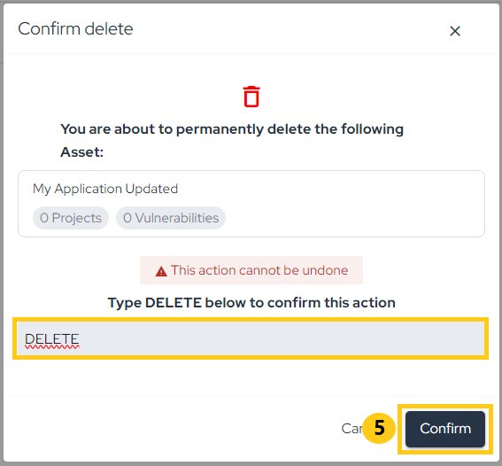

## Introduction

By utilizing Asset Management, you gain control and visibility over all assets through a centralized repository. This allows you to correlate vulnerabilities, define priorities, and increase agility in the process.

## Usage
In the left menu, click on **Asset Management** to access the centralized dashboard of all your assets:

This page displays an overview of registered assets, with the following information:

- **Risk Score**: A holistic view of an asset's risk based on factors such as open vulnerabilities, attack surface, business impact, and data classification.
- **Open Vulnerabilities**: Refers to the vulnerabilities identified in projects related to the asset.
- **Business Impact**: Indicates how critical or relevant the asset is for the business.
- **Tags**: Refers to the categories the assets belong to.
- **Integrations**: Integrations performed with the asset.
- **Last Updated**: Referring to the last time the asset was updated.

The list is sorted by Risk Score by default, but you can also sort by Name, Business Impact, and Last Updated. To do this, click on the icon that appears when you hover over one of the column headers:

Need to find something specific? No problem. Use our intuitive filters to search by Name, Tags, Business Impact, Integrations, Technology, Attack Surface, Data Classification, Teams, Created at and Last updated:

### Creating Assets

You can create assets in different ways:
1. Through integration with external scanners (click here);
2. By running the Conviso AST (click here);
3. Manually through the Conviso Platform.

To manually create an asset through the platform, click on **New Asset (1)** and then **Manual (2)**:

An asset can be an application of your company, so let's call it **"My Application"**. Then, fill in the fields "Business Impact" (which indicates the asset's impact on your business), "Data Classification" (which indicates the sensitivity of the data), and "Attack Surface" (which indicates whether the application is exposed to the internet or not). Finally, click **Create (3)**:

### Editing Assets

If you need to edit an asset, find it in the list and **click on the pencil icon**, highlighted below:

Now, make the necessary changes to the information and click **Save (4)**:

### Removing Assets

If you need to remove an asset, find it in the list and click on the trash can icon, highlighted below:

Next, type "DELETE" and confirm the removal by clicking "Confirm" (5):

### Export Asset Information

To export asset information, you can generate a CSV through the platform or retrieve it via API. To generate the CSV, click on the **Download as CSV (6)** and **Generate CSV (7)** buttons. Once complete, the file will be sent via email and will be available for download for X minutes

**Enhance your development lifecycle's security with the Conviso Platform. Join us today and foster a security-first culture!**

## Support

Should you have any questions or require assistance while using the Conviso Platform, feel free to reach out to our dedicated support team.

## Resources

By exploring our comprehensive content, you’ll discover resources that will enhance your understanding of AppSec.

[Conviso Blog](https://bit.ly/3JtXM8A): Access a wealth of informative videos covering various topics related to AppSec. Please note that the content is primarily in Portuguese.

[Conviso's YouTube Channel](https://bit.ly/3NIbbfM): Engage with our informative podcast, where we discuss AppSec-related subjects, providing valuable insights and discussions. The podcast is conducted in Portuguese.

[AppSec to Go - Conviso's Podcast on AppSec](https://spoti.fi/43UJQwN): Explore our blog, which offers a collection of articles and posts covering a wide range of AppSec topics. The content on the blog is primarily written in English.

