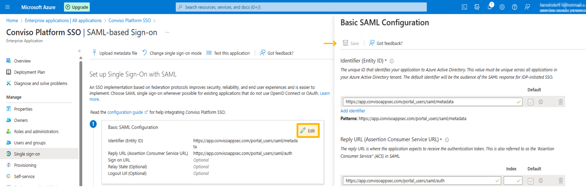
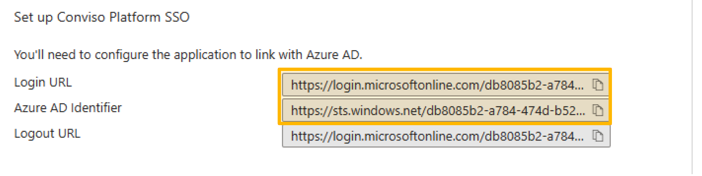
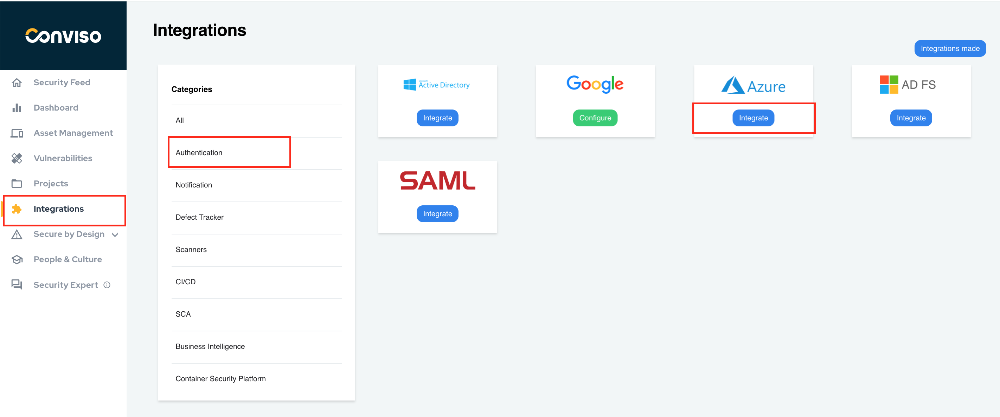
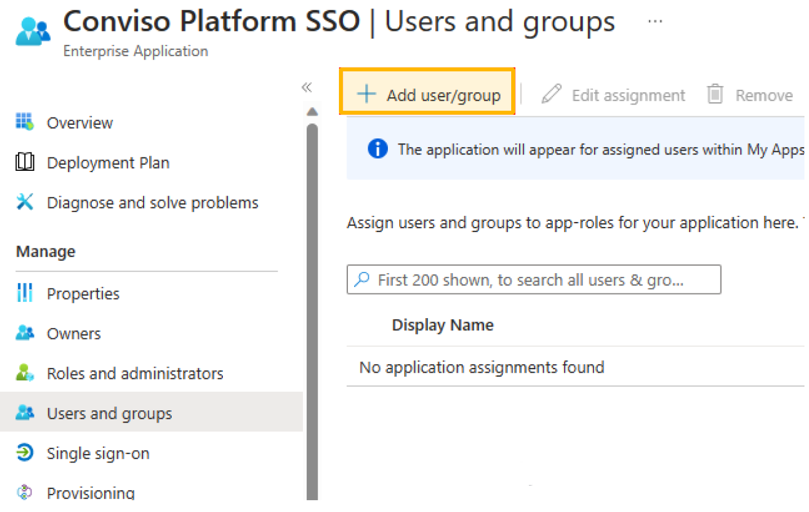

## Introduction

The integration of Active Directory (AD) with the Conviso Platform significantly user management for enterprise customers. By installing the Conviso Platform Single Sign-On (SSO) Application from the Azure marketplace, you enable SSO authentication, which facilitates direct management of access to the Conviso Platform via Azure.

### Prerequisites

Before getting started, ensure you have the following prerequisites:
- An Azure AD subscription. If you don't have a subscription, you can create a [free account](https://azure.microsoft.com/free/).
- Your Azure subscription should have single sign-on enabled for the Conviso Platform SSO Application.

## Usage

This section offers a detailed guide on utilizing the Conviso Platform SSO Application, encompassing installation steps and the process of assigning user permissions.

**Installing the Conviso Platform SSO Application:** This involves adding the Conviso Platform SSO Application to your Azure AD from the Azure marketplace.

**Setting up Conviso Platform:** Configuring the Conviso Platform to integrate with Azure AD for SSO.

**Assigning Users:** Process of assigning users to the Conviso Platform SSO application in Azure AD.

By following these steps, you will be able to effectively configure and manage user access to the Conviso Platform. This ensures a secure and streamlined experience for your enterprise customers, enhancing both usability and security.

## Installing the Conviso Platform SSO Application

1. Sign In: Access the Azure Portal using your administrative account.
2. Navigate to Azure Active Directory: In the left navigation pane, select the 'Azure Active Directory' service.
3. Access Enterprise Applications: Within Azure Active Directory, choose 'Enterprise Applications'.
4. Add New Application: Click on 'New Application' under the 'All Applications' section.

5. Search for the Application: Enter 'Conviso Platform SSO' in the search box provided.
6. Select the Application: From the search results, locate and select the 'Conviso Platform SSO' application.
7. Create the Application: Click on 'Create' to add the Conviso Platform SSO application to your Azure Active Directory.

8. Access Overview Page: After adding the application, you will be directed to the Conviso Platform SSO application's 'Overview' page.
9. Select Single Sign-On: In the left navigation pane, click on 'Single Sign-On'.
10. Choose SAML: On the 'Select a single sign-on method' page, select 'SAML' as the sign-on method.
11. Edit Basic SAML Configuration: Microsoft requires certain SAML configurations to be set. Click on 'Edit' in the 'Basic SAML Configuration' section. Once the edit window opens, simply save the pre-filled data and then close the pop-up window.

12. Download the Certificate:Next, locate the 'Certificate (Base64)' within the SAML configuration settings. Download this certificate by clicking on the appropriate download link or button provided. This certificate is essential for establishing a secure connection between Azure AD and the Conviso Platform SSO application. 

13. In addition to downloading the Certificate (Base64), it's important to also obtain the Login URL and the Azure AD Identifier. These elements are critical for setting up the SAML SSO connection:

- Login URL: This URL is used by your users to log in via Azure AD for SSO. It is typically provided in the SAML configuration section.
- Azure AD Identifier: This is the unique identifier for your Azure Active Directory instance. It's also found in the SAML configuration settings.

14. Make sure to note or copy these details, as they will be required when configuring the SSO settings on the Conviso Platform.

The Conviso Platform utilizes the Certificate (Base64), Login URL, and Azure AD Identifier as essential credentials to establish communication with Azure. These credentials are integral for enabling a secure and seamless Single Sign-On (SSO) experience, ensuring that authentication and authorization processes are properly synchronized between the Conviso Platform and Azure Active Directory.

## Performing Conviso Platform setup

To configure the Conviso Platform for Azure integration, follow these steps:

1. Log into the Conviso Platform: Access your account on the Conviso Platform.
2. Navigate to Integrations: In the left-hand menu, select 'Integrations'.
3. Select Authentication for Azure: In the 'Integrations' panel, choose 'Authentication', then select 'Azure'.
5. Initiate Integration: Click on the 'Integrate' button to begin the process of integrating Azure with the Conviso Platform.

["Conviso Platform integrations.")](https://cta-service-cms2.hubspot.com/web-interactives/public/v1/track/redirect?encryptedPayload=AVxigLKtcWzoFbzpyImNNQsXC9S54LjJuklwM39zNd7hvSoR%2FVTX%2FXjNdqdcIIDaZwGiNwYii5hXwRR06puch8xINMyL3EXxTMuSG8Le9if9juV3u%2F%2BX%2FCKsCZN1tLpW39gGnNpiLedq%2BrrfmYxgh8G%2BTcRBEWaKasQ%3D&webInteractiveContentId=125788977029&portalId=5613826)

Fill in the Required Fields: Input the previously obtained credentials - the Certificate (Base64), Login URL, and Azure AD Identifier - into the corresponding fields in the form.

6. Enter Domain Information: In the 'Authorized Domains' field, enter your organization's domain name along with any domain aliases that are used for logging in. This ensures that users from your organization can authenticate via SSO.
- Example of Authorized Domains: company.com
7. Save the Configuration: After accurately filling in all the necessary information, click the 'Save' button to finalize and save your SSO configuration settings.

The next crucial step involves specifying which users in Azure will be granted Single Sign-On (SSO) access to the Conviso Platform. This process ensures that only authorized Azure users can log in to the Conviso Platform using SSO, enhancing security and streamlining the login process. You'll need to manage these user assignments directly within the Azure portal, under the settings of the Conviso Platform SSO application.

## Assigning users to the Conviso Platform SSO Application

To assign users to the Conviso Platform SSO application in Azure, follow these steps:

8. Return to Azure Portal: After completing the Azure integration setup on the Conviso Platform, navigate back to your Azure Portal.
9. Access Enterprise Applications: Go to the 'Enterprise Applications' section and then select 'All applications'.
10. Select Conviso Platform SSO Application: Find and select the Conviso Platform SSO application you recently configured. If you don't immediately see the new application, try refreshing the page.

11. Access Users and Groups: Look for the 'Users and Groups' option in the left navigation pane of the application's page. Selecting this option will allow you to manage which users and groups have access to the Conviso Platform SSO application."

3. Search for the **Add user/group** button.

- Select Users: In the 'Add user/group' section browse through the list and select the desired users you want to grant access to the Conviso Platform.
- Confirm Selection: After choosing the users, click on 'Select'.
- Finalize Assignment: Complete the process by clicking on the 'Assign' button. This will grant the selected users access to the Conviso Platform SSO application."

You can now view the list of Azure AD users who have been granted access to the Conviso Platform. With this setup complete, your users can log in using their domain-specific email addresses via the SSO Access option on the [Conviso Platform website](https://app.convisoappsec.com/).

Note: Also consult the [Microsoft Documentation](https://learn.microsoft.com/en-us/azure/active-directory/saas-apps/appsec-flow-sso-tutorial) for further guidance. There you will find a similar tutorial to help you.

## Support
If you have any questions or need help using our product, please don't hesitate to contact our [support team](mailto:support@convisoappsec.com).

## Resources

By exploring our content, you'll find resources to help you to understand the benefits of the Conviso Platform integrations:

[AppSec: Integrations with CI/CD tools through Conviso Platform:](https://bit.ly/3ODN0jw) Follow this article to understand how we can integrate your main tools within a single platform.

[Security Precautions in Kubernetes for Cloud scenarios – IaaS (Infrastructure as a Service):](https://bit.ly/3qaizqR) What is the importance of using Kubernetes in a Cloud environment? And what are the security practices that we need to apply for this context?

