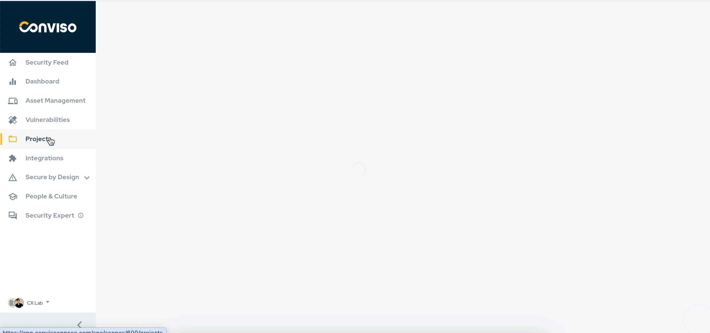

## Introduction

The Dynamic Application Security Testing (DAST) is a type of automated security test that aims to analyze the behavior of the application, handling the sending of requests to the server in search of possible vulnerabilities.

## Advantages

All results found by the DAST tool will be available to users on the Conviso Platform, making it easier to manage the vulnerability correction process. Your enterprise will get more control over the process and will be able to ensure that the entire correction flow is carried out following the market best practices.

## Requirements

In order to use the DAST Scan, you will need:

- A web application;
- An URL to this web application that is reachable from Conviso Platform;

## Creating a New Asset 

Log in to the [Conviso Platform](https://app.convisoappsec.com);

On the Menu to the left, choose **Assets Management**. At the panel to the left, click on the drop-down list **+ New Asset**:

- At the field **Name**, label your new asset as you wish;
- At the **URL** field, type the URL of the asset you want to scan;
- Description of your asset.

You may want to provide some additional information for your new asset. Fill the corresponding fields of the form wit useful data. When done, click at the button **Create** at the end of the form: 

## Creating a Project

1. Project Name: Choose a meaningful name for your project.
2. Project Type: Define the type of project that best suits your needs.
3. Requirements: Select the necessary requirements for the project.
4. Time Estimate: Estimate the time required for project completion.
5. Project Description: Provide a detailed description of what the project involves.
6. In Scope: Enter the URL related to the project.
7. Link to Asset: Associate the project with the relevant asset.
8. Save: Complete the process by clicking save to confirm your project settings.

## Start Scan

To initiate the scan, access the Projects menu. Within it, you will find all the projects. Look for the project created with the name you chose. Now, locate the Actions button, click on the icon to open a "window," and several options will appear.

- Click on **Integrate with Scanner** to validate communication with the URL.
- After validation, click on **Schedule Scan** to schedule the scan or click on **Execute Scan** to start the scan immediately.

