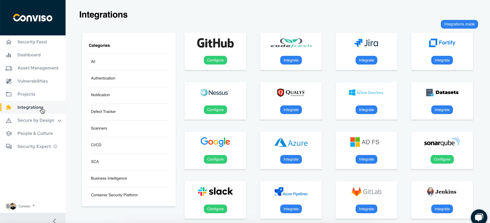

**Howdy**! Welcome to Conviso's Technical Documentation.
Here you can find all the details related to our tools and integrations for [**Conviso Platform**](https://cta-service-cms2.hubspot.com/web-interactives/public/v1/track/redirect?encryptedPayload=AVxigLKtcWzoFbzpyImNNQsXC9S54LjJuklwM39zNd7hvSoR%2FVTX%2FXjNdqdcIIDaZwGiNwYii5hXwRR06puch8xINMyL3EXxTMuSG8Le9if9juV3u%2F%2BX%2FCKsCZN1tLpW39gGnNpiLedq%2BrrfmYxgh8G%2BTcRBEWaKasQ%3D&webInteractiveContentId=125788977029&portalId=5613826), a solution for Application Security Posture Management (ASPM). 

>
Conviso Platform is a comprehensive AppSec management solution that empowers secure development for development teams. A detailed view of the software, associated application risks, and potential business impact supports the implementation and definition of a structured application security program. 

