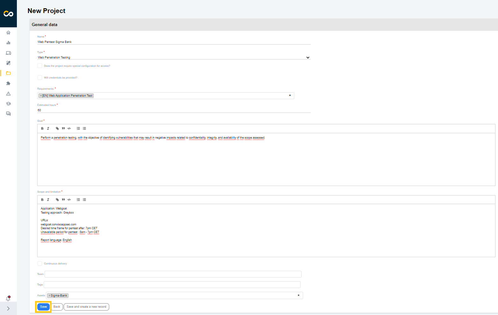

## Introduction

With the **Projects Management** feature, you can create different types of projects and centralize the results of security analyses, such as code review, penetration testing, and requirement validation (Threat Modeling), all in one place.

## Usage
In the left menu, click on **Projects** to access the centralized dashboard of all projects:

On this screen, you will find an overview of the status of your projects.
- Estimated: indicates that the project has not yet started, but is planned for the near future.
- Running: indicates that the project is in progress.
- Fixing: indicates that security vulnerabilities have been identified and the responsible team is working to fix them.
- Done: indicates that the project has been completed and the security team considers that the vulnerabilities have been adequately identified and/or corrected.
- Paused: indicates that the project has been temporarily suspended. This may be due to a change in priority, lack of resources, or any other reason.

### Creating New Projects

To create a new project, click on **New project**, add the necessary information, and click **Save**:

### Editing Projects

To edit a project, find it in the list and click on the highlighted buttons below:

Now, insert the updated information and click **Save**:

### Deleting Projects

To delete a project, find it in the list and click on the highlighted buttons below:

### Details and Properties

After selecting a project, the default **Details** screen will be displayed. You can review the project's properties here or edit them by clicking the **Edit** icon on the left. You can also delete the project by clicking the **Delete** icon on the left:

#### Projects Status

You can change the project status by clicking on its current status and selecting a new one:

#### Timeline

Track the entire progress of the project through the **Timeline** tab. The history contains a complete record of each action taken on the project.

#### Access

In **Access** tab, it is possible to manage access by project, allowing the project manager or responsible party to invite new users to access it. For more information, consult the [following guide](./user-management).

#### Report

**Report** is used to insert custom content into technical reports. The feature is used so that users can extract the results of a project executed on the platform.
The purpose of the technical report is to document everything that occurred during the project, identify any security risks that were detected, and include project information provided by the security analyst.

#### Requirements

In **Requirements** tab, it is possible to create an action plan based on the tasks that need to be performed.
They are divided into status according to the situation in which they are: not started, in progress, and completed.

**Enhance your development lifecycle's security with the Conviso Platform. Join us today and foster a security-first culture!**

## Support

Should you have any questions or require assistance while using the Conviso Platform, feel free to reach out to our dedicated support team.

## Resources

By exploring our comprehensive content, you’ll discover resources that will enhance your understanding of AppSec.

[Conviso Blog](https://bit.ly/3JtXM8A): Access a wealth of informative videos covering various topics related to AppSec. Please note that the content is primarily in Portuguese.

[Conviso's YouTube Channel](https://bit.ly/3NIbbfM): Engage with our informative podcast, where we discuss AppSec-related subjects, providing valuable insights and discussions. The podcast is conducted in Portuguese.

[AppSec to Go - Conviso's Podcast on AppSec](https://spoti.fi/43UJQwN): Explore our blog, which offers a collection of articles and posts covering a wide range of AppSec topics. The content on the blog is primarily written in English.

