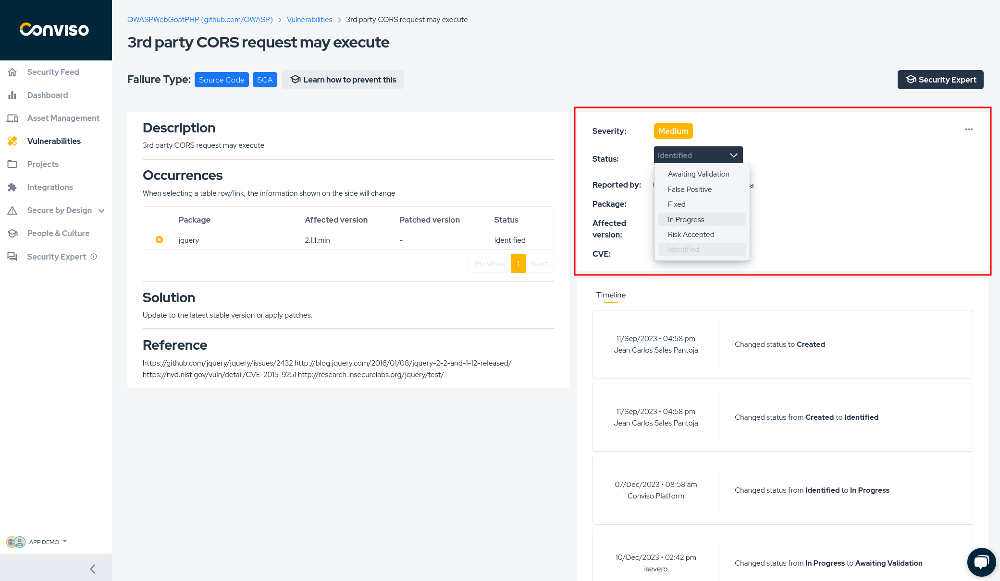
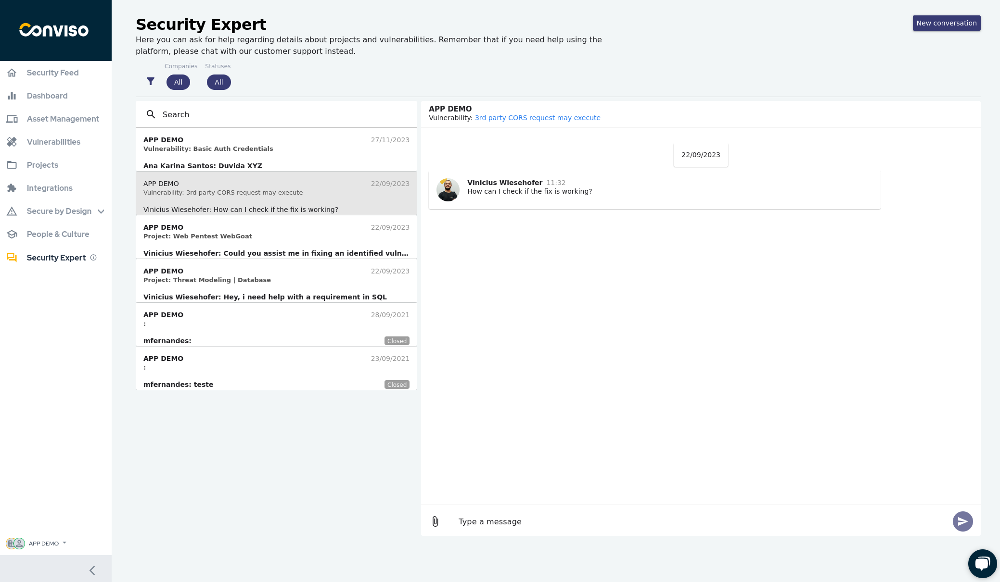
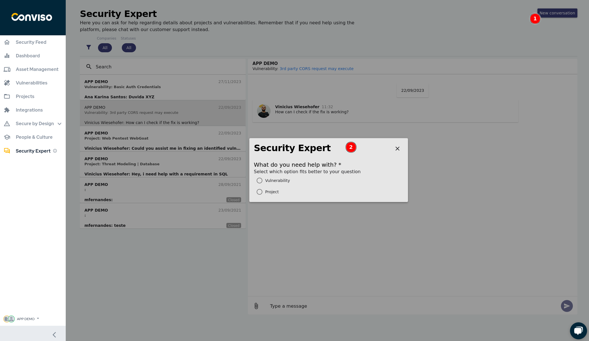
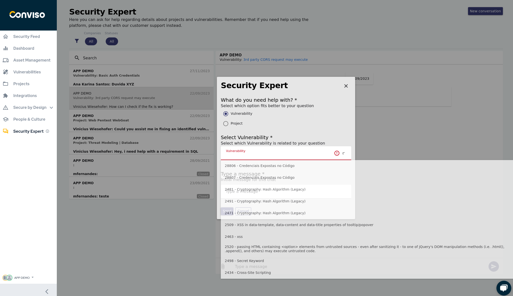
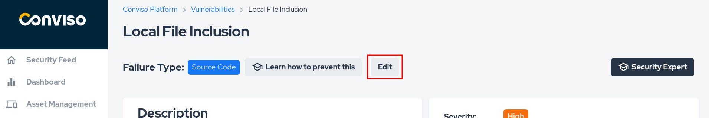
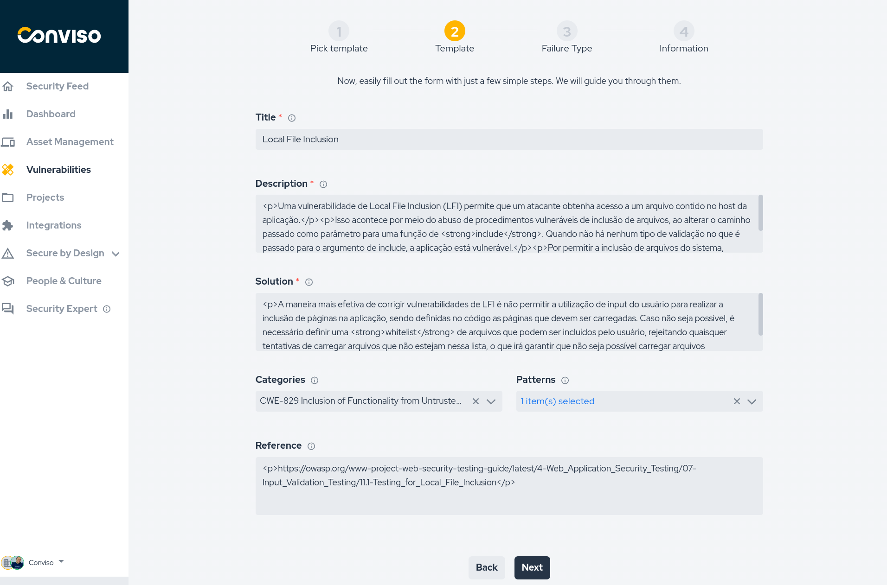
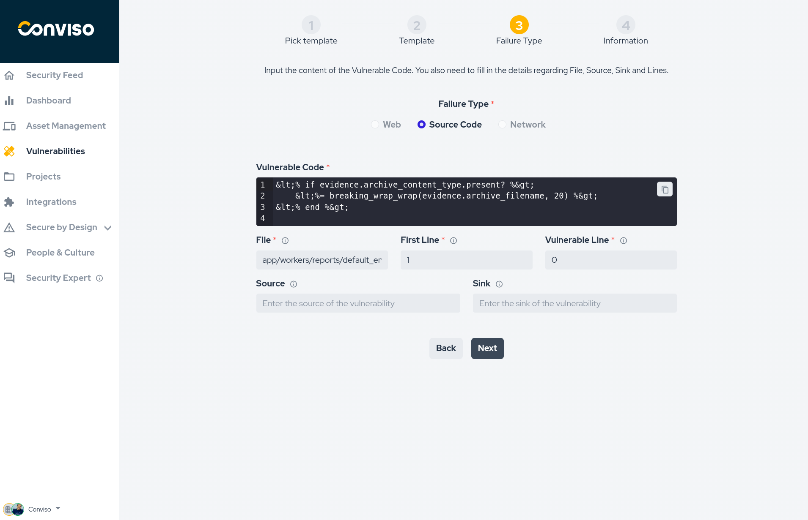

## Introduction
Conviso Platform has a complete workflow for vulnerability management, such as the process cycle to evaluate, remediate, and mitigate security weaknesses in systems or applications. 

## Usage

To view all identified vulnerabilities, click the "Vulnerabilities" option in the left-hand menu.
 

The vulnerabilities will be displayed according to their respective statuses, including:
 

Select the vulnerability you want to manage. The vulnerability will expand, exhibiting all projects where it was identified. Click on the project you want to manage to access a Vulnerability Workflow.

1. **Waiting Validation/Waiting** Review: indicates that the vulnerability has been fixed, and the solution is awaiting validation;
2. **False Positive:** indicates that the vulnerability is actually a false positive;
3. **Fixed:** indicates that the solution to the vulnerability has been accepted;
4. **In Progress:** indicates that the vulnerability remediation workflow has started and that the vulnerability is under correction;
5. **Risk Accepted:** indicates that the vulnerability has been accepted as an acceptable risk, and no action will be taken to fix it;
6. **Identified:** indicates that a vulnerability has been identified or discovered;

Clicking on a specific vulnerability’s project will allow you to view its corrective workflow process in detail.

**On this page you can also find detailed information about each vulnerability, including:**

1. A description of the vulnerability;
2. Occurrences;
3. Details on any occurrence when selected, showing Severity, Status, and other information in a side panel.
4. Any indicated solutions;
5. References;
6. A timeline demonstrating all actions already carried out.

## Vulnerability Workflow

Each vulnerability can have a separate management flow, and can progress at different times. As shown in the image, everything continues to happen on the same screen, which makes it easier to centralize information.
Each of the vulnerabilities can have one of the following statuses:
1. Awaiting Validation;
2. False Positive;
3. Fixed;
4. In Progress;
5. Accepted Risk;
6. Identified.

All of these statuses were discussed above.

**Vulnerabilities Management Options**

For developers working on the vulnerability, there are several useful options. The first is the ability to contact the Conviso analysts working on the project directly through the "Security Expert" option, located in the top right corner of the screen.

When selecting "Security Expert" you will be redirected to the screen, where you can leave or read messages exchanged with analysts in the flow of action on this vulnerability. This facilitates greater contact between clients and analysts and maintains a history of information exchanges throughout the vulnerability solution cycle.

Starting a new communication is as simple as selecting the "New Conversation" option. A window will then display for selecting the topic of the new conversation, whether it's about a specific vulnerability or a project.

The next two images are very similar, the only thing that changes visually is the indication that the conversation is being started to talk about a vulnerability, and at this point you choose which vulnerability. In the same way, you will select the project, if this is your desire to start a conversation about projects.

To choose vulnerabilities

To choose projects

If the vulnerability you are working on originates from manual input and not from an analysis tool, you can edit it. This option, however, is only available for manually registered vulnerabilities.

Upon selecting the edit option, you will be guided through a set of fields to be filled in or changed, as shown in the images below. Complete the process by clicking "Finished" at the end of the page.

#### Timeline

## Support
If you have any questions or need help using our product, please don't hesitate to contact our [support team](mailto:support@convisoappsec.com).

## Resources
By exploring our content you'll find resources to help you understand vulnerability management:

[How Vulnerability Management Works in Conviso Platform:](https://bit.ly/3LBxR0m) Discover the key features of the platform and how it helps detect, prioritize, and remediate vulnerabilities.

[Prioritization of Vulnerabilities:](https://bit.ly/3LBxR0m) Learn best practices for prioritizing vulnerabilities and creating a strategy that works for your organization.

[Vulnerability Management Process:](https://bit.ly/3LgMDIn) Get an overview of the process and learn how to implement it in your organization.

