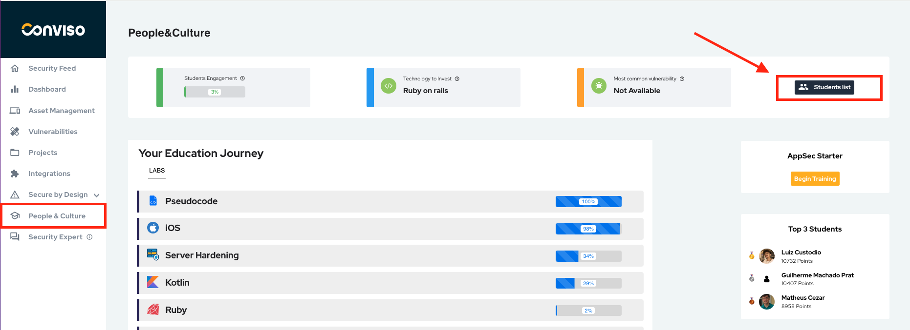
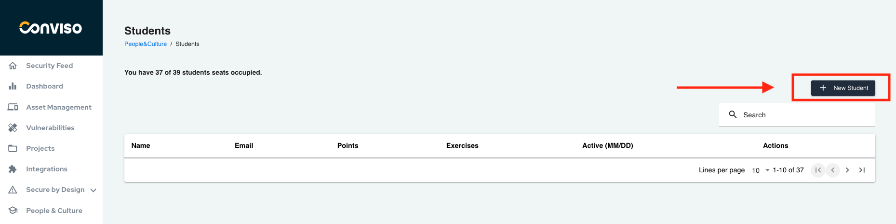
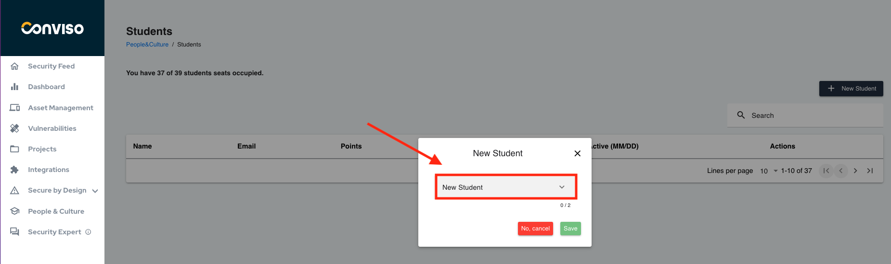
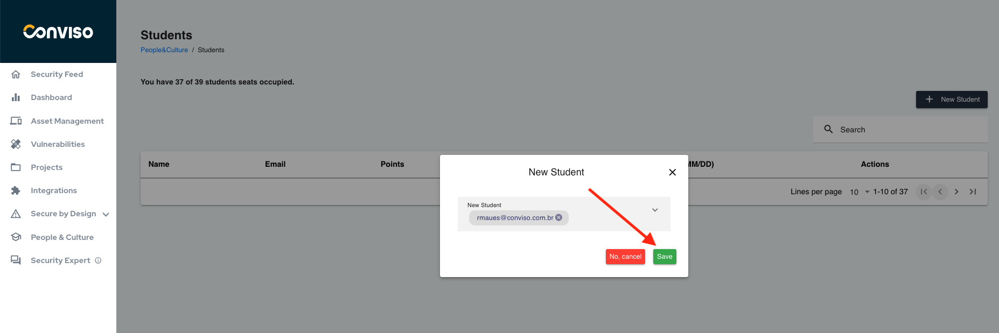

## Introduction

To add a user to the People Culture module, it is necessary for the user to have access to the Conviso Platform.

### Prerequisite

- To have access to the Conviso Platform.
- To have a license for the People & Culture module.

## Add user

To add a user, access People Culture located in the left menu and look for the 'Student List' button.

Click on the student list

To list the users who have access to the Conviso platform, click on 'New Student,' as shown in the example image.

After selecting the user who should have permission to use the People Culture module, click on the save button.

## Support
If you have any questions or need help using our product, please don't hesitate to contact our [support team](mailto:support@convisoappsec.com).

## Resources
By exploring our content, you'll find resources to help you understand the importance of education to an AppSec culture.

[AppSec training through People & Culture](https://bit.ly/43kEQk6): We know that we need to develop applications with security to avoid the numerous threats of everyday life. However, how to carry out this work with the development team without training in AppSec?

[The Role of Education in AppSec Culture](https://bit.ly/42ZSMAg): Implementing application security practices in a company goes far beyond performing tasks. It’s a culture to be cultivated. In this journey, education is a fundamental step.

