## Introduction
People & Culture plays a **key role in culturally transforming** development teams, promoting the adoption of secure practices and awareness of the importance of application security. 

As a valuable tool in this process, the main objective of People & Culture is to facilitate **continuous learning** and allow the improvement of the necessary skills to deal with day-to-day challenges. 

People and Culture also elevate the learning experience through **immersive gamification** elements. 
 
Our Just in Time Training approach allows you to **choose training plans based on identified vulnerabilities**, ensuring that you receive the training that makes the most sense for the code correction you need to apply. This means you can choose the specific training modules that are relevant to your current development challenges, ensuring that you are equipped with the right knowledge at the right time.

### Prerequisite
To access People & Culture, it is necessary to initiate a contract for using this product, see here to [contact the responsible team](https://bit.ly/43abLIy).

## Usage
Conviso Platform offers a seamless integration between training and practice, providing developers with the necessary skills to efficiently deal with identified vulnerabilities in applications. 

Within this platform, you will find an exclusive section dedicated to Vulnerability Management:

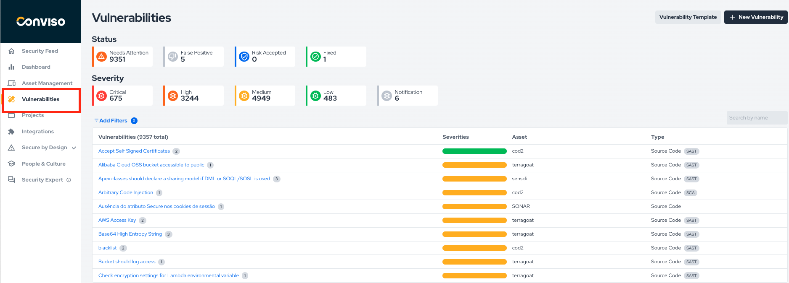

In this section, you will have access to a complete view of the vulnerabilities present in your applications.  The People & Culture differential is that, when managing vulnerabilities, you can use the training to study the identified vulnerabilities.

This allows you to choose the training modules that make the most sense for the vulnerabilities you need to address, ensuring you can sharpen your application security skills in a targeted and effective way. By focusing on the specific challenges related to the vulnerabilities you find, you can better prepare yourself to handle them with confidence.

To access the secure coding trails, click the "People & Culture" option in the left-hand menu:

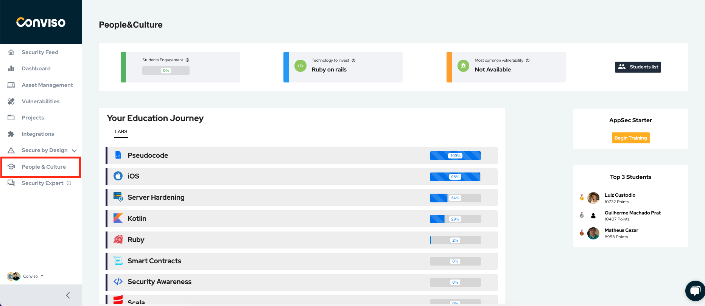

At first, you will notice important information about the use of the platform in your company:

### Students Engagement

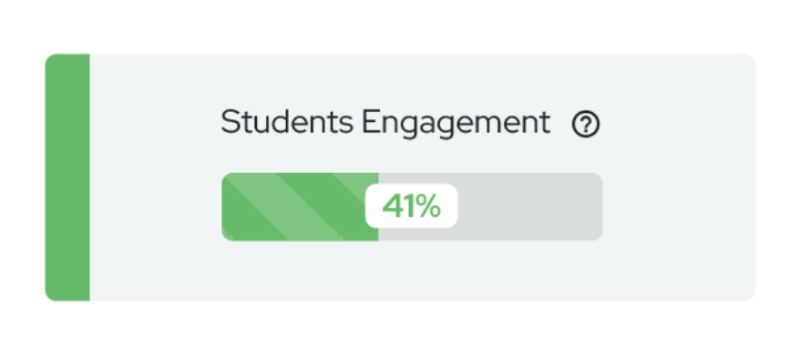

This visual tool provides a clear and straightforward representation of students' engagement levels over the past week, presented as a percentage.

 It is a valuable metric to measure and track collective progress, allowing instructors and learners to monitor their engagement and stay motivated.

### Technology to Invest

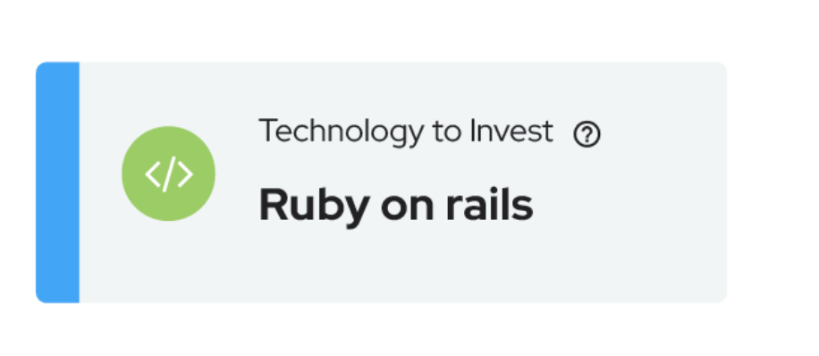

This tool provides valuable insights into the technology developers must prioritize to strengthen security measures.

It highlights the technologies that demand heightened attention due to their widespread usage across registered assets on the platform. 

### Most common vulnerability

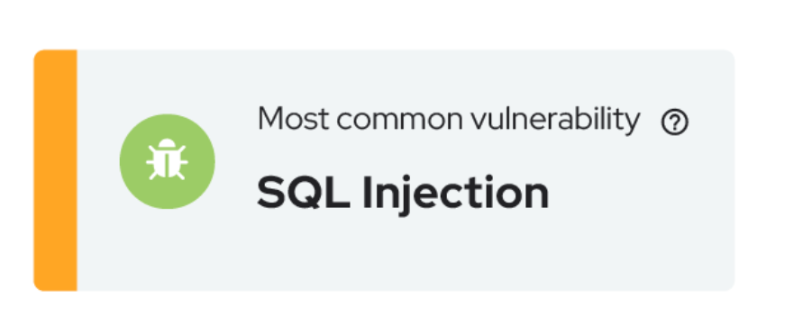

Stay proactive in safeguarding your applications by focusing on the vulnerability that poses the greatest threat. 

This tool analyzes the data from all assets on the platform to pinpoint the most commonly identified vulnerability. 

### Student list

Introducing the "Student List" feature, your gateway to a comprehensive overview of all registered students:

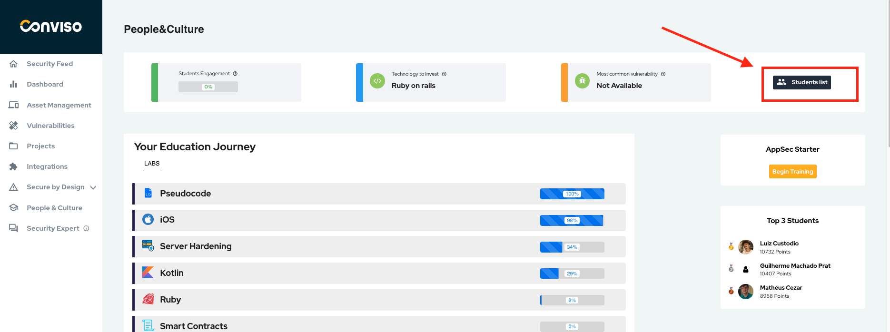

To add a new user in the People Culture module, click on the 'New Student' button

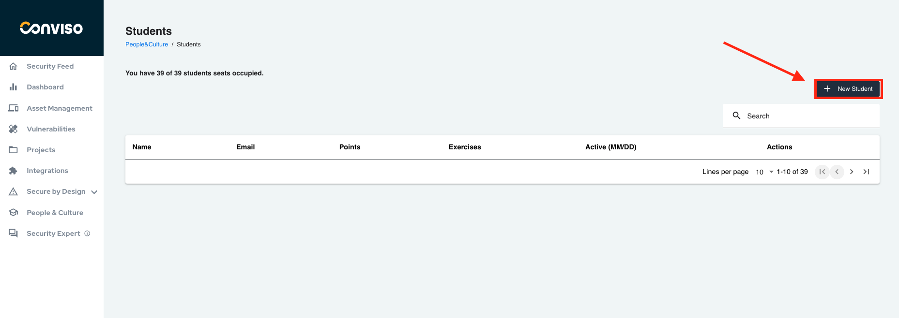

Stay informed about the individuals who are embarking on their learning journey. 

In this feature, you can view the total points and exercises solved by students, in addition to being able to add or remove people from the program.

### AppSec Starter

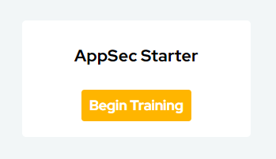

By clicking the "AppSec Starter" button, you'll gain access to a beginner-friendly training program that covers the essentials of Application Security. 

Equip yourself with the knowledge and tools to identify and mitigate potential risks, ensuring the security and resilience of your applications.

### Top Students

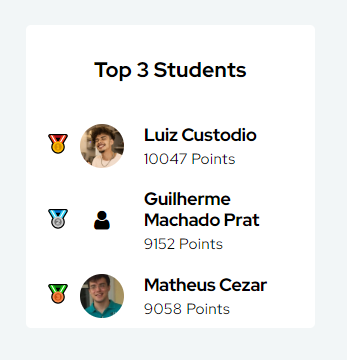

Get ready for a friendly competition among dedicated learners! In the "Top 3 Students" leaderboard, where the leading individuals who excel in completing exercises and earning points are recognized.

It serves as a source of inspiration, motivating learners to push their boundaries and reach new heights in their secure coding journey.

## Exploring your Education Journey Labs

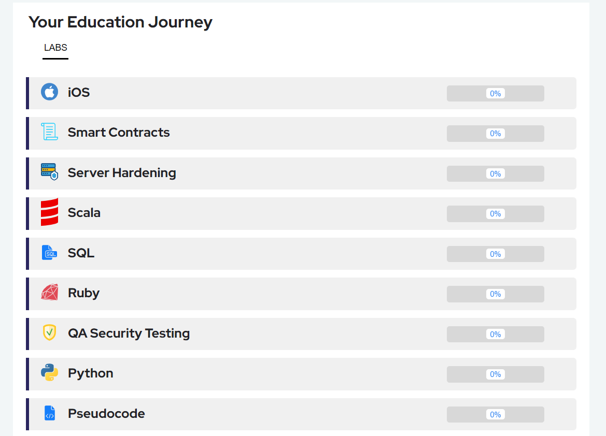

This feature provides a **curated list of technologies**, each representing a unique knowledge track in secure coding for developers.

Within each technology track, you'll find a wealth of hands-on exercises and challenges designed to sharpen your skills and deepen your understanding of secure coding practices. 

Keep track of your progress with the convenient completion **progress bar** displayed alongside each technology. This percentage-based progress bar provides a clear visual representation of how far you've come in completing all the exercises within a specific technology track.

### Lab Technologies
You can explore a variety of technologies to enhance your secure coding skills. 

The available technologies include **iOS, Smart Contracts, Server Hardening, Scala, SQL, Ruby, QA Security Testing, Python, Pseudocode, PHP, NodeJS, Kubernetes, Kotlin, Java, Go Lang, Frontend, Exploitation, Docker, COBOL, C, Apex, Android, AWS, ABAP, and .NET**. 

### Learning path for your language or technology

By clicking on one of the available technologies, an exercise trail will appear for you:

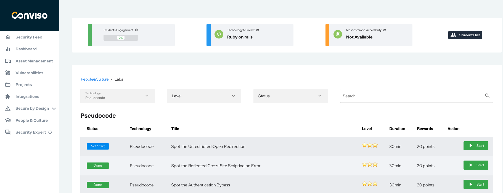

This lab is designed to provide a structured and engaging learning experience. It guides you through exercises focused on addressing specific vulnerabilities, gradually increasing in difficulty as you progress. 

Within this interface, you will find the following columns:

- **Status**: Indicates the progress of each exercise in the Learn Path.

- **Technology**: Specifies the programming language or technology associated with the exercises in the labs.

- **Vulnerability Title**: Each exercise is associated with a specific vulnerability that needs to be addressed. 

- **Difficulty Level**:  Represents the complexity of the exercise. It is indicated by a star rating system, with one star indicating an easy exercise, three stars representing a moderate level of difficulty, and five stars denoting a challenging exercise.

- **Duration**: Specifies the time limit allocated to complete the exercise.

- **Score**: Represents the points awarded for completing the exercise.

- **Action**: It features a play button that you can click to start the exercise and dive into solving the presented vulnerability.

By clicking on start, you will be able to solve the exercise. [See here how to solve an exercise in People & Culture](../people-and-culture/solving-code-review.md).

Completing exercises, you enhance your understanding of secure coding practices and strengthen your ability to mitigate vulnerabilities effectively.

## Solving practical exercises in the virtualized development environment

In People & Culture, when you click on a chosen technology, you can access an exercise path. For this example, we will use the "Pseudocode" track.

## Getting support for the People & Culture
If you have any questions or need help using our product, please don't hesitate to contact our [support team](mailto:support@convisoappsec.com).

## Resources
By exploring our content, you'll find resources to help you understand the importance of education to an AppSec culture.

[AppSec training through People & Culture](https://bit.ly/43kEQk6): We know that we need to develop applications with security to avoid the numerous threats of everyday life. However, how to carry out this work with the development team without training in AppSec?

[The Role of Education in AppSec Culture](https://bit.ly/42ZSMAg): Implementing application security practices in a company goes far beyond performing tasks. It’s a culture to be cultivated. In this journey, education is a fundamental step.

