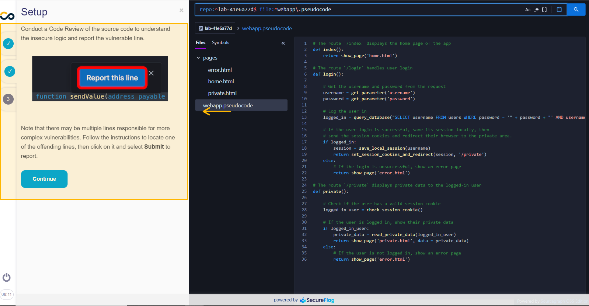
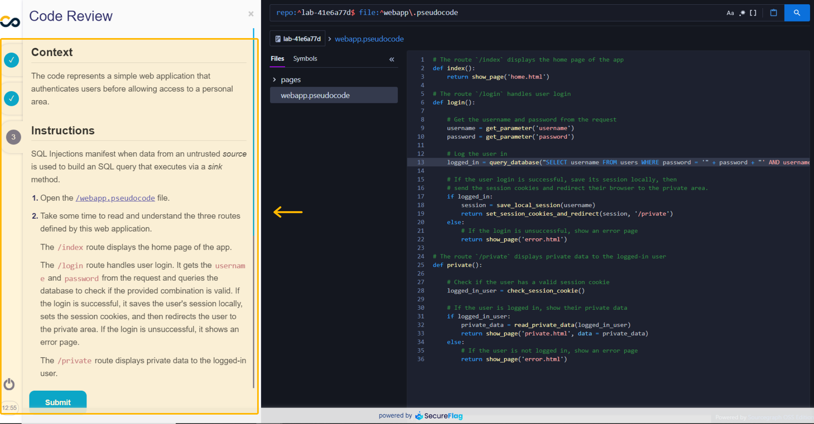

## Introduction
This guide is designed to help you navigate the process of effectively solving exercises and enhancing your secure coding skills within the People & Culture.

By engaging in hands-on exercises, you can put your knowledge into practice and develop a deeper understanding of secure coding techniques. Each exercise presents a specific vulnerability or coding challenge requiring attention and problem-solving abilities.

### Prerequisite
To access People & Culture, it is necessary to initiate a contract for using this product, see here to [contact the responsible team](https://bit.ly/43abLIy).

## Solving practical exercises in the virtualized development environment
In People & Culture, when you click on a chosen technology, you can access an exercise path. For this example, we will use the "Pseudocode" track.

**Note:** Pseudocode is a high-level, simplified programming language that focuses on expressing algorithms and logic without strict adherence to any specific programming language syntax.

When solving security problem exercises, the Pseudocode track can be an excellent suggestion for beginners. 

### Step 1: Choosing the exercise
So let's choose an easy-level exercise for our example:

It is possible to identify the difficulty through the number of stars in "level". Generally, easy exercises have a short duration and low scores. 

To select exercises, prioritize the **technologies** and **vulnerabilities** suggested in the People & Culture panel. By aligning your exercises with the platform's indications, you can effectively enhance your skills in the most relevant areas of secure coding for your company.

Everyone starts somewhere, and every beginning is a chance to learn and grow!

### Step 2: Accessing the exercise
To get started, simply click on the "Start" button in the Actions column:

After starting, a new tab will appear. In this window, a message will ask you to accept the "Licence Agreement":

**Note:** The license is a legal agreement between you and Conviso for using SecureFlag software and services and any materials or documents made available by us through our platform (collectively referred to as the Service). 

After accepting the terms of the "License Agreement," you will then have access to the exercise environment.

It is important to pay attention, the countdown has already started, and you can run out of time from now on! 

If you lose, no worries: you can start over!

##### Time counter
In case you are worried about the time left to solve the exercise, the counter is located in the lower-left corner of your screen, as indicated in the image:

But if you need more time, in the last few minutes you will receive a notification allowing you to add extra time to the counter:

Upon receiving the notification, by clicking on the time counter you can add another 10 minutes to solve the exercise.

### Step 3: Explaining the Scenario for the exercise
Initially, in part one of the exercise tutorials, the **Scenario** is presented.

In this section, you will be presented with a scenario that outlines a specific vulnerability. It provides background information on the vulnerability and explains how it can be exploited. 

If you have questions or want to go deeper into the type of vulnerability you are dealing with, it is common to find tips to learn more about it later in the explanation part:

And then, you will have access to content with more detail on how the attack against this vulnerability works:

To proceed to the next step, just click on “Continue”.

#####  Introducing the virtualized development environment
The virtualized development environment is an innovative solution designed to enhance the coding experience and provide numerous benefits for secure coding practices. 

In the beginning, you will visualize the development environment for solving the exercise as if it were a real situation:

Developers can enhance their coding practices, test security measures, explore new technologies, iterate on code, and facilitate training and education. This environment allows you to prototype, iterate, and refine your code at lightning speed.

### Step 4:  Performing the Setup
Now that we know the scenario and have had an immersive experience with the code in the virtualized development environment, we must understand what the exercise calls for.

For this purpose, in the second part, we have the **Setup**, which teaches what we must do to solve the problem.

The Setup part of this exercise focuses on conducting a code review of the source code. 

It is important to pay close attention to what is asked for in the exercise because depending on the change you make to the code, this may result in success or failure!

### Step 5:  Submit your code change
The Code Review section provides additional context and instructions for analyzing the code in more detail:

It provides clear guidance on what aspects of the code to look out for and how to locate the issue.

Following the tutorial correctly, understanding the problem, and taking the necessary action, you click on submit, and that's it. You will receive the result of the exercise:

But if you don't get the solution right the first time, don't worry. You can keep trying!

By following this structure, you can effectively analyze and resolve exercises related to different vulnerabilities.

##### Ending an exercise before solving it
If you need to close an exercise before solving it, click the "power" icon above the time counter in the lower left corner. Then click on "Stop lab":

Overall, these exercises provide a comprehensive learning experience that combines theory with practical application, strengthens code analysis skills, deepens understanding of vulnerabilities and fosters collaboration. 

By actively participating in these exercises, developers can enhance their secure coding capabilities and contribute to building robust and resilient software systems.

## Support
If you have any questions or need help using our product, please don't hesitate to contact our [support team](mailto:support@convisoappsec.com).

## Resources
By exploring our content, you'll find resources to help you understand the importance of education to an AppSec culture.

[AppSec training through People & Culture](https://bit.ly/43kEQk6): We know that we need to develop applications with security to avoid the numerous threats of everyday life. However, how to carry out this work with the development team without training in AppSec?

[The Role of Education in AppSec Culture](https://bit.ly/42ZSMAg): Implementing application security practices in a company goes far beyond performing tasks. It’s a culture to be cultivated. In this journey, education is a fundamental step.