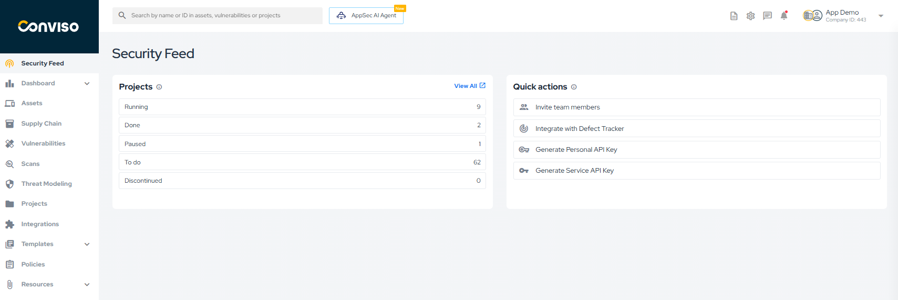
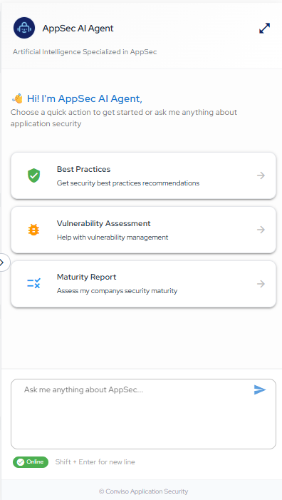

## Introduction

Conviso Platform offers a complete solution for application security management, including the **AppSec AI Agent**, an artificial intelligence assistant specialized in vulnerability analysis and remediation.

## Usage
The **AppSec AI Agent** is available at the top of the Conviso Platform interface, identified by the highlighted icon next to the search field:

1. Log in to Conviso Platform;
2. Locate the **"AppSec AI Agent"** button in the upper header;
3. Click the button to open the AI assistant.

The AI assistant will open on the right side of the browser, allowing interaction with Conviso Platform. For better visualization, you can expand the panel by clicking the button with two arrows located in the upper right corner.
To hide the AI assistant, simply click the **"AppSec AI Agent"** button again.

## Where is the AppSec AI Agent available?

The **AppSec AI Agent** is an intelligent tool designed to optimize application security at different stages of the development lifecycle.

In addition to automated vulnerability detection, the **AppSec AI Agent** can also be used to analyze **false positives**, allowing the configuration of specific policies for different types of issues.

The solution also offers advanced features that assist in correcting identified **vulnerabilities**, making the remediation process faster and more efficient.

Another new feature is that **Threat Modeling** can now be performed directly with the **AppSec AI Agent**, integrating proactive security into the development workflow.

Check out and try our new features available with the **AppSec AI Agent**.

**Enhance your development lifecycle's security with the Conviso Platform. Join us today and foster a security-first culture!**

## Support

Should you have any questions or require assistance while using the Conviso Platform, feel free to reach out to our dedicated support team.

## Resources

By exploring our comprehensive content, you’ll discover resources that will enhance your understanding of AppSec.

[Conviso Blog](https://bit.ly/3JtXM8A): Access a wealth of informative videos covering various topics related to AppSec. Please note that the content is primarily in Portuguese.

[Conviso's YouTube Channel](https://bit.ly/3NIbbfM): Engage with our informative podcast, where we discuss AppSec-related subjects, providing valuable insights and discussions. The podcast is conducted in Portuguese.

[AppSec to Go - Conviso's Podcast on AppSec](https://spoti.fi/43UJQwN): Explore our blog, which offers a collection of articles and posts covering a wide range of AppSec topics. The content on the blog is primarily written in English.

