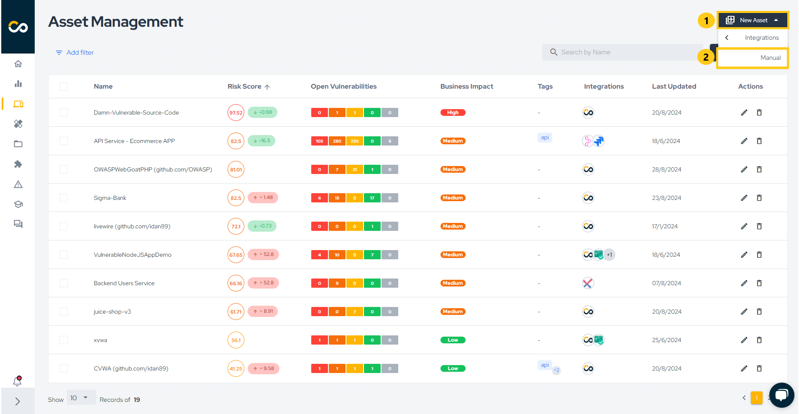
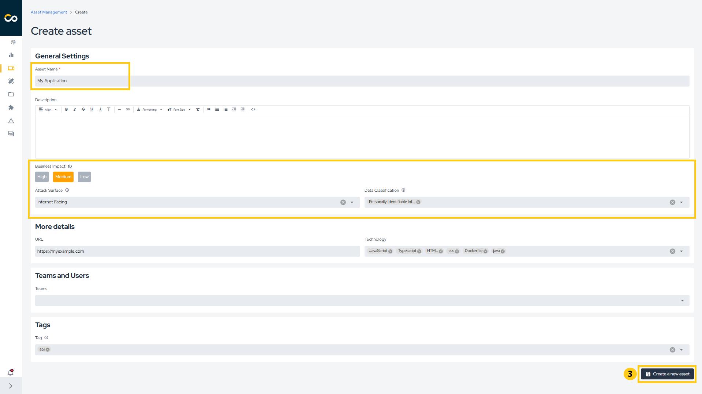
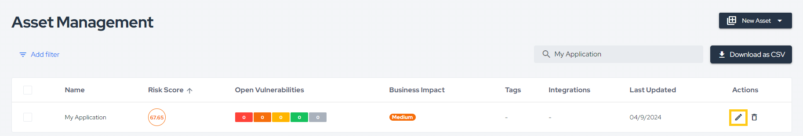
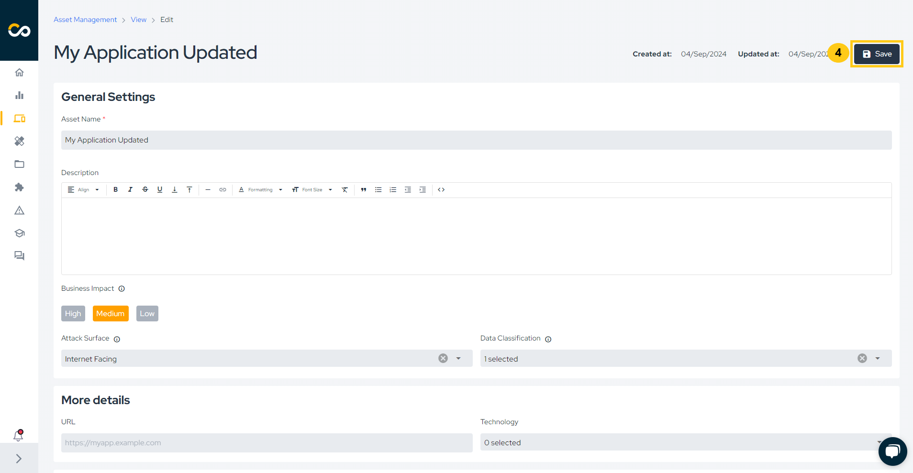
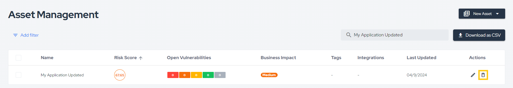
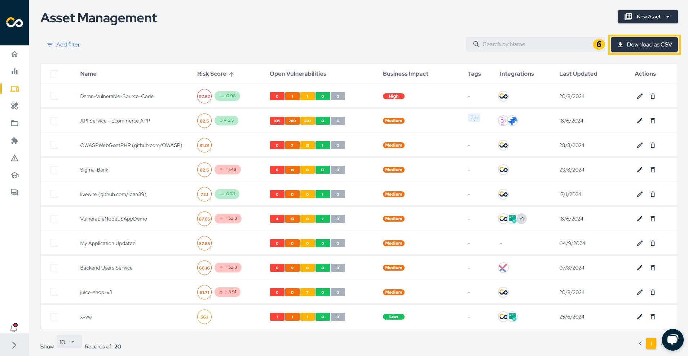
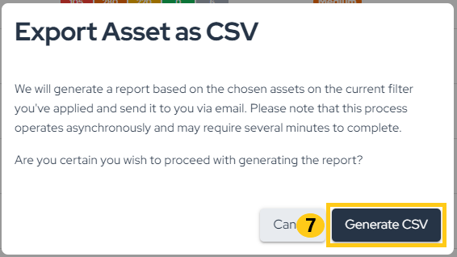

## Introduction

By utilizing Asset Management, you gain control and visibility over all assets through a centralized repository. This allows you to correlate vulnerabilities, define priorities, and increase agility in the process.

## Usage
In the left menu, click on **Assets** to access the centralized dashboard of all your assets:

This page displays an overview of registered assets, with the following information:

- **Risk Score**: A holistic view of an asset's risk based on factors such as open vulnerabilities, attack surface, business impact, and data classification.
- **Open Vulnerabilities**: Refers to the vulnerabilities identified in projects related to the asset.
- **Business Impact**: Indicates how critical or relevant the asset is for the business.
- **Integrations**: Integrations performed with the asset.
- **Teams**: Teams that have access to the asset.
- **Last Updated**: Referring to the last time the asset was updated.
- **Actions**: Available actions for managing individual assets, such as editing asset details or deleting an asset.

The list is sorted by Risk Score by default, but you can also sort by Id, Name, Business Impact, and Last Updated. To do this, click on the icon that appears when you hover over one of the column headers:

You already have some filters to quickly filter assets if needed, such as: Last Updated, Source, Technologies, Teams, and Compromised Environment. But if you need to find something more specific, no problem. Use our intuitive filters to search by Business Impact, Attack Surface, Data Classification, Risk Parametrization, DAST Configuration, Covered by Scans, Created At, and Tags.

> ⚠️ **Important:** Tags will be automatically deleted from the system when they are no longer associated with any asset.

### Creating Assets

You can create assets in different ways:
1. By running the Conviso AST [click here](../security-scans/conviso-ast/conviso-ast.md);
2. Through integration with external scanners [click here](../integrations/integrations_intro.md);
3. Manually through the Conviso Platform.

To manually create an asset through the platform, click on **New Asset (1)** and then **Manual (2)**:

An asset can be an application of your company, so let's call it **"My Application" (1)**. Then, fill in the fields "Business Impact" (which indicates the asset's impact on your business), "Data Classification" (which indicates the sensitivity of the data), and "Attack Surface" (which indicates whether the application is exposed to the internet or not) **(2)**. Finally, click **Create a new asset (3)**:

### Editing Assets

To edit an asset, locate it in the list, click on the three dots, and select the **Update** option (pencil icon), as highlighted below:

Now, make the necessary changes to the information and click **Save asset**:

### Removing Assets

To delete an asset, locate it in the list, click on the three dots, and select the **Delete** option (trash can icon), as highlighted below:

Next, type `DELETE` (1) and confirm the removal by clicking **Confirm** (2):

### Export Asset Information

To export asset information, you can generate a CSV through the platform or retrieve it via API. To generate the CSV, click on the **Export** and **Generate CSV** buttons. Once complete, the file will be sent via email and will be available for download for X minutes

**Enhance your development lifecycle's security with the Conviso Platform. Join us today and foster a security-first culture!**

## Support

Should you have any questions or require assistance while using the Conviso Platform, feel free to reach out to our dedicated support team.
