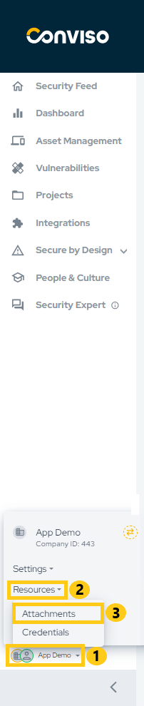
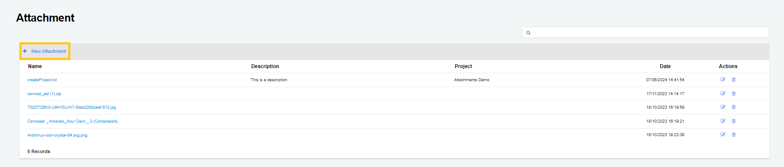
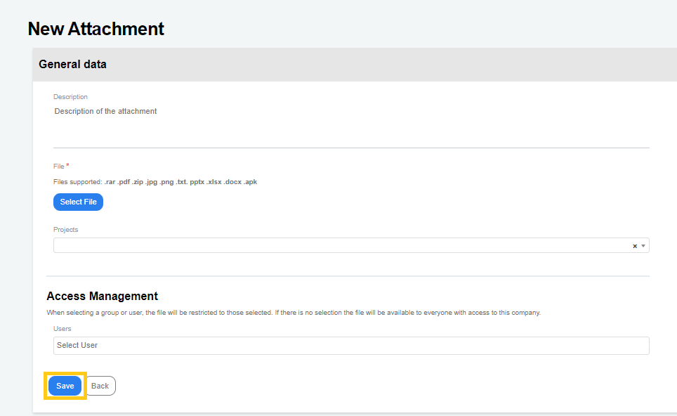

## Introduction

Manage attached files in Conviso Platform. This feature allows you to securely share files with Conviso's Security Experts, ensuring a safe way to grant access to sensitive information that needs to be shared, such as application source code and vulnerability reports, for example.
This ensures control over who should have access to this critical information.

## Creating Attachments
To register an attachment, in the main left menu, click on **your company's name (1)**, **Resources (2)** and **Attachments (3)**:

Next, click on **New Attachment** to start setting up your file attachment:

Fill the form with proper data:
- Description: A brief description of your file attachment (optional);
- File: use the **Select File** button to browse for your attachment file. This field is mandatory;
- Projects: To share the file attachment you are creating with any project, select the project or projects you want by clicking on the drop-down list;

The **Access Management** section of the form allows you to restrict the file attachment access to one or more users, by selecting them by clicking on the drop-down list Users. When done, click on the **Save** button to store your attachment configuration settings:

**Enhance your development lifecycle's security with the Conviso Platform. Join us today and foster a security-first culture!**

## Support

Should you have any questions or require assistance while using the Conviso Platform, feel free to reach out to our dedicated support team.

## Resources

By exploring our comprehensive content, you’ll discover resources that will enhance your understanding of AppSec.

[Conviso Blog](https://bit.ly/3JtXM8A): Access a wealth of informative videos covering various topics related to AppSec. Please note that the content is primarily in Portuguese.

[Conviso's YouTube Channel](https://bit.ly/3NIbbfM): Engage with our informative podcast, where we discuss AppSec-related subjects, providing valuable insights and discussions. The podcast is conducted in Portuguese.

[AppSec to Go - Conviso's Podcast on AppSec](https://spoti.fi/43UJQwN): Explore our blog, which offers a collection of articles and posts covering a wide range of AppSec topics. The content on the blog is primarily written in English.

