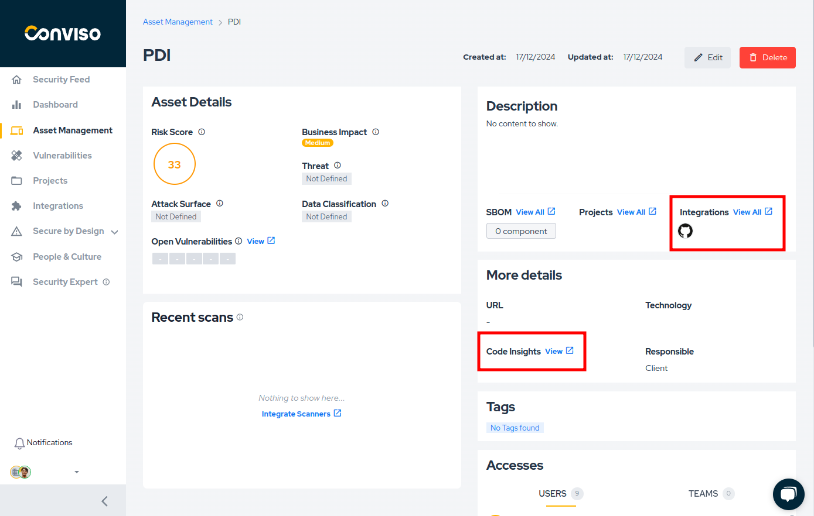
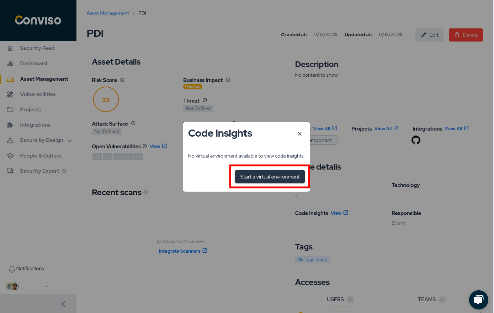
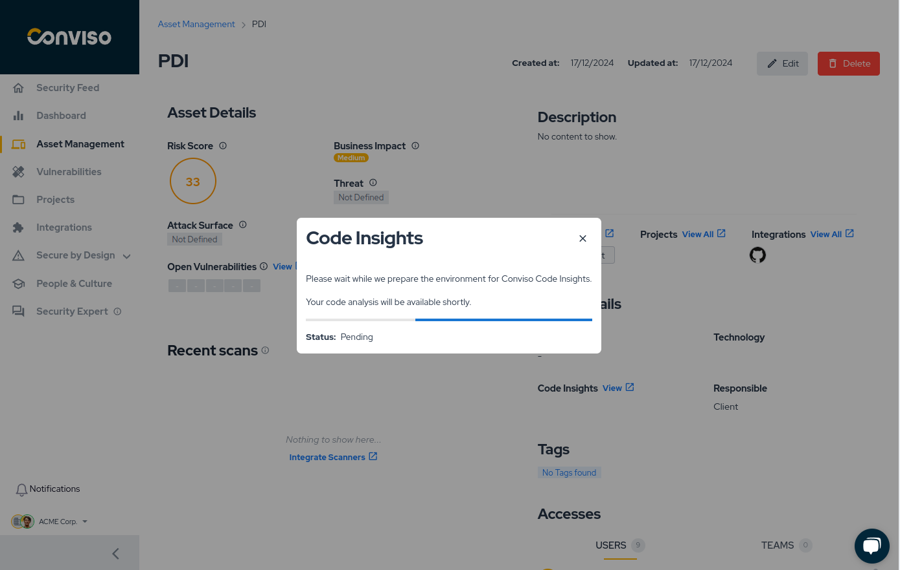
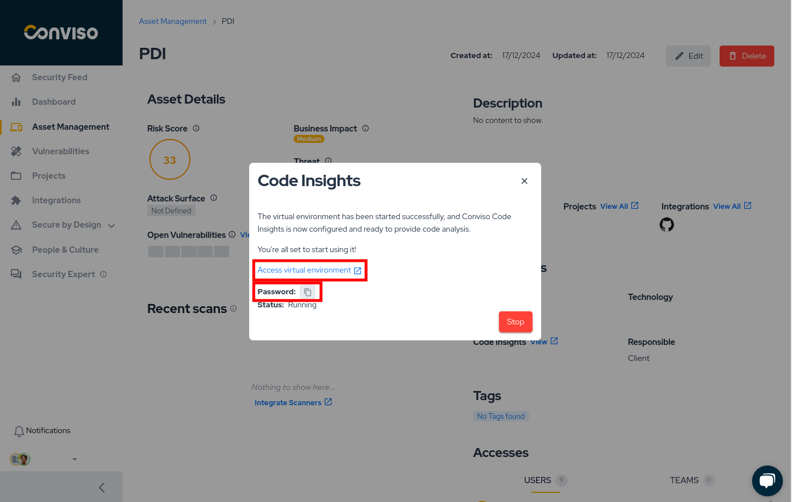
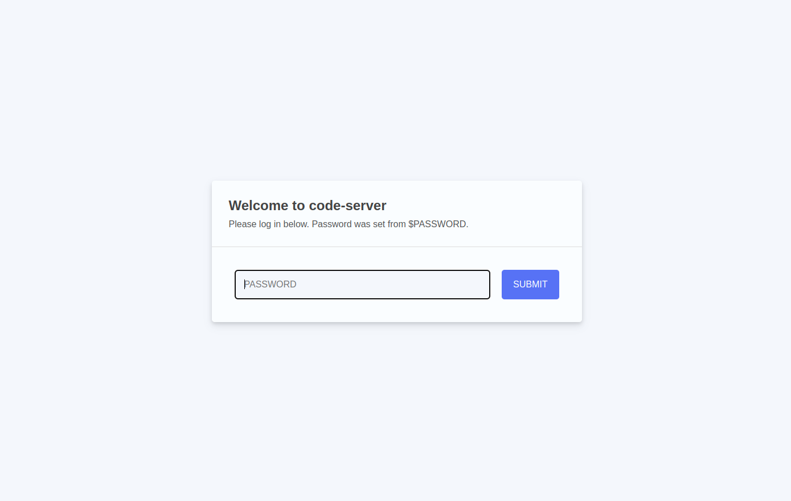
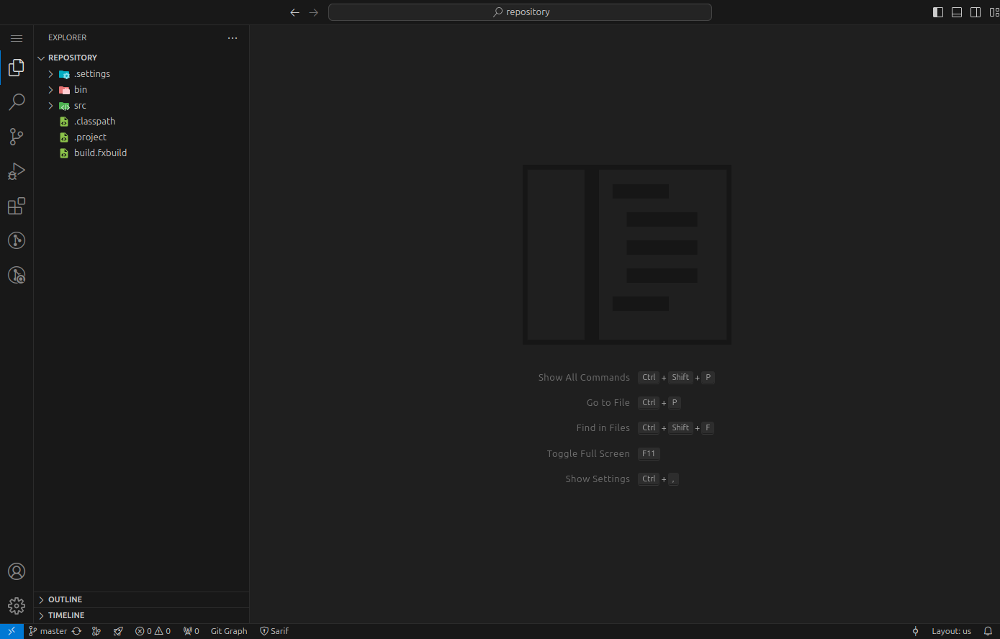

## Introduction

The **Code Insights** module in the Conviso Platform offers a powerful way to analyze your entire codebase, focusing on mapped assets in a secure virtual environment. This feature provides deep visibility into your code, identifying potential vulnerabilities, insecure coding practices, and areas for improvement. By leveraging Code Insights, you ensure that your application meets high security standards throughout its development lifecycle.

## Usage

The **Code Insights** module helps you maintain a secure codebase by providing:

- In-depth analysis of your codebase
- Detection of vulnerabilities and unsafe coding patterns
- Continuous monitoring to ensure ongoing code security

### Locate the Configured Asset

To access **Code Insights**, locate the configured asset, navigate to **More Details > Code Insights**, and click **View**.

After clicking **View**, a dialog box will appear where you can start the analysis by clicking **Start a virtual environment**:

Wait until the virtual environment is provisioned:

### Accessing Code Insights

Once the environment is ready, you will receive a **link** and **password** to access it:

After accessing the link, a new tab will open, displaying the following:

Enter the **password** provided in the previous dialog, and your repository will be fully accessible in the virtual environment:

## Support

If you have any questions or need assistance using our product, feel free to contact our support team.

**[Unlock the full potential of your Application Program with Conviso Platform integrations. Visit our Integration page now to get started.](https://bit.ly/3NzvomE)**
