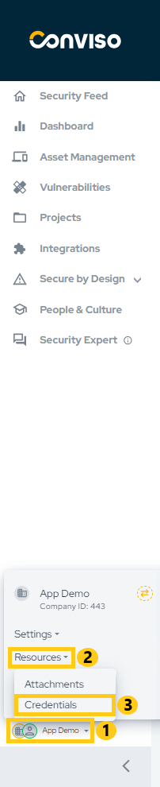
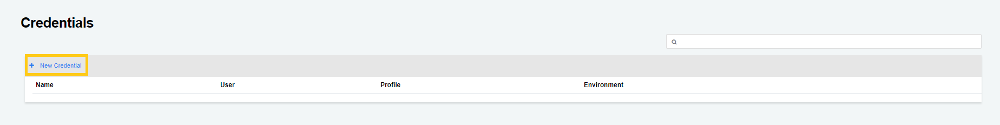
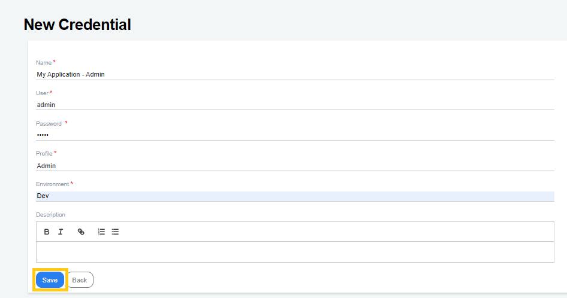
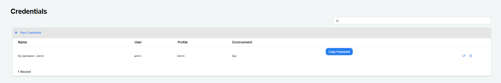
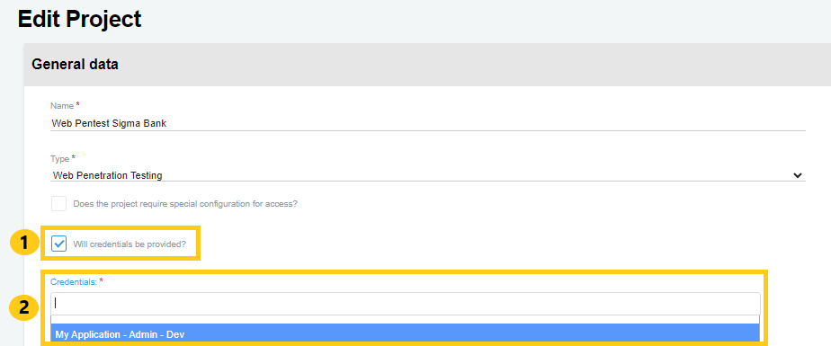

## Introduction

Conviso Platform has a complete workflow for vulnerability management, such as the process cycle to evaluate, remediate, and mitigate security weaknesses in systems or applications.

## Creating Credentials
To register a credential, in the main left menu, click on **your company's name (1)**, **Resources (2)** and **Credentials (3)**:

Next, click on **New Credential** to start creating your credential:

Fill in the mandatory form fields:
- Name: A label to identify your credential;
- User: The username you will use;
- Password: The username password;
- Profile: The user profile;
- Environment: The environment where this credential will be used;
If you wish to better describe you credential purposes, use the optional **Description** text box to set a brief description of your credential. When done filling the form, click on the **Save** button to store your new credential:

## Using credentials in Projects

To add an existing credential to a new or an existing project, create (or edit) a project.
In the project configuration form, check the option **Will credentials be provided? (1)**, and then select the credential filled in the previous steps in the **Credentials label (2)**, as shown in the image below. It is possible to fill in more than one credential in this text box:

**Enhance your development lifecycle's security with the Conviso Platform. Join us today and foster a security-first culture!**

## Support

Should you have any questions or require assistance while using the Conviso Platform, feel free to reach out to our dedicated support team.

## Resources

By exploring our comprehensive content, you’ll discover resources that will enhance your understanding of AppSec.

[Conviso Blog](https://bit.ly/3JtXM8A): Access a wealth of informative videos covering various topics related to AppSec. Please note that the content is primarily in Portuguese.

[Conviso's YouTube Channel](https://bit.ly/3NIbbfM): Engage with our informative podcast, where we discuss AppSec-related subjects, providing valuable insights and discussions. The podcast is conducted in Portuguese.

[AppSec to Go - Conviso's Podcast on AppSec](https://spoti.fi/43UJQwN): Explore our blog, which offers a collection of articles and posts covering a wide range of AppSec topics. The content on the blog is primarily written in English.

