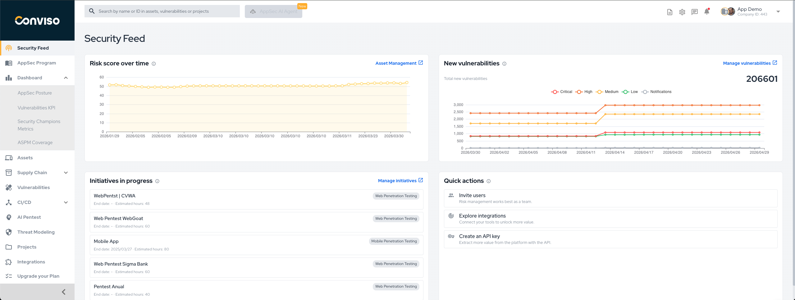
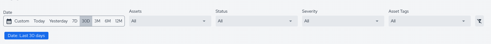

## Overview

The **Dashboard** area gives you access to visual metrics that help you monitor posture, vulnerability trends, developer engagement, and coverage.

## Usage
In the left menu, click on **Dashboard**:

## Available Dashboards

The platform currently provides four dashboard views:

1. [Risk and Posture Management](../posture-management/posture.md)
2. [Vulnerability KPI](../posture-management/vulnerability-kpi.md)
3. [Security Champions Metrics](../posture-management/security-champions-metrics.md)
4. [ASPM Coverage](../posture-management/aspm-coverage.md)

Use these pages when you need detailed guidance about what each dashboard shows and how to interpret the charts.

## Filters

By default, dashboards are filtered to show the last 30 days. You can refine the view using:

* date range;
* assets;
* vulnerability status;
* severity;
* asset tags.

These filters are applied across the selected dashboard and help you focus the analysis on a specific time window, asset group, severity range, or workflow state.

For vulnerability status definitions used in dashboard filters and charts, see [Workflow Status](../vulnerability-management/workflow-status.md).

## Support

Should you have any questions or require assistance while using the Conviso Platform, feel free to reach out to our dedicated support team.
