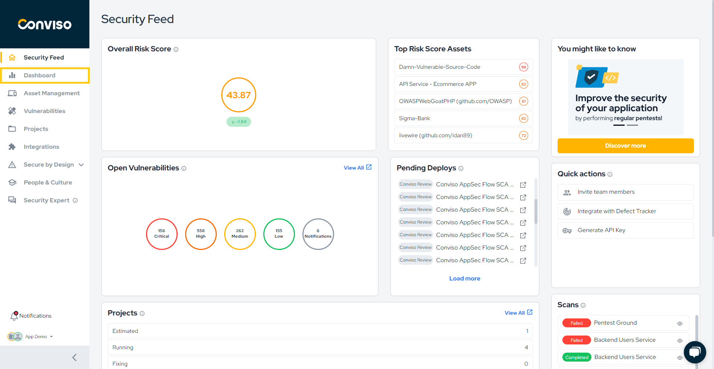
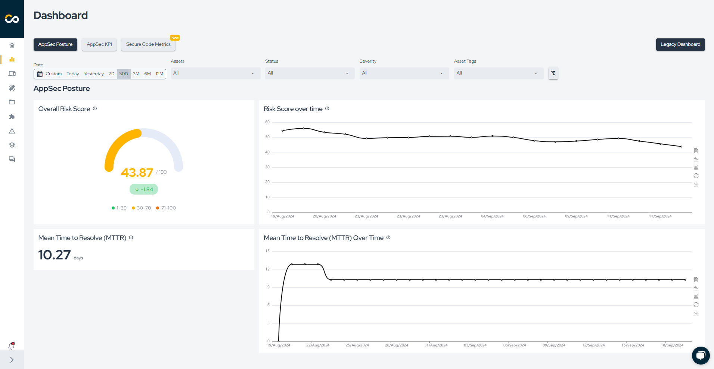
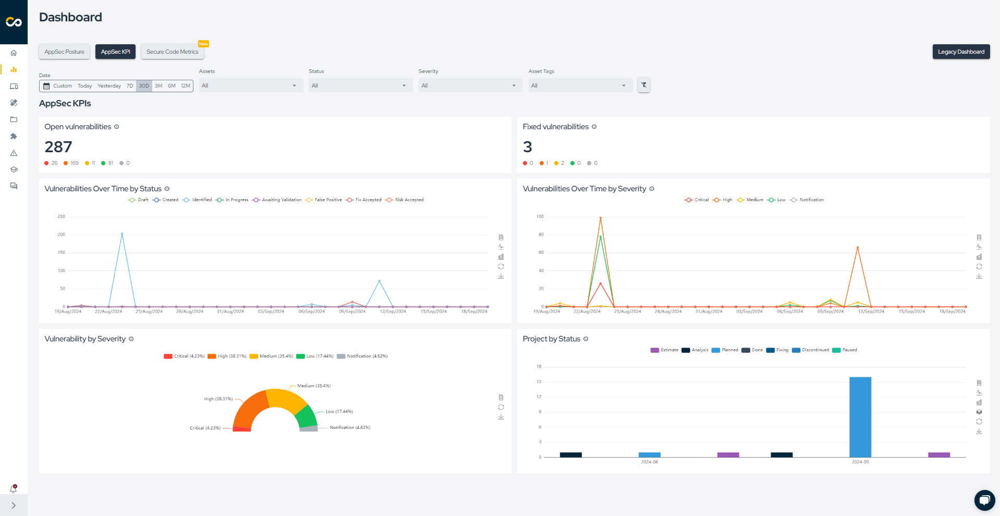
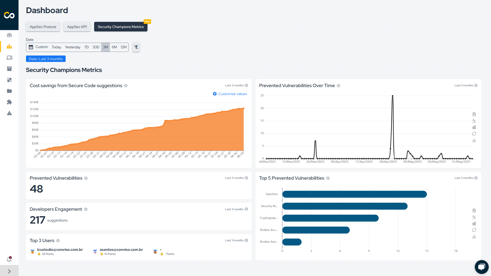
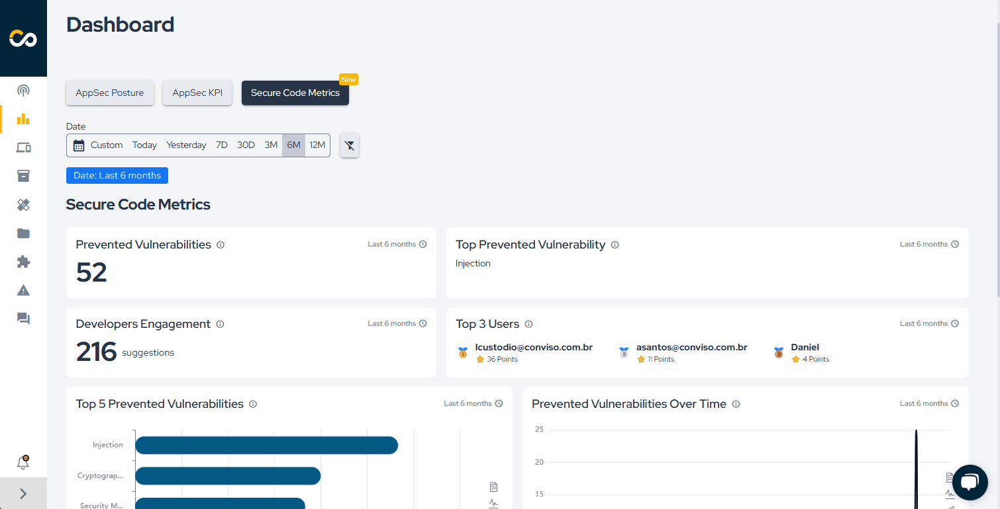

## Introduction

By utilizing the Dashboard, you gain control and visibility over all your company's metrics, with graphs that help you understand the evolution of your AppSec Posture and Metrics.

## Usage
In the left menu, click on **Dashboard**:

<div style={{textAlign: 'center'}}>



</div>

By default, the dashboards are filtered to show the last 30 days. You can change this to any date range you prefer. You can also filter the dashboard information by assets, vulnerability statuses, vulnerability severities and asset tags.

There are four different types of dashboards available:
1. AppSec Posture;
2. AppSec KPIs;
3. Security Champions Metrics.

## AppSec Posture

The AppSec Posture Dashboard presents four key metrics:
1. Overall Risk Score: The Overall Risk Score of your application;
2. Risk Score over time: See how your Risk Score has been changing over time;
3. Mean Time to Resolve (MTTR): Time taken to identify, diagnose, and resolve vulnerabilities affecting your asset;
4. Mean Time to Resolve (MTTR) Over Time: Time taken to identify, diagnose, and resolve vulnerabilities affecting your asset, displayed over a timeline.

<div style={{textAlign: 'center'}}>



</div>

## AppSec KPI

The AppSec KPIs Dashboard shows six key metrics:
1. Open vulnerabilities: Vulnerabilities with status of Identified, In Progress and Awaiting Validation;
2. Fixed vulnerabilities: Vulnerabilities with the current status at Fixed;
3. Vulnerabilities Over Time by Status: See how your application vulnerabilities change over time. This show all your existing vulnerabilities;
4. Vulnerabilities Over Time by Severity: See how your application vulnerabilities change over time. This shows all your existing vulnerabilities;
5. Vulnerability by Severity: Check how your vulnerabilities are distributed by its severity;
6. Project by status: Check your projects grouped by status.

<div style={{textAlign: 'center'}}>



</div>

## Security Champions Metrics

The Security Champions Metrics Dashboard presents six key metrics:
1. Cost savings from Secure Code suggestions: Estimated financial savings resulting from vulnerabilities that were prevented through Secure Code Mentor.
2. Prevented Vulnerabilities Over Time: Number of vulnerabilities prevented per day.
3. Prevented Vulnerabilities: Total vulnerabilities prevented based on suggestions provided by our Addon.
4. Developers Engagement: Total code improvement suggestions provided by Secure Code.
5. Top 3 Users: Developers who most frequently use plugin to request code security improvements.
6. Top 5 Prevented Vulnerabilities: Most frequently identified vulnerability types during the coding stage.

<div style={{textAlign: 'center'}}>



</div>

### Cost savings from Secure Code suggestions

This metric estimates the financial savings generated by preventing vulnerabilities before they are introduced into the codebase. The calculation is based on the following formula:

```
AVOIDED_COST = PREVENTED_VULNERABILITIES × HOURS_PER_VULNERABILITY × HOURLY_RATE
```

- PREVENTED_VULNERABILITIES: Estimated number of vulnerabilities that were avoided thanks to secure development practices.
- HOURS_PER_VULNERABILITY: Average time required to investigate, fix, and validate a vulnerability (e.g., 6 hours).
- HOURLY_RATE: Average cost per developer hour (e.g., USD 40).

Example: If 250 vulnerabilities were prevented, each requiring 6 hours to fix at USD 40/hour, then:

```
AVOIDED_COST = 250 × 6 × 40 = USD 60,000
```

This value represents the amount of money the organization saved by not having to fix vulnerabilities that were proactively prevented.

How this helps:

- Demonstrates the financial impact of secure development initiatives.
- Supports investment decisions in AppSec tooling, training, and process improvements.
- Helps communicate the value of prevention to stakeholders and leadership teams.
- Aids in prioritization of security efforts based on return on investment.

<div style={{textAlign:'center'}}>



</div>

**Enhance your development lifecycle's security with the Conviso Platform. Join us today and foster a security-first culture!**

## Support

Should you have any questions or require assistance while using the Conviso Platform, feel free to reach out to our dedicated support team.

## Resources

By exploring our comprehensive content, you’ll discover resources that will enhance your understanding of AppSec.

[Conviso Blog](https://bit.ly/3JtXM8A): Access a wealth of informative videos covering various topics related to AppSec. Please note that the content is primarily in Portuguese.

[Conviso's YouTube Channel](https://bit.ly/3NIbbfM): Engage with our informative podcast, where we discuss AppSec-related subjects, providing valuable insights and discussions. The podcast is conducted in Portuguese.

[AppSec to Go - Conviso's Podcast on AppSec](https://spoti.fi/43UJQwN): Explore our blog, which offers a collection of articles and posts covering a wide range of AppSec topics. The content on the blog is primarily written in English.

[](https://cta-service-cms2.hubspot.com/web-interactives/public/v1/track/redirect?encryptedPayload=AVxigLKtcWzoFbzpyImNNQsXC9S54LjJuklwM39zNd7hvSoR%2FVTX%2FXjNdqdcIIDaZwGiNwYii5hXwRR06puch8xINMyL3EXxTMuSG8Le9if9juV3u%2F%2BX%2FCKsCZN1tLpW39gGnNpiLedq%2BrrfmYxgh8G%2BTcRBEWaKasQ%3D&webInteractiveContentId=125788977029&portalId=5613826)