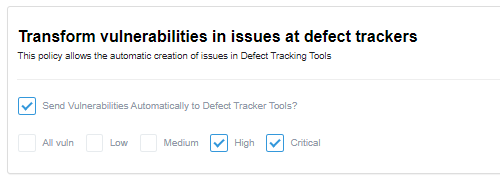

## Introduction

Manage policies to tailor your experience on the Conviso Platform, enabling features that enhance usability according to your needs.

## Usage
To manage your policies, in the main left menu, click on **your company's name (1)**, **Settings (2)** and **Policies (3)**:

The **Transform vulnerabilities in issues at defect trackers** policy allows you to automatically create issues in Defect Tracking Tools based on your vulnerabilities. You can configure this policy to apply only to **specific vulnerability severities** or all severities, selecting the **All vuln** checkbox:

The **Transform scans findings in vulnerabilities** policy allows you to automatically change the  status of vulnerabilities generated from scans to **Identified** instead of the default **Created** status. You can configure this policy to apply only to specific vulnerability severities or all severities, selecting the **All vuln** checkbox:

The **Transform SCA findings states** policy lets you adjust the initial status of SCA findings. By default, the initial status is **Identified**. However, by selecting this checkbox, the initial status will be set to **Created**.

**Enhance your development lifecycle's security with the Conviso Platform. Join us today and foster a security-first culture!**

## Support

Should you have any questions or require assistance while using the Conviso Platform, feel free to reach out to our dedicated support team.

## Resources

By exploring our comprehensive content, you’ll discover resources that will enhance your understanding of AppSec.

[Conviso Blog](https://bit.ly/3JtXM8A): Access a wealth of informative videos covering various topics related to AppSec. Please note that the content is primarily in Portuguese.

[Conviso's YouTube Channel](https://bit.ly/3NIbbfM): Engage with our informative podcast, where we discuss AppSec-related subjects, providing valuable insights and discussions. The podcast is conducted in Portuguese.

[AppSec to Go - Conviso's Podcast on AppSec](https://spoti.fi/43UJQwN): Explore our blog, which offers a collection of articles and posts covering a wide range of AppSec topics. The content on the blog is primarily written in English.

