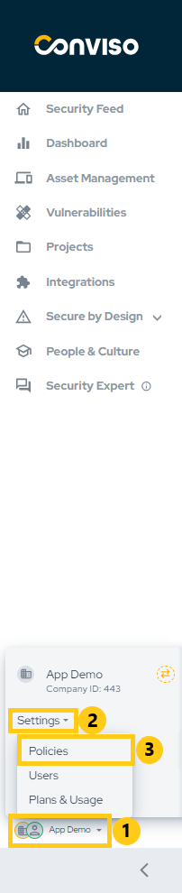
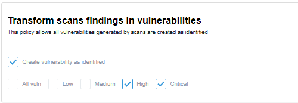

## Introduction

Manage policies to tailor your experience on the Conviso Platform, enabling features that enhance usability according to your needs.

## Usage
To manage your policies, in the main left menu, click on **Policies**:

The **Transform vulnerabilities into issues in defect trackers** policy allows you to automatically create issues in Defect Tracking Tools based on your vulnerabilities. You can configure this policy to apply only to **specific vulnerability severities** or all severities, selecting the **All vuln** checkbox:

The **Transform scans findings in vulnerabilities** policy allows you to automatically change the  status of vulnerabilities generated from scans to **Identified** instead of the default **Created** status. You can configure this policy to apply only to specific vulnerability severities or all severities, selecting the **All vuln** checkbox:

The **Transform SCA findings states** policy lets you adjust the initial status of SCA findings. By default, the initial status is **Created**. However, by selecting this checkbox, the initial status will be set to **Identified**.

The **Transform Container vulnerabilities states** policy lets you adjust the initial status of Container findings. By default, the initial status is **Created**. However, by selecting this checkbox, the initial status will be set to **Identified**.

The **False Positive Analysis Agent Policies** policy allows you to enable **False Positive Analysis** to analyze vulnerabilities with our AI agent, giving you the possibility to analyze issues with **Created** and/or **Identified** status.

**Enhance your development lifecycle's security with the Conviso Platform. Join us today and foster a security-first culture!**

## Support

Should you have any questions or require assistance while using the Conviso Platform, feel free to reach out to our dedicated support team.
