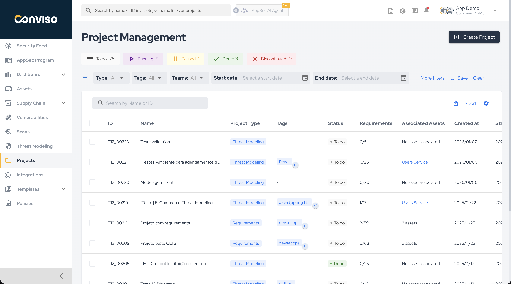

## Introduction

The **Projects** area allows you to create and manage security projects in a centralized way. Teams can use it to organize execution, track progress, coordinate users, and review project outputs such as vulnerabilities, requirements, and reports.

## Accessing Projects

To access the project dashboard, navigate to **Projects** in the left-hand menu:

## What You Can Do in This View

From the project list and project details view, you can:

* create, edit, and delete projects;
* filter projects by status and other criteria;
* track timeline and project progress;
* update project statuses;
* manage accesses, assigned users, assets, vulnerabilities, attachments, and requirements;
* generate technical reports for supported project types.

## Learn More

For the complete project management documentation, see:

* [Workflow Status](../project-management/workflow-status.md)
* [Process](../project-management/process.md)
