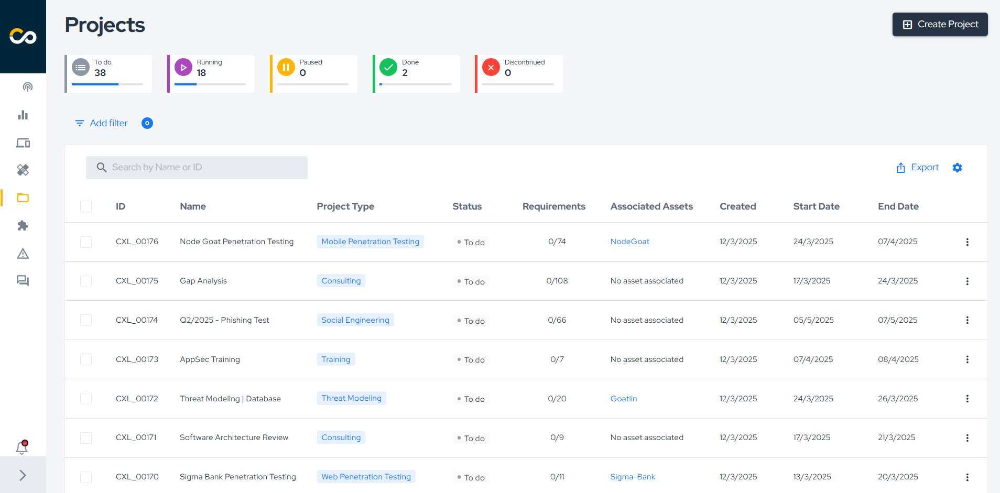
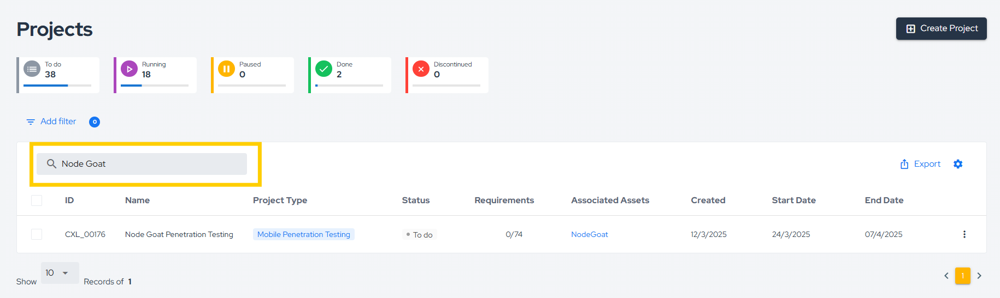
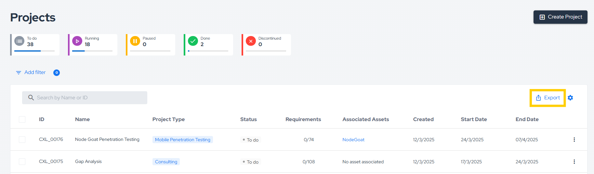
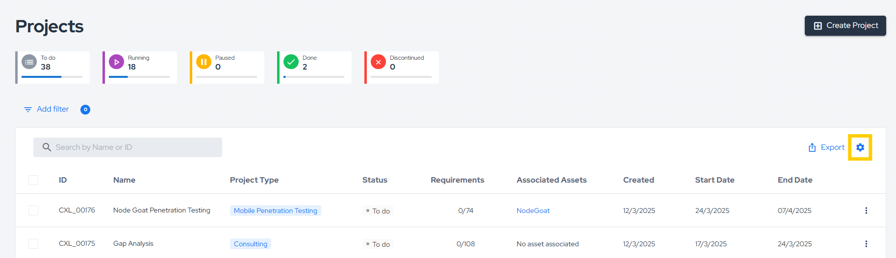
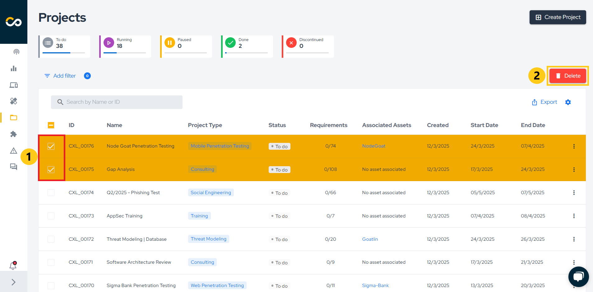
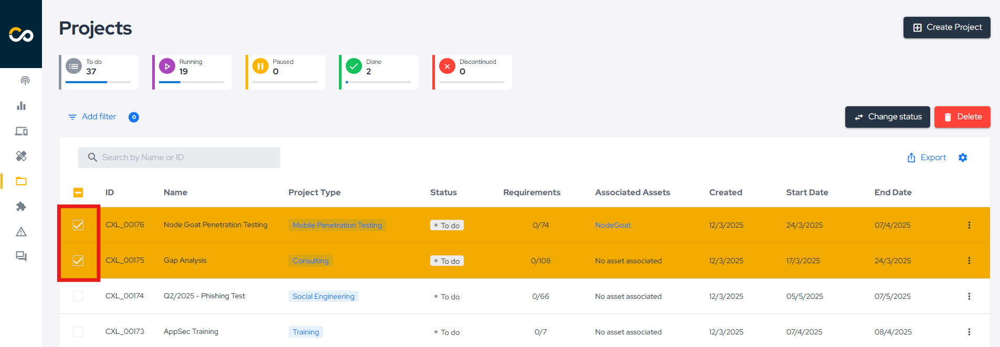
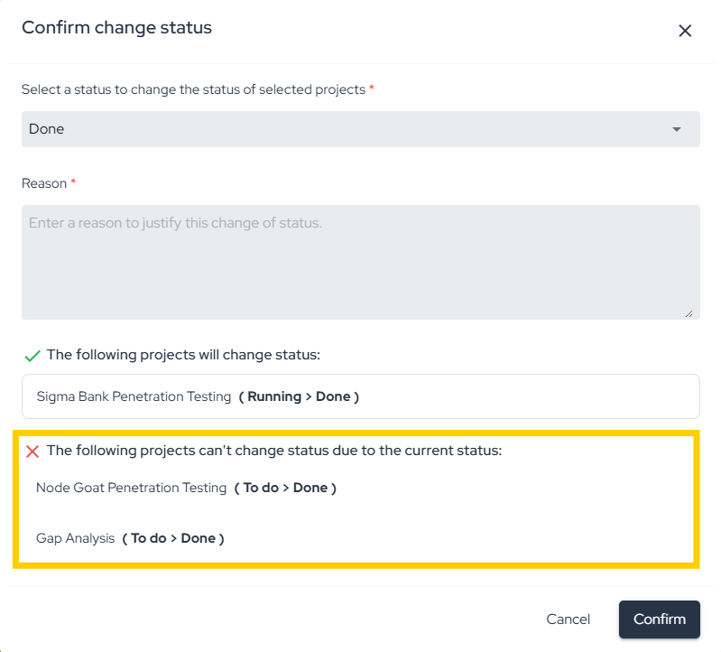
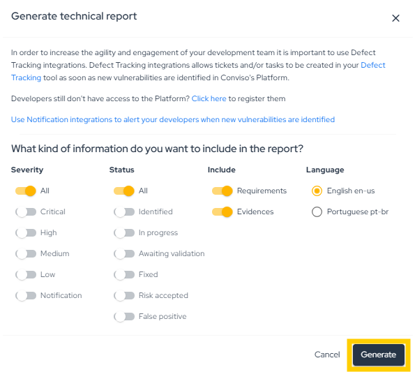
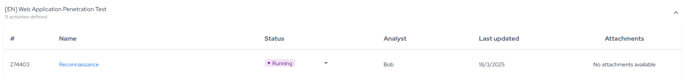

## Introduction

The **Projects** feature allows you to create and manage different types of security projects in a centralized way. You can consolidate the results of security analyses, such as code reviews, penetration testing, and requirement validation (Threat Modeling), all in one place.

## Usage
To access the project dashboard, navigate to **Projects** in the left-hand menu:

On this screen, you'll find an overview of your project statuses. You can quickly filter projects by status by clicking on the corresponding status name:

:::note
For more details on project statuses, please refer to [this guide](#projects-status).
:::

Additionally, you can filter projects by name or ID:

For more advanced filtering options, click **Add filter** to refine your search:

From this screen, you can export a CSV Report of your projects by clicking the **Export** button:

Furthermore, you can customize the project list by choosing which columns to display. To do this, click on the highlighted icon below and disable any columns you don't want to see:

### Creating New Projects

To create a new project, click **Create project**, fill in the required details, and then click **Create a new project**:

### Editing Projects

To edit an existing project, locate it in the list and click the corresponding edit button:

Next, update the necessary information and click **Save**.

### Deleting Projects

To delete one or multiple projects, locate them in the list and click on the highlighted buttons below:

### Details and Properties

After selecting a project, the default **Details** screen will be displayed. Here, you can review the project's properties or edit them by clicking the **Edit** button. You can also delete the project by clicking the **Delete** button:

#### Projects Status

You can update the project status by clicking on its current status and selecting a new one:

##### Bulk Status Change

To update the status of multiple projects at once, select the checkboxes of the projects you want to update, as shown in the image below:

Next, choose the new status, provide a reason, and click **Confirm**:

If any of the selected projects cannot be transitioned to the chosen status, a notification will be displayed:

##### Projects Status Meaning

Below is a list of project statuses and their meanings:

- To do: indicates that the project has not yet started
- Running: indicates that the project is in progress.
- Done: Indicates that the project has been completed and the objectives have been accomplished.
- Paused: indicates that the project has been temporarily suspended. This may be due to a change in priority, lack of resources, or any other reason.
- Discontinued: indicates that the project has been suspended.

##### Projects Status Mapping

The Conviso Platform allows the following status transitions for projects:

| Current Status    | Allowed Statuses                     |
|-------------------|--------------------------------------|
| To Do             | Running, Discontinued                |
| Running           | To Do, Paused, Discontinued, Done    |
| Paused            | Running, Discontinued                |
| Discontinued      | To Do, Running                       |
| Done              | Running                              |

#### Timeline

Monitor the entire progress of the project through the **Timeline** section. The history provides a complete record of each action taken within the project:

#### Accesses

In the **Accesses** section, it is possible to manage access by project, allowing the project manager or responsible team to invite new users to access it:

For more information, refer to the [User Mangement guide](./user-management).

#### Assigned Users

**Assigned Users** are those responsible for executing the project. To associate a user with the project, ensure they have the necessary access permissions:

#### Technical Report

The **Technical Report** feature allows you to generate a report for projects conducted within the platform.

Its purpose is to document the technical aspects of the project, highlight any detected security risks, and include relevant project information provided by the [assigned users](#assigned-users).

By clicking **Customize project report**, you can add an Executive Summary and Final Considerations according to your needs:

Once customization is complete, click **Save**:

To generate the Technical Report, click **Generate Technical Report**, fill in the required details, and click **Save**:

:::note
Only projects of the following types can have a Technical Report: Assessment, Code Review, Penetration Testing, Reverse Engineering, Social Engineering, and Vulnerability Retest.
:::

#### Assets

Projects represent a set of activities carried out over a specific period on one or more assets to achieve a defined objective. In this section, you can view the assets associated with the project:

#### Vulnerabilities

Certain types of projects lead to the identification and creation of vulnerabilities within the Conviso Platform. In this section, you can easily create a new vulnerability by clicking **New Vulnerability** or filter existing vulnerabilities within the project by clicking **View All**:

:::note
To add a new vulnerability using the **New Vulnerability** button, ensure that your user is assigned to the project (under Assigned Users) and that the project status is set to **Running**.
:::

#### Security Expert

The Security Expert feature allows users to easily contact Conviso specialists to ask questions and discuss project-related or vulnerability-related topics. In this section, you can view the most recent message sent in the project chat. Clicking on the message will redirect you to the corresponding chat:

If no chat has been created for the project yet, you will see a screen similar to the one below. In this case, simply click **Start Conversation** to initiate a new chat associated with the project:

#### Attachments

The Conviso Platform allows you to associate attachments with projects, enabling file sharing. In the section below, you can download the attachments linked to the project:

To add an attachment to the project, you can either [edit the project](#editing-projects) or do so from the [Attachments](./attachments.md#creating-attachments) page.

### Requirements

In the **Requirements** tab, you can create an action plan based on the tasks that need to be completed.
They are categorized by status according to their progress: **To do**, **Running**, **Not According**, **Not Applicable** and **Done**.

Each **Requirement** can have multiple activities, which must be completed (or dismissed) for the project to be finalized.

To view the tasks associated with each activity, simply click on its title:

To change an activity's status, click on its current status and select the desired one:

When updating an activity’s status to **Not according**, a reason and/or evidence must be added:

When updating an activity’s status to **Not applicable**, a reason must be provided:

When updating an activity’s status to **Done**, a reason and/or evidence must be added:

After an activity's status has been updated, you can see who made the change in the Analyst column, as well as the date of the update in the **Last updated** column.

If an activity is completed and has an attachment linked to it, you can download it by clicking the **Download icon** in the rightmost column:

**Enhance your development lifecycle's security with the Conviso Platform. Join us today and foster a security-first culture!**

## Support

Should you have any questions or require assistance while using the Conviso Platform, feel free to reach out to our dedicated support team.

## Resources

By exploring our comprehensive content, you’ll discover resources that will enhance your understanding of AppSec.

[Conviso Blog](https://bit.ly/3JtXM8A): Access a wealth of informative videos covering various topics related to AppSec. Please note that the content is primarily in Portuguese.

[Conviso's YouTube Channel](https://bit.ly/3NIbbfM): Engage with our informative podcast, where we discuss AppSec-related subjects, providing valuable insights and discussions. The podcast is conducted in Portuguese.

[AppSec to Go - Conviso's Podcast on AppSec](https://spoti.fi/43UJQwN): Explore our blog, which offers a collection of articles and posts covering a wide range of AppSec topics. The content on the blog is primarily written in English.

