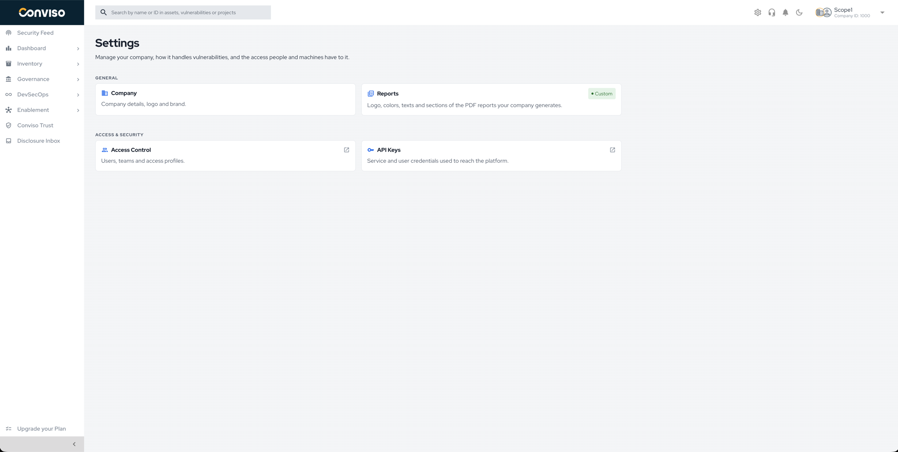
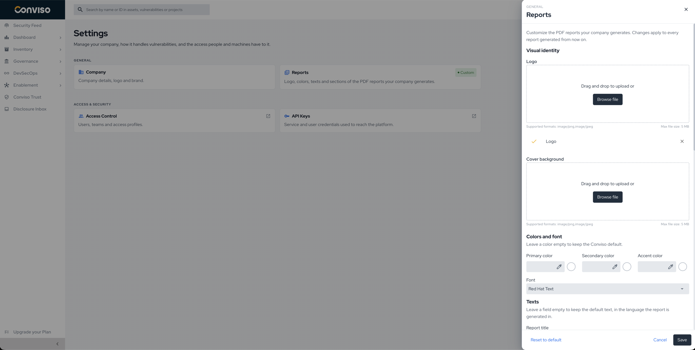
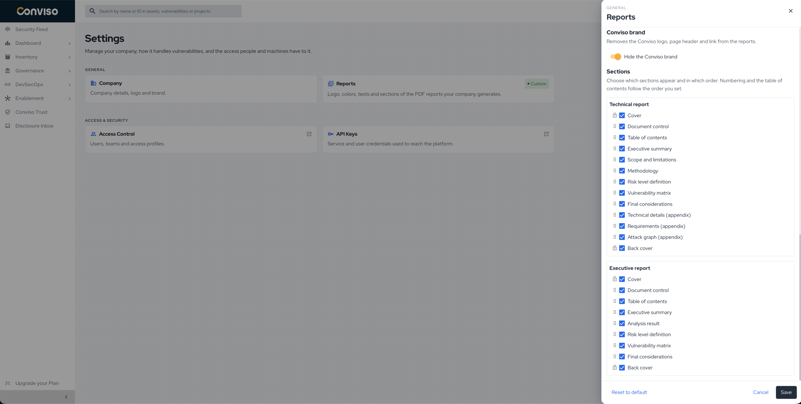

## Introduction

Report Customization lets you apply your company's identity to the PDF reports generated on the Conviso Platform. You can change:

* the logo and the cover background;
* the colors and the font;
* the report title, page header, page footer, confidentiality notice and back cover;
* which sections appear, and in which order;
* whether the Conviso brand appears.

The settings apply to **every report your company generates from the moment you save them**. Reports generated earlier are not changed.

## Prerequisites

* You must be an **administrator** of the company.
* Your company's plan must include **Report Customization**. If it does not, the **Reports** card does not appear in Settings. Contact your account manager to add it.

## Open the report settings

1. In the top bar, click the **Settings** icon.
2. Under **General**, click the **Reports** card.

The card shows **Default** while your company uses the Conviso layout, and **Custom** once any setting differs from it.

## Customize the reports

### Visual identity

1. In **Logo**, drag an image or click **Browse file**. The logo replaces the Conviso logo on the cover and on the back cover.
2. In **Cover background**, drag an image or click **Browse file**. The image fills the background of the cover.

Both accept **PNG** or **JPEG** files up to **5 MB**. To remove an image, click the **X** next to it.

### Colors and font

1. Enter the **Primary color**, **Secondary color** and **Accent color** in the `#RRGGBB` format, or pick them with the color picker.
2. Select a **Font**: Red Hat Text (default), Inter, Roboto, Open Sans, Lato, Montserrat, Source Sans 3 or Merriweather.

Leave a color empty to keep the Conviso default.

### Texts

Fill in the texts you want to replace. Leave a field empty to keep the default text, in the language the report is generated in.

| Field | Where it appears | Limit |
|---|---|---|
| **Report title** | Cover and document title | 120 characters |
| **Page header** | Top of each page | 120 characters |
| **Page footer** | Bottom of each page | 120 characters |
| **Confidentiality notice on the cover** | Bottom of the cover | 500 characters |
| **Back cover text** | Back cover | 500 characters |
| **Back cover link** | Back cover | Must start with `https://` |

### Conviso brand

Turn on **Hide the Conviso brand** to remove the Conviso logo, the Conviso page header and the Conviso link from the reports.

A small **Powered by Conviso** credit stays at the bottom right of every page.

### Sections

Choose which sections appear in the **Technical report** and in the **Executive report**, and in which order:

1. Clear the checkbox of a section to hide it.
2. Drag a section by its handle to change its position.

The numbering and the table of contents follow the order you set. **Cover** and **Back cover** always stay first and last; they can be hidden but not moved. Keep at least one section visible.

### Save

Click **Save**. The message **Report settings saved** confirms the change.

## Restore the Conviso defaults

1. Click **Reset to default**. The panel fills in every default value and removes the images.
2. Click **Save** to apply it.

The **Reports** card goes back to **Default**.

## Validation

Generate a report from a project. The PDF shows your logo, colors, font, texts and section order.

## Troubleshooting

| Problem | Cause | Solution |
|---|---|---|
| The **Reports** card does not appear | The plan does not include Report Customization | Contact your account manager |
| The card shows **You do not have permission to access this setting** | Your user is not an administrator of the company | Ask a company administrator |
| An image is refused | It is not PNG or JPEG, or it is larger than 5 MB | Use a PNG or JPEG file up to 5 MB |
| **Use an address starting with https://** under the back cover link | The link does not use `https` | Use an `https://` address |
| **Keep at least one section visible** | Every section of a report is hidden | Select at least one section |
| Reports went back to the Conviso layout | The plan no longer includes Report Customization | Your settings are kept and apply again once the plan includes it |

## Support

Should you have any questions or require assistance while using the Conviso Platform, feel free to reach out to our dedicated support team.
