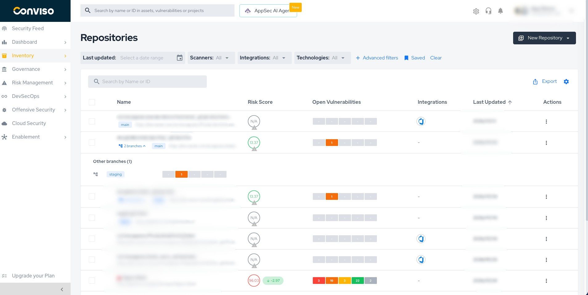
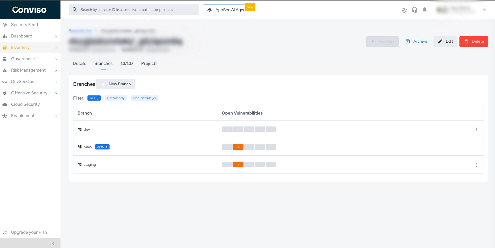
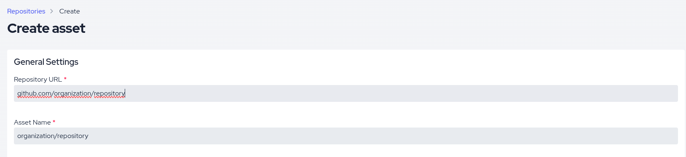
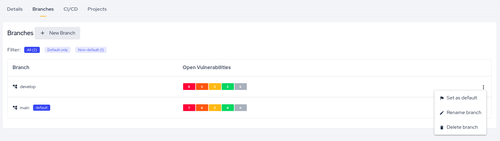
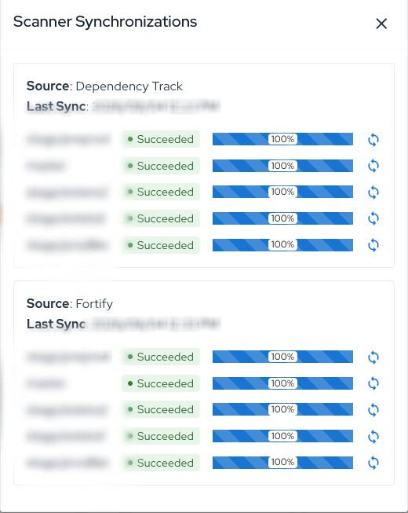
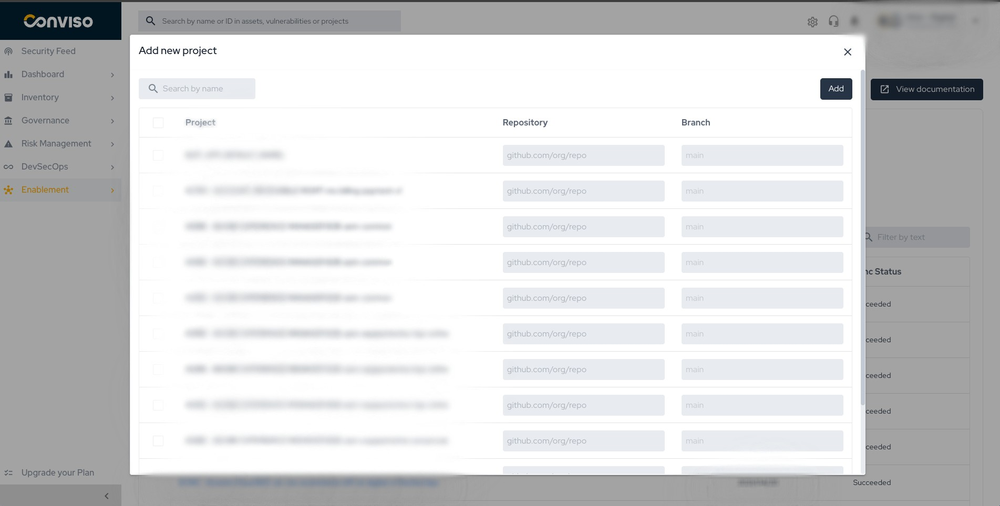
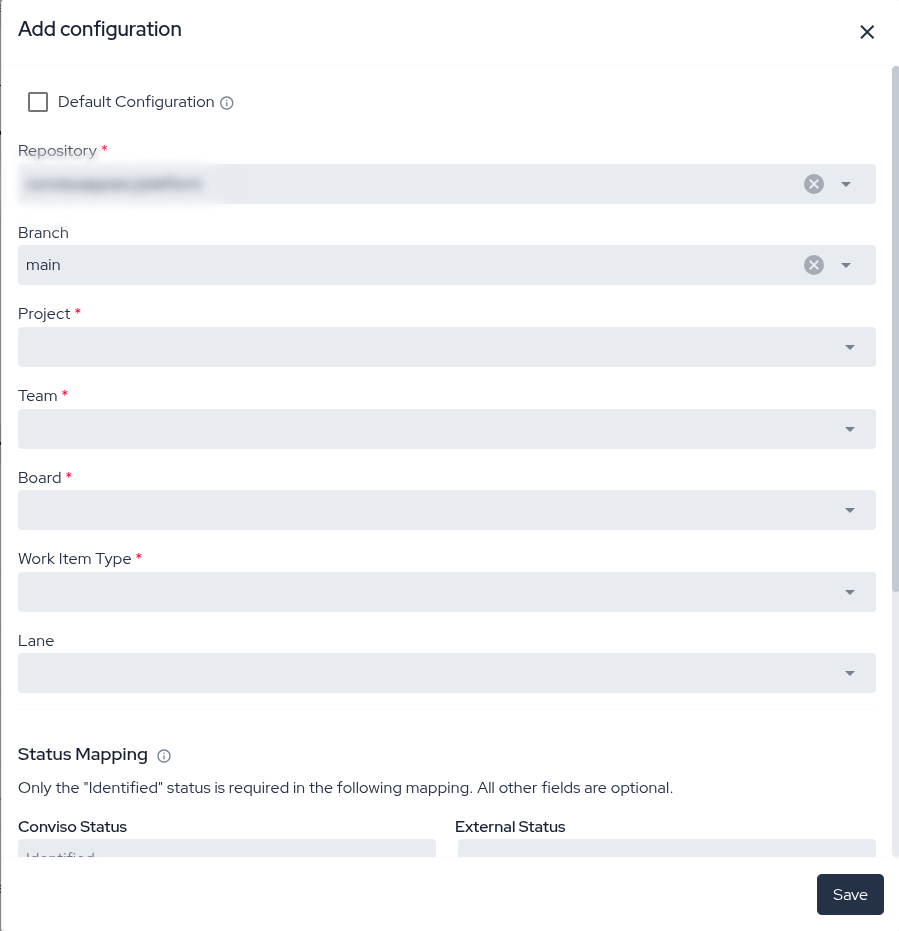

## Overview

In the **repository model**, one asset represents **one repository**, and every branch of that
repository is tracked **inside** it.

Previously, each branch of the same codebase was registered as a **separate asset**. Three
branches of the same service meant three assets, three risk scores and three independent
vulnerability lists, with no built-in way to tell that they were the same application.

With the repository model:

* **One asset = one repository**, registered with the address you use to clone it.
* **Every branch is listed inside the repository**, with its own open vulnerabilities.
* **Vulnerabilities and scans show which branch they came from.**
* **The repository's risk score reflects its default branch**, so the number you track is the
  risk of the code you actually ship.

:::note
Assets created before the repository model become repositories when your scans report a repository
address **and** a branch; anything left over is combined with the help of the Conviso team. See
[How Your Assets Become Repositories](#how-your-assets-become-repositories).
:::

## Do I Need to Do Anything?

There is **nothing for you to turn on**. The repository model does not have a setting in your
account, and no migration runs on your side. If **Repositories** is not listed under
**Inventory > Assets** yet, ask Conviso Support where your account stands.

What is worth doing is making sure your pipelines report what the model needs, and that the branch
the platform will measure is the branch you actually ship.

### Where you need to act

| Situation | What to do |
| --- | --- |
| Your pipeline does not report a **repository address and a branch** | Act now. Without both, nothing is consolidated and the branch is ignored — with no error to tell you |
| The same codebase is registered under two addresses — HTTPS and SSH, or a browser URL | Standardize on one address now: two addresses become two separate repositories |
| More than one asset carries the same repository address | Act now. With two or more candidates nothing is consolidated on its own, and the case has to go to the Conviso team |
| Your production branch is not the one marked as default | Adjust it before the first scan — see [Setting the Branch That Represents Production](#setting-the-branch-that-represents-production) |
| You report the risk score upward | Note the current numbers first: the score starts following the default branch alone |

### Does it break anything?

**What does not change:**

* The **id of the asset**. Ids of assets that became branches keep resolving permanently — in the
  interface, in the API and in your integrations.
* Your **findings**, with their status, comments, assignees and history.
* Your **defect-tracker links**, **bookmarks** and deep links.
* Your **pipelines and scanner integrations**, which keep reporting without being edited.

**What does change:**

* The **risk score** reflects the default branch alone, and the open-vulnerability counters no
  longer add up every branch.
* **Dashboards, exports and the Security Gate** follow the default branch. See
  [What Each Screen Shows](#what-each-screen-shows).
* Rows that used to be **separate assets collapse into a single repository row**.
* **Business Impact**, **Data Classification** and **Attack Surface** of the assets that were
  absorbed are dropped — review them on the repository afterwards.

## Before You Start

### What your pipeline has to report

Two values, and **both are required**: the **repository address** and the **branch**.

:::caution
A scan that reports the repository address without a branch — or a branch without the address — is
**ignored silently**. There is no error and no warning: the scan finishes, the findings land where
they always did, and nothing is consolidated.
:::

There is **no minimum version** enforced by the platform. What matters is capability, not version:
whatever reports your scans has to be able to send both values. If you use a Conviso task or
plugin in your pipeline, check that it is on a version that offers repository and branch fields.

The [GitHub Actions integration](../integrations/github-actions.md#repository-and-branch) fills
both in from the workflow context by default, and is a good reference for what the equivalent
fields look like elsewhere. For scanner integrations, each one asks for the repository and most
ask for a branch — see
[Importing projects from a scanner integration](#importing-projects-from-a-scanner-integration).

### The access you need

**No new permission is introduced.** The permissions you already use on assets cover branches:

| What you want to do | What you need |
| --- | --- |
| See a repository's branches | The same access that lets you see the asset |
| **Set as default**, **Rename branch**, **Delete branch**, **New Branch** | **Update** permission on Asset — and the asset must not be archived |
| Register a repository | **Create** permission on Asset |
| Combine repositories, or split one back into separate assets | Conviso Support — this is not an action available in your account |

### Checking that it worked

After the first pipeline run:

1. The repository is listed under **Inventory > Assets > Repositories**.
2. The **Git URL** on the **Details** tab is filled in, and does not read **Not Defined**.
3. The chip under the repository name shows the branch you consider production.
4. The branch your pipeline reported appears on the **Branches** tab. If it does not, the scan
   most likely reported the address without the branch.
5. With the **Branch** column enabled on the vulnerability list, new findings show the branch they
   came from.

## Finding Your Repositories

You will find the list under **Inventory > Assets > Repositories** in the left menu, alongside
**Cloud**, **FQDN** and **API**. Each row is one repository, and can hold branches.

Each row displays:

* The **repository name**, with the **default branch** shown as a chip below it, and the
  repository's **Git URL** when one is recorded.
* The **risk score**, **open vulnerabilities**, **business impact**, **scanners**,
  **integrations**, **teams** and **last updated** columns you already know. **Tags** is
  available too, hidden by default — turn it on in the table's column settings.
* A **`N branches`** badge when the repository has more than one branch. The count includes the
  default branch.

:::caution
The **risk score** and **open vulnerabilities** on the row are those of the repository's **default
branch**, not the sum of all its branches — the other columns describe the repository as a whole.

This is why a repository row can show 12 open vulnerabilities while the Vulnerabilities list
filtered by that repository returns 30: the other 18 are on non-default branches, fully visible
but not part of the headline number. See [What Each Screen Shows](#what-each-screen-shows).
:::

### Seeing a repository's branches

Click the **`N branches`** badge to expand the row and see the repository's **other** branches —
the default branch is not repeated in the expansion. Each branch shows its name and its **open
vulnerabilities**, broken down by severity.

The expansion is read-only, and clicking anywhere else on the row opens the repository as usual.

### Filtering by branch

Open **Advanced filters** above the list. There are two branch filters and they do different
things:

* On the **Basic** tab, the **Branch** field does **not** change which repositories are listed.
  It filters the branches you see when you **expand** a row: type `release` and each expanded
  repository shows only its branches whose name contains `release`. Upper and lower case are
  ignored here.
* On the **Advanced** tab, add a rule on **Branch** to narrow the **list itself** — only
  repositories that have a branch matching the rule are returned. Use `contains` to match part of
  a name, or `is` / `is not` to match it exactly, and combine the rule with the other asset
  filters. This match is case-sensitive.

## Inside a Repository

Opening a repository shows the same detail page you already use, with repository-specific
information added. The header displays the repository name and its creation and update dates, and
the page is organized into tabs:

| Tab | Content |
| --- | --- |
| **Details** | Risk score, risk parameters, open vulnerabilities, a **Details** card (integrations, scanners, technology, SBOM and the repository's Git URL), tags, description, developers and accesses |
| **Branches** | The repository's branches and the actions available on them |
| **CI/CD** | Scan configuration and recent scans |
| **Projects** | Projects linked to the repository |

:::note
The **Branches** tab is shown for repositories only. An asset that has not become a repository yet
keeps the Details, CI/CD and Projects tabs.
:::

The repository's **Git URL** appears on the **Details** tab, inside the **Details** card, as a
link that opens the repository in a new tab. When no URL is recorded the field shows
**Not Defined**.

The **risk score** and the **open vulnerabilities** on the Details tab are those of the
repository's **default branch** — the same numbers shown on the default branch's row in the
**Branches** tab. **Manage your vulnerabilities** opens the vulnerability list already filtered by
the default branch, so the two views agree.

### The Branches tab

The **Branches** tab lists every branch of the repository with:

* **Branch** — the branch name, with a `default` pill on the default branch.
* **Open Vulnerabilities** — the open findings of that branch, broken down by severity.
* **Actions** — the actions available for the branch.

Use the **All / Default only / Non-default** filters above the table to narrow the list.

Branches appear on their own the first time something reports them, so the tab fills up as your
pipelines run. **New Branch**, next to the table title, is there for when you want to track a
branch before anything has reported it.

:::note
Branch names are **case-sensitive**, exactly as in Git: `main` and `Main` are two different
branches. Adding a branch that is already listed does not duplicate it.
:::

## Registering a Repository

When you create a repository, the form asks for the **Repository URL** — the address you use to
clone it, for example `https://github.com/org/repo`. The field is **required**.

The `https://` is optional — `github.com/org/repo` is accepted and read as an `https` address. What
the field does need is the host, the organization and the repository: `github.com/org`, with the
repository missing, is rejected as an invalid URL.

The **Asset Name** is suggested automatically from the URL as `org/repo`. The field is required —
the suggestion simply fills it in for you, and you can replace it with any name you prefer.
Repository names do not have to be unique in your account.

:::danger Use the clone URL, not your browser's address bar
The address in your browser usually carries extra segments — `.../tree/main`, `.../-/tree/main`,
`.../pull/42`, `.../blob/main/README.md`. An address like that registers a **separate entry** that
your scans will never reach: it stays at risk score 0 with no findings, while your real results go
somewhere else.

The quickest tell is the **Asset Name** the form suggests while you type: for a correct URL it
reads `org/repo`. If it reads something like `tree/main`, you pasted a browser URL.
:::

Pick one address per repository and use it everywhere — when you create the asset, when you import
projects from a scanner and when you configure a defect tracker. Some Git servers publish an HTTPS
address and an SSH address that do not look alike, Azure DevOps being the common case; registering
both leaves you with two separate entries for the same codebase.

:::caution
If the Repository URL you entered already belongs to a repository in your account, the repository
is **not** created — the form fails to save and nothing is stored. The screen reports a generic
save error, so if you see one right after entering a Repository URL, the most likely cause is that
the repository is already registered. Search the Repositories list for its name or its Git URL and
open the existing entry.
:::

The **Asset Name** field is always shown, for repositories and for older assets alike. The
**Repository URL** field appears when you edit any asset, including older assets that do not have
one yet.

When editing, the Repository URL can be updated: the repository then follows the new address, and
future scans are matched to it. If that URL already belongs to another repository in your account,
the change is refused and nothing is saved.

## Setting the Branch That Represents Production

The repository's risk score follows its **default branch**, so the default branch should be the
branch you actually ship.

A repository you create by hand starts with a single branch named `main`. If your production
branch has another name, adjust it before or right after the first scan:

| Situation | What to do |
| --- | --- |
| Nothing has been scanned yet and only `main` is listed | **Rename** it to your real branch name, so your scans report to that branch instead of creating a second one |
| Your real branch is already listed because a scan reported it | Open its actions menu and choose **Set as default** |

### Setting the default branch

Select **Set as default** in a branch's actions menu, then provide a **reason** — the field is
required.

:::caution
Changing the default branch **recalculates the repository's risk score**, because the repository's
risk always follows the default branch. The change raises a notification of its own, so whoever
follows the repository sees why the number moved — default-branch changes made by Conviso while
consolidating an account are not notified.

The open-vulnerability counters switch immediately; the recalculated score appears on the Details
tab a few minutes later, so do not repeat the change if the number has not moved yet.

A default-branch change can move the score **without your security posture having changed** — you
changed *which code* is being measured. Take note of the score before the change if you report it
upward.
:::

If you need the history of default-branch changes for a repository, ask Conviso Support.

### Renaming a branch

Select **Rename branch** to change a branch's name. Renaming does not move any finding, does not
change which branch is the default, and does not change the risk score.

A branch can only be renamed while nothing has been recorded on it — once a pipeline has reported
to it, scanners rely on the name to reach the right branch, and the option is no longer offered in
its actions menu. The branch the platform starts you with is the exception: you can always rename
it to your real branch name.

### Deleting a branch

Select **Delete branch** and confirm.

:::danger
Deleting a branch also deletes the **vulnerabilities, the scans and the scan history that belong
to that branch** — including a scan still running on it, which is cancelled.

The effect goes beyond the branch: those findings disappear from the vulnerability list, from the
exports and retroactively from the dashboard charts. This cannot be undone from your account.

Use it to remove branches that no longer exist in your repository, not to tidy up the list view.
The **default branch cannot be deleted** — set another branch as default first.
:::

## Vulnerabilities by Branch

### Which branch a finding appears on

Findings appear under the branch your scan reported, whether they came from Conviso AST, a
CI/CD pipeline, a scanner integration or a file upload. A branch that is not listed yet appears
the first time it is reported.

The same issue detected on `main` and on `release/2.0` is tracked as **two findings**, one per
branch, so each branch keeps its own list, its own status and its own history. A finding stays on
its branch: fixing it on a feature branch closes it there, and the one on the default branch
closes when the default branch is scanned after the merge.

Findings on assets that are not repositories — cloud, domain or API assets — have no branch.

### The Branch column

The vulnerability list has a **Branch** column, placed right after **Asset**. The column is
**hidden by default** — enable it in the table's column settings.

A dash appears when the finding has no branch: assets that are not repositories, and assets that
have not been consolidated into a repository yet.

### Filtering by branch

Open the vulnerability filters and use the **branch** field to filter findings by branch name. The
filter is global: it works across all repositories, so a branch name that exists in several
repositories returns the findings of all of them.

The name must match **exactly**: the match is case-sensitive (`Main` is not `main`), it matches
the whole name (`release` does not match `release/2.0`), it takes one name at a time, and a name
that matches no branch returns an **empty list** rather than the unfiltered one.

### Branch on the vulnerability detail

On a vulnerability's detail page, the **Affected Assets** card shows the branch next to the asset,
so the origin of the finding is visible without going back to the list.

### Reporting a vulnerability manually

A vulnerability you create by hand is recorded on the repository's **default branch**, so it counts
towards the repository's risk score like any other finding.

Where the form offers a **Branch** field, you can point the finding at another branch instead. The
field is enabled once an asset is selected, lists that asset's branches, and comes already filled
in with the default branch — change it only when the finding is on another one.

## What Each Screen Shows

The same repository can legitimately show different vulnerability totals on different screens.
This table is the reference:

| Screen | What it shows |
| --- | --- |
| **Risk score** of a repository | The **default branch** |
| **Open vulnerabilities** column in the Repositories list | The default branch |
| **Open vulnerabilities** card on the repository's Details tab | The default branch |
| Counts in the **Branches** tab and in the expanded `N branches` row | That branch |
| **Repositories CSV export** | The default branch |
| **SBOM** inventory | The default branch |
| **Vulnerabilities** list, its counters and the vulnerabilities CSV export | **All branches**, unless you apply the branch filter |
| **Dashboards** and the reports exported from them | The default branch |
| **Security Gate** result | The repository's **default branch** |

:::info
The rule of thumb: the **Vulnerabilities list** is the one place that shows every branch at once —
everywhere else a repository is summarized by its **default branch**. Opening the list from the
repository's card applies the default-branch filter for you, so the list and the card agree; clear
the branch filter to see the other branches.
:::

Assets that are not repositories are unaffected: all of their open vulnerabilities keep counting,
exactly as before.

## Scanners and Defect Trackers

### Scanner sync status per branch

On a repository's **Details** tab, click **Show Syncs** next to **Scanners** to open the
**Scanner Synchronizations** panel. Each scanner appears as a single card listing **one row per
branch**, with that branch's status, its progress and a button to synchronize that branch on its
own.

The **Last Sync** date is shown once per scanner and is the most recent synchronization across the
repository's branches — it is not a date per branch. Scanners that report without a branch keep the
single card you already know.

### Importing projects from a scanner integration

When you import projects from a scanner integration, each project row gains a **Repository**
column where you enter the repository the project maps to, so imported findings land on the right
repository. This applies to Checkmarx, Snyk, SonarCloud, SonarQube, Fortify and Dependency Track;
Tenable is unchanged and does not ask for a repository.

Only **Snyk** reports the repository address itself, so there the column comes already filled in.
On the other scanners you type the repository URL by hand.

Branch selection depends on the scanner:

* **Checkmarx** and **Fortify** keep their existing multi-select, so you can still import several
  branches at once.
* **SonarCloud** and **SonarQube** now import **one branch per project**: the branch list becomes
  a single choice, and when the project reports no branches you type the branch name.
* **Snyk** and **Dependency Track** gain a **Branch** field where you pick or type the single
  branch to import. On Snyk, importing every project at once is no longer offered, since each
  project needs its own repository.

The branch you choose here is where that project's findings appear from then on.

### Defect trackers

The configuration form of **Jira V2**, **ServiceNow**,
**Azure Boards** and **Business Map** labels the asset field **Repository** and offers an optional
**Branch** field, so you can route a configuration to a single branch. **ClickUp** and the first
version of the Jira integration do not offer it yet.

Leaving the Branch field empty keeps the configuration at repository level: it applies to every
branch that does not have a configuration of its own. You can keep a repository-level
configuration and add branch-specific ones alongside it — a finding on a branch that has its own
configuration goes there, and everything else uses the repository-level one.

## How Your Assets Become Repositories

Accounts that used the platform before the repository model have assets representing individual
branches. They become repositories two ways.

### When a scan reports a repository and a branch

An asset is turned into a repository on its own when a scan — or a call to the API that creates or
updates it — reports a **repository address together with a branch**, and the match leaves no room
for doubt. All of the following have to hold:

* Both values are reported. **The branch is required**: an address without a branch, or a branch
  without an address, does nothing.
* **Exactly one** asset carries that repository address. With two or more candidates nothing is
  consolidated, and the case goes to the Conviso team.
* The asset is **not archived**, and it is not a cloud, domain or API asset.
* Whoever makes the call has **Update** permission on the asset.

When they all hold, one of two things happens:

* If no repository is registered at that address yet, the asset **becomes the repository** for it,
  keeping its id, its name, its findings and its history. The branch that was reported becomes the
  repository's default branch.
* If a repository is already registered at that address, the asset is **absorbed into it** as the
  branch that was reported, and stops appearing as a row of its own. Absorbing also requires
  **Delete** permission on the asset being absorbed.

:::caution
The branch is what makes this safe, and that is why it is required. Consolidating without one would
file the scan under a placeholder default branch that nothing ever corrects — and because the
repository's risk score follows its default branch, a critical finding reported on `staging` would
leave the repository reading **zero**.
:::

:::note
Everything outside those conditions stays exactly as it is: assets nothing scans, scans that report
no address, scans that report an address without a branch, and addresses claimed by more than one
asset. None of them are consolidated automatically — they are handled with the Conviso team, below.
:::

### With the Conviso team

Whatever is left — assets no pipeline reaches, duplicates created by hand, the same address claimed
by several assets, groupings you want reviewed — is combined by the **Conviso team**. Combining is
always a reviewed action: the platform can suggest which assets look like the same repository, but
nothing is merged without someone deciding it. Contact Conviso Support if you want your account
consolidated, or a particular grouping looked at.

### What is preserved, either way

Your vulnerabilities, scans and history are not deleted: they move under the branch they came
from, keeping their status, comments, assignees and defect-tracker links. Existing links keep
working **permanently** — the ids of the former assets never expire, so bookmarks, deep links and
API calls that use them open the repository they became, and your pipelines and scanner
integrations keep reporting without being edited.

### What you will see afterwards

| What you had | What you see afterwards |
| --- | --- |
| One row per branch in the asset list | One repository row, with a `N branches` badge |
| The name you gave to each asset | The name of the asset the others were combined into — an asset keeps the name it already had |
| Tags, technologies and environments per asset | All of them together, on the repository |
| Access lists per asset | Everyone who could see any of the assets can see the repository |
| Projects and scanner integrations per asset | All of them on the repository |

The asset that tracked `develop` becomes the `develop` branch, so nothing is lost from view — it
moves inside the repository.

Cloud, API and domain assets are never turned into repositories, and archived assets are left out
— unarchive them first if you want them included.

**Business Impact**, **Data Classification** and **Attack Surface** are never combined: the
repository keeps the values of the asset the others were combined into, and the values of the other
assets are dropped. Review them on the repository afterwards if the assets differed.

:::note
If a consolidation was not what you expected, talk to Conviso Support: a repository can be split
back into separate assets, branch by branch. There is **no deadline** for this — the split can be
requested at any time, not only right after the consolidation. It is worth reviewing the case with
the team before requesting it.
:::

## Related Areas

* [Asset Management](./asset-management.md) — the asset list, filters, creation and export flows
  that also apply to repositories.
* [Vulnerabilities](./vulnerabilities.md) — the vulnerability list, filters and detail page.
* [Risk Score](./risk-score.md) — how the risk score of a repository is computed.
* [SBOM Management](./sbom-management.md) — component inventory for your repositories.

## Support

Should you have any questions or require assistance while using the Conviso Platform, feel free to reach out to our dedicated support team.
