## Overview

In the Conviso Platform, **Requirements** are used inside projects to organize the action plan that must be followed during execution.

They help teams:

* track what still needs to be done;
* organize activities within each requirement;
* register reasons and evidence during execution;
* verify whether the project is ready to move toward completion.

Each requirement can contain multiple activities, and these activities are the operational unit that users update during the project lifecycle.

## Access Requirements in a Project

Requirements are managed from within the project workspace.

To access them:

1. Open **Projects** in the left-hand menu.
2. Select the desired project.
3. Open the **Requirements** tab.

## How Requirements Are Organized

Requirements are grouped by execution status:

* **To do**
* **Running**
* **Not According**
* **Not Applicable**
* **Done**

Each requirement contains one or more activities that must be completed, dismissed, or justified depending on the project context.

## Review Activities

To view the tasks associated with a requirement activity, click the activity title:

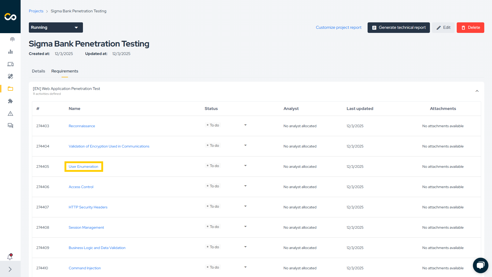

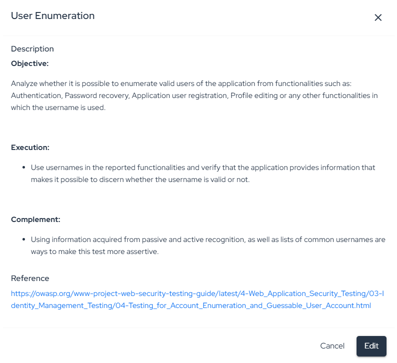

This helps you inspect the current execution state before deciding which status should be applied.

## Update Activity Status

To change the status of an activity, click the current status and select the desired one:

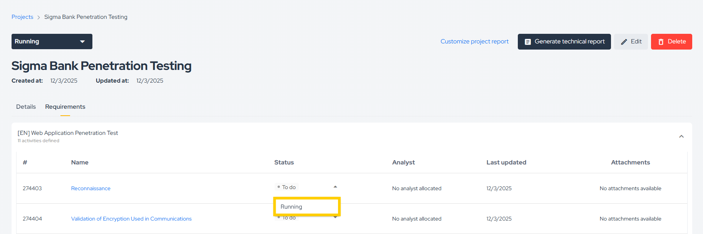

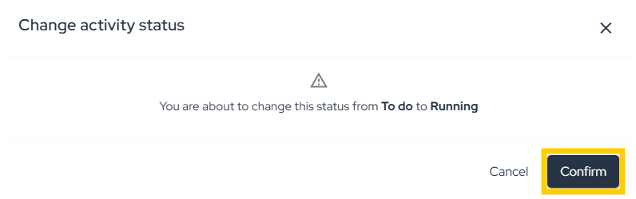

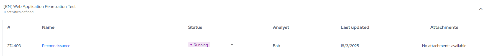

## Status-specific Actions

Depending on the selected status, the platform asks for additional context.

### Not According

When marking an activity as **Not According**, add a reason and, when applicable, evidence:

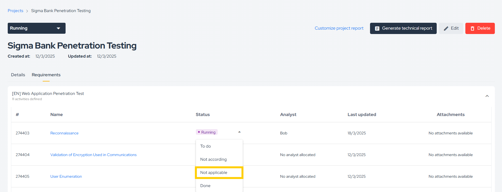

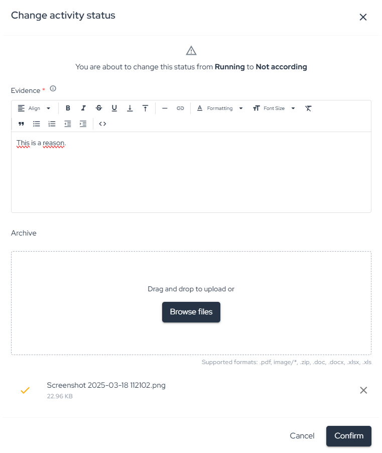

### Not Applicable

When marking an activity as **Not Applicable**, provide the reason for that decision:

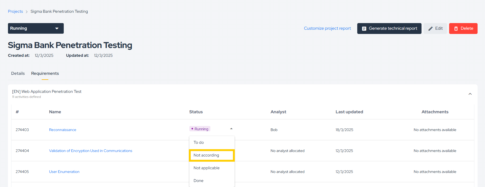

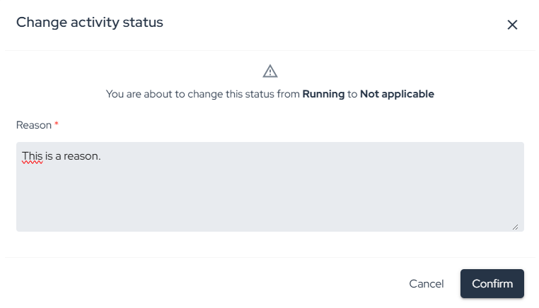

### Done

When marking an activity as **Done**, add the execution reason and/or supporting evidence:

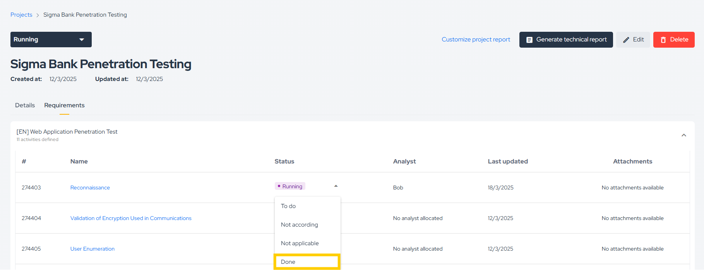

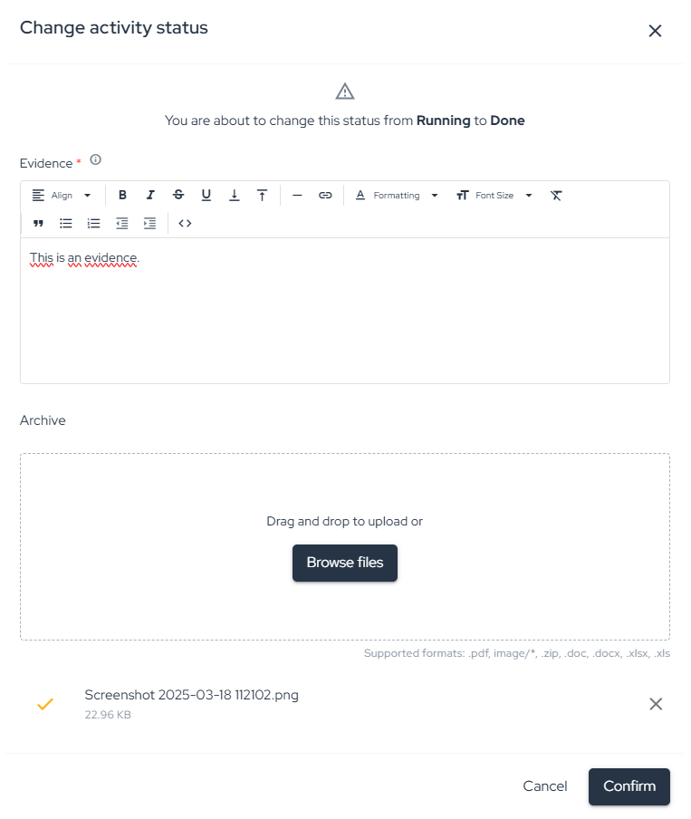

## Review Analyst and Update History

After an activity is updated, the platform shows:

* who performed the change in the **Analyst** column;
* when the change happened in the **Last updated** column.

This makes the requirement execution traceable during the project lifecycle.

## Download Activity Evidence

If an activity has an attachment associated with it, you can download it directly from the requirement view:

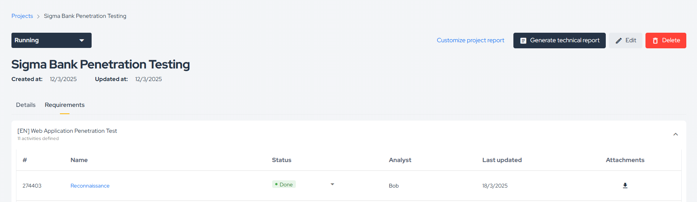

## Related Area

Requirements are part of the broader project execution flow.
For the complete project process, see [Project Management / Process](../project-management/process.md).

## Support

Should you have any questions or require assistance while using the Conviso Platform, feel free to reach out to our dedicated support team.
