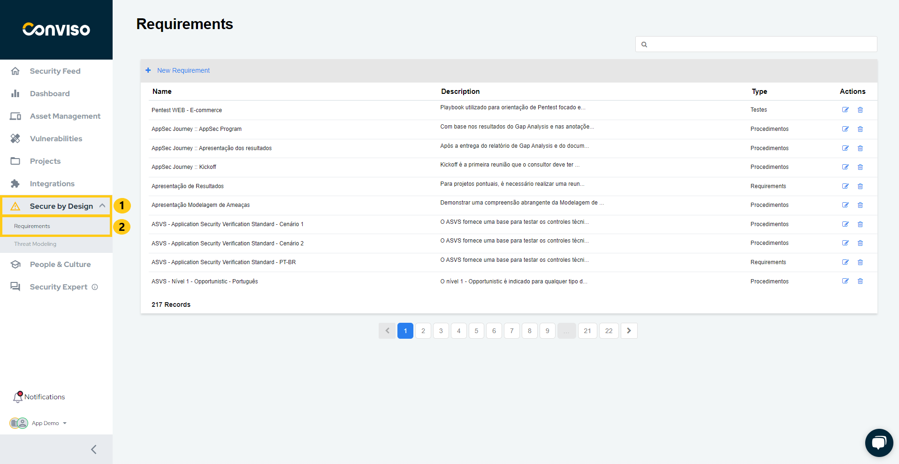

## Introduction

Requirements help keep large teams working towards the same goals, and following a pattern within a process is not the easiest of tasks. Requirements allow you to create an action plan based on tasks that must be accomplished. These tasks, in some cases, can be placed as mandatory for the closing of a project, which guarantees the manager total control over the execution.

## Usage
To view all requirements, click on the **Secure by Design (1)** and **Requirements (2)** buttons:

### Creating a New Requirement

Conviso provides some standardized requirements, but if you need to create a new one, click on the "New Requirement" button:

Enter the requirement to be created, along with its **activities**, and click **Save**:

### Editing a Requirement

To edit a requirement, find it in the list and click on the pencil icon highlighted below:

:::note
You cannot edit a requirement created by Conviso, only those created within your own company.
:::

### Deleting a Requirement

To delete a requirement, find it in the list and click on the trash can icon highlighted below:

:::note
You cannot delete a requirement created by Conviso, only those created within your own company.
:::

**Enhance your development lifecycle's security with the Conviso Platform. Join us today and foster a security-first culture!**

## Support

Should you have any questions or require assistance while using the Conviso Platform, feel free to reach out to our dedicated support team.
