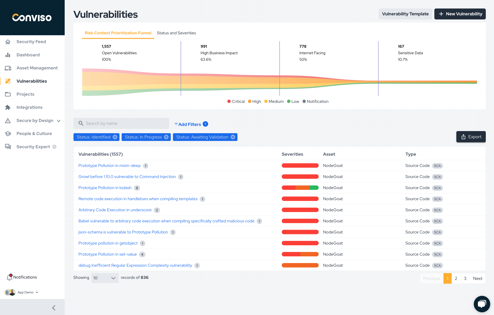

Effective risk management and prioritization are critical components of Application Security. To address vulnerabilities intelligently, it is essential to understand the concept of risk and its implications.

## Understanding Risk and its Importance

Risk is the combination of the potential impact and the likelihood of a threat exploiting a vulnerability within an application. It goes beyond merely assessing the severity of vulnerabilities. Focusing just on severity often overlooks contextual factors that influence the actual risk to the application.

For example, while a high severity vulnerability might seem like a top priority, it may not pose an immediate risk if it exists in an application that is not exposed to the internet or lacks sensitive data. Conversely, a lower severity vulnerability in a critical, internet-facing application may demand urgent attention, particularly if its exploitation could result in higher business impact, such as financial loss or disruption to key operations.

This deeper understanding is vital for developers and security teams, who often face the challenge to prioritize among numerous vulnerabilities and determine what to address first. By prioritizing based on risk rather than severity alone, teams can allocate their efforts more effectively, ensuring the most impactful vulnerabilities are mitigated in alignment with the application's context and business priorities.

To address this challenge, our new Risk Context Funnel feature helps prioritize vulnerabilities more effectively by providing a structured approach to evaluate risk. By combining factors like severity, exposure, data classification and business impact, the Risk Context Funnel ensures that teams focus their efforts where they matter most, aligning security decisions with organizational priorities.

Understanding risk and incorporating this view into the decision-making process is key to overcoming the challenges of modern application security and improving the overall security posture.

## Addressing the Challenge: The Risk Context Prioritization Funnel View

The Risk Context Prioritization Funnel view is designed to provide developers and security teams with a clear, data-driven approach to prioritizing vulnerabilities based on contextual risk. As shown in the image above the funnel helps break down and categorize open vulnerabilities by their criticality and relevance to the business.

All open vulnerabilities are displayed at the top of the funnel, offering a comprehensive view of the security landscape. As the funnel narrows, it filters vulnerabilities based on key risk factors:

- **High Business Impact**: Identifies vulnerabilities that could significantly affect core operations or financial stability. In this example, 63.6% of the open vulnerabilities are categorized as high business impact, highlighting their potential urgency.
- **Internet-Facing Applications (Attack Surface)**: Focuses on vulnerabilities in applications exposed to the internet, which are more likely to be exploited by external attackers (50% in this scenario).
- **Sensitive Data**: Prioritizes vulnerabilities affecting applications that store or process sensitive information, with 10.7% of vulnerabilities flagged in this category.

The color-coded graph visually represents the severity levels: Critical, High, Medium, Low and Notification.

Below the funnel, a detailed table displays the vulnerabilities, including their severities, associated assets, and types, sorted by the highest risk first. This allows teams to drill down into specifics and take actionable steps toward remediation.

## Embracing a Risk-based Vulnerability Prioritization for an Effective Vulnerability Management

By integrating the Risk Context Funnel, developers and security teams can move beyond generic vulnerability prioritization based on just severity and instead focus their efforts on vulnerabilities that pose the greatest risk to the organization's security and business priorities. This structured approach ensures resources are allocated effectively, reducing the likelihood of business disruption or data breaches.

In the example provided, the Risk Context Funnel helps prioritize over 1,500 open vulnerabilities, narrowing them down to the 167 that pose the highest risks which should be addressed first.
This focused approach improves decision-making and ensures resources are directed toward mitigating vulnerabilities with the most significant potential impact. By prioritizing effectively, organizations can enhance their security posture, reduce remediation efforts, and achieve a measurable return on their security investments.
