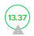

## Introduction

The Risk Score feature in the Conviso Platform provides a clear, quantitative measure of the risk associated with each asset, enabling organizations to make informed security decisions. By analyzing key factors such as **Business Impact**, **Threats**, **Attack Surface**, and **Data Classification**, the Risk Score offers a comprehensive view of the potential risks affecting your applications.

With this feature, users can:

- Quickly identify which assets carry the highest risk.
- Understand how various factors contribute to overall risk.
- Monitor changes in risk levels over time to gauge the effectiveness of security measures.
- Prioritize remediation efforts based on a clear, data-driven scoring system.

This documentation explains how the Risk Score is calculated and how you can leverage this insight to enhance your application security posture.

## Requirements

To calculate the Risk Score, you must provide the following information:

- **Asset Creation**: At least one asset must be created in the Conviso Platform with the fields below filled in.
- **Business Impact**: It represents how critical the asset is for the company in terms of impact/loss in case of a security incident occurs.
- **Attack Surface**: Indicates the asset's exposure — whether it is internet-facing or internal.
- **Data Classification**: It represents what type of information the asset have access to. For example, does it access sensitive data such as PII, PCI?
- **Threats**: It represents the numbers of vulnerabilities with their specific severity that are currently open (`Identified`, `In Progress` or `Awaiting Validation` statuses). This information is automatically obtained by Conviso Platform.

Until all the necessary information for calculating the Risk Score is provided, you will see a warning icon, as shown below:

## Calculating the Risk Score

The Risk Score for an asset is derived from a weighted evaluation of four key factors, each contributing to the overall risk assessment:

- **Business Impact**:
This factor reflects how critical the asset is to the organization in the event of a security incident. Assets are categorized as Low, Medium, or High, with corresponding numerical values assigned. Business Impact carries a substantial weight, emphasizing the importance of an asset’s role within the organization.

- **Threat**:
This component measures the severity and number of open vulnerabilities associated with the asset. Vulnerabilities are assessed based on their severity — from low-risk notifications to critical threats — with higher values assigned to more severe issues. This factor is weighted to moderately influence the overall score, ensuring that assets with more or higher-severity vulnerabilities receive a higher risk evaluation.

- **Attack Surface**:
This indicator evaluates the extent to which an asset is exposed to potential attacks. It distinguishes between assets that are internet-facing and those that are internal. The Attack Surface is given a significant weight, as exposure is a key determinant of an asset's risk.

- **Data Classification**:
This factor assesses the sensitivity of the data that the asset processes, such as personal or financial information (e.g., PII, PCI). Like the Attack Surface, it is measured on a binary scale and is assigned a lower weight, reflecting its supportive role in the overall risk assessment.

Each of these factors is converted into a numerical value and then combined using predetermined weights. The final Risk Score provides a clear, quantitative measure of an asset's risk level, enabling better prioritization of remediation efforts and more informed decision-making regarding asset security.

:::note
The precise mathematical formula used to compute the Risk Score is proprietary. However, understanding that the calculation leverages weighted inputs for Business Impact, Threats, Attack Surface, and Data Classification can help you interpret the risk levels assigned to your assets.
:::

## Using the Risk Score Informations to Prioritize Vulnerabilities

Based on the data used to calculate the Risk Score (**Business Impact**, **Attack Surface**, and **Data Classification**), a key feature of the Conviso Platform can be leveraged: the [Risk Context Prioritization Funnel](./risk-context-funnel.md). This view is designed to provide developers and security teams with a clear, data-driven approach to prioritizing vulnerabilities based on contextual risk. The funnel helps break down and categorize open vulnerabilities by their criticality and relevance to the business.

## Changing the Risk Score Values

The Risk Score can range from N/A (when the necessary information is not provided) to 99 (its maximum value). The higher the score, the greater the risk associated with the asset. Therefore, the goal is that, with the help of the Conviso Platform, you will be able to reduce the Risk Score as vulnerabilities are remediated.

## Being Notified When the Risk Score Changes

Whenever the Risk Score is updated, you can receive notifications via [in-app alerts or email](https://app.convisoappsec.com/spa/user/notifications-center), as well as through [Microsoft Teams](../integrations/microsoft-teams.md) or [Slack](../integrations/slack.md) integration.

## Support

Should you have any questions or require assistance while using the Conviso Platform, feel free to reach out to our dedicated support team.

## Resources

By exploring our comprehensive content, you’ll discover resources that will enhance your understanding of AppSec.

[Conviso Blog](https://bit.ly/3JtXM8A): Access a wealth of informative videos covering various topics related to AppSec. Please note that the content is primarily in Portuguese.

[Conviso's YouTube Channel](https://bit.ly/3NIbbfM): Engage with our informative podcast, where we discuss AppSec-related subjects, providing valuable insights and discussions. The podcast is conducted in Portuguese.

[AppSec to Go - Conviso's Podcast on AppSec](https://spoti.fi/43UJQwN): Explore our blog, which offers a collection of articles and posts covering a wide range of AppSec topics. The content on the blog is primarily written in English.

