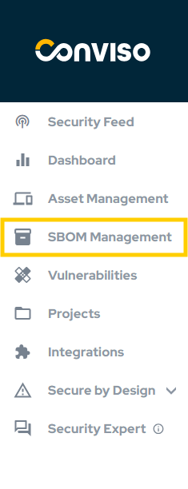
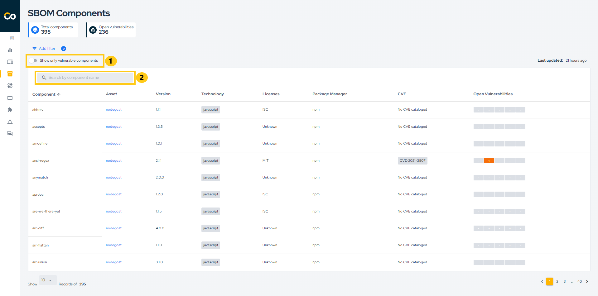
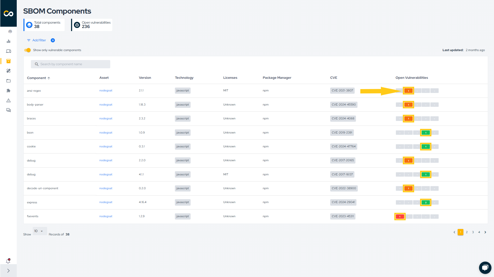
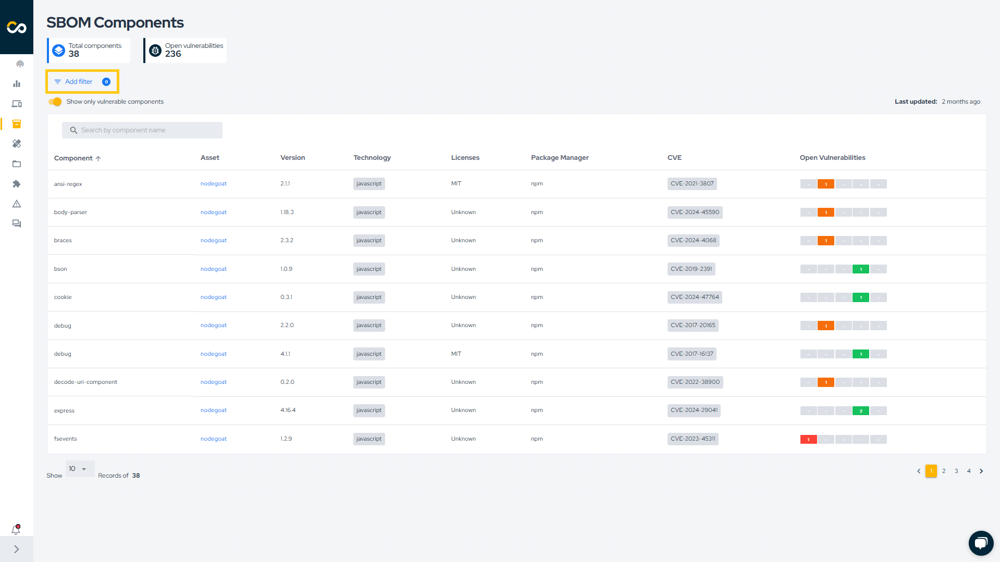
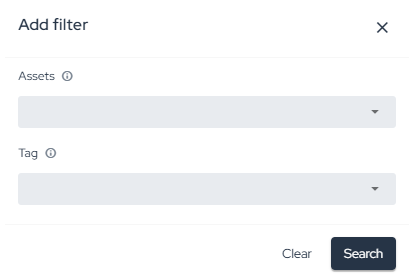

## Introduction

Today, it is almost impossible to develop software without using third-party libraries. Many solutions have already been designed and transformed into libraries that we can use and adapt in our software. However, this reliance on external libraries poses risks to our applications, as these third-party components may contain vulnerabilities and/or have licenses that conflict with our own applications.

For more information about SBOM in Conviso Platform, [click here](../security-scans/conviso-sbom/conviso-sbom.md).

## How to generate and view components in Conviso Platform

An SBOM file will be generated and sent to the respective asset each time you run `conviso ast run`, `conviso sca run` or `conviso sbom generate`.

After executing any of these commands, simply navigate to the **SBOM Management** section:

On this page, you'll see all components used in your assets, including the component name, version, technology, license (if available), package manager, CVEs, and open vulnerabilities. You can quickly filter by component name, as shown in the first reference in the image, and you can also display only components with vulnerabilities, as indicated in the second reference in the image.

If a component has vulnerabilities, you can click on the severity to be redirected to the associated vulnerability or vulnerabilities, as shown in the image below.

You can also filter by Asset name or Asset tag. To do this, click **Add filter** and select the desired filter, as demonstrated below:

## Support

Should you have any questions or require assistance while using the Conviso SBOM feature at any stage of the process, feel free to contact our dedicated support team.

