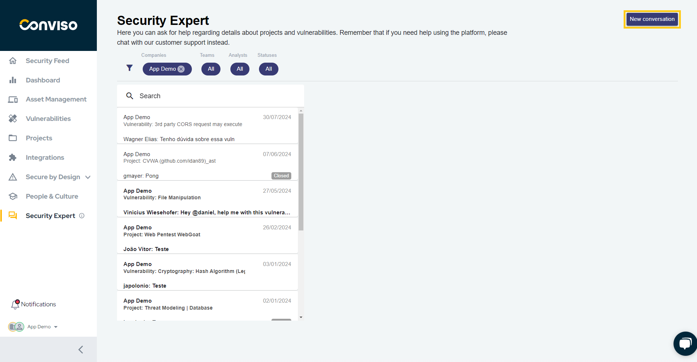
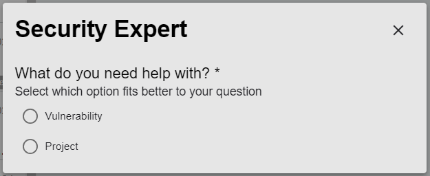
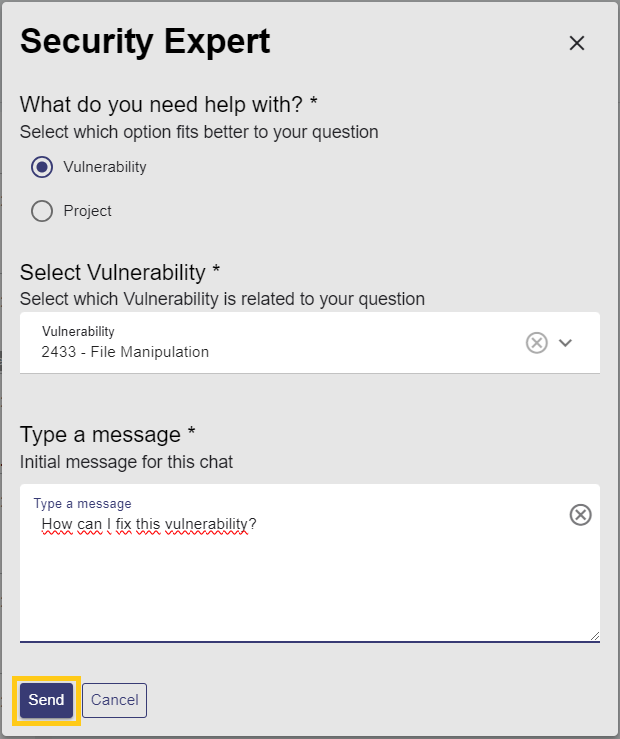

## Introduction

The Security Expert feature allows you to directly contact Conviso's experts. This helps you understand your vulnerabilities, learn how to fix them, and clarify any doubts related to your company's projects.

## Usage
To use the Security Expert feature, you can access or create a chat from the vulnerability/project detail screen or from the sidebar menu. Let's do this by clicking on **Security Expert** in the sidebar menu:

In the image below, the area highlighted with number 1 represents all company chats. The button highlighted with number 2 is used to start a new chat:

### Creating a New Chat

1. To create a new chat, click the button highlighted below:

2. Next, choose whether the chat will be linked to a project or a vulnerability:

3. After selecting a project or vulnerability, enter your message and click "Send":

4. A new chat will be created, and Conviso's analysts will be notified so you can receive a response:

To ensure you don't miss replies from our experts, enable notifications for the Security Expert.

**Enhance your development lifecycle's security with the Conviso Platform. Join us today and foster a security-first culture!**

## Support

Should you have any questions or require assistance while using the Conviso Platform, feel free to reach out to our dedicated support team.

## Resources

By exploring our comprehensive content, you’ll discover resources that will enhance your understanding of AppSec.

[Conviso Blog](https://bit.ly/3JtXM8A): Access a wealth of informative videos covering various topics related to AppSec. Please note that the content is primarily in Portuguese.

[Conviso's YouTube Channel](https://bit.ly/3NIbbfM): Engage with our informative podcast, where we discuss AppSec-related subjects, providing valuable insights and discussions. The podcast is conducted in Portuguese.

[AppSec to Go - Conviso's Podcast on AppSec](https://spoti.fi/43UJQwN): Explore our blog, which offers a collection of articles and posts covering a wide range of AppSec topics. The content on the blog is primarily written in English.

