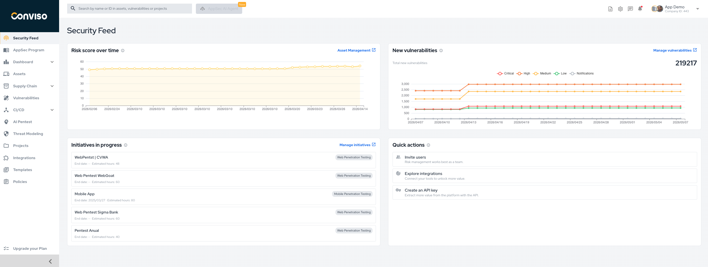

## Overview

The **Security Feed** is the platform home screen.
It gives you a quick operational summary of your current AppSec scenario so you can understand what needs attention without navigating through multiple areas first.

The current layout is organized around four main blocks:

* risk trend visibility;
* vulnerability growth visibility;
* active initiatives in execution;
* quick access to common actions.

## Access the Security Feed

To access the Security Feed, click **Security Feed** in the left-hand menu.

## What You Can See on This Screen

### Risk Score Over Time

This card shows how the overall risk score evolves over time.
It helps you understand whether the security posture is improving, remaining stable, or deteriorating.

Use this view to:

* monitor long-term risk movement;
* detect sudden increases in risk;
* identify when remediation activity is improving the posture.

The card also provides a direct shortcut to [Asset Management](./asset-management.md).

### New Vulnerabilities

This card shows the volume of new vulnerabilities over time, grouped by severity.
It helps teams identify whether the vulnerability backlog is growing and which severity bands are increasing faster.

Use this view to:

* monitor the entry rate of new findings;
* compare growth between critical, high, medium, low, and notification findings;
* identify when ingestion or scan activity changed materially.

The **Manage vulnerabilities** action takes you to the [Vulnerabilities](./vulnerabilities.md) area for detailed investigation and follow-up.

### Initiatives in Progress

This section lists the projects that are currently active, showing their names, initiative type, and estimated effort information.

Use this view to:

* follow what is currently being executed;
* identify initiatives that may need operational attention;
* jump quickly into the [Projects](./projects.md) workspace.

For project status meanings and transition logic, see [Workflow Status](../project-management/workflow-status.md).

### Quick Actions

The **Quick actions** block provides shortcuts for common onboarding and activation steps in the platform.

The actions currently available are:

* **Invite users**: open the user invitation flow so more people can collaborate in the platform.
* **Explore integrations**: navigate to the [Integrations](../integrations/integrations_intro.md) area to connect external tools.
* **Create an API key**: start using the platform programmatically through the [API](../api/api-overview.md).

## How to Use the Security Feed

The Security Feed works best as a starting point for daily navigation:

1. Check whether the risk score trend is stable or rising.
2. Review whether new vulnerabilities are accumulating.
3. Look at the initiatives currently in progress.
4. Use the available shortcuts to continue into deeper operational areas.

In practice, this page is not meant to replace the detailed workflows.
It is the entry point that helps you decide whether to continue into Assets, Vulnerabilities, Projects, Integrations, or API setup.

## Related Areas

After reviewing the Security Feed, the most common next steps are:

* [Asset Management](./asset-management.md)
* [Vulnerabilities](./vulnerabilities.md)
* [Projects](./projects.md)
* [Integrations](../integrations/integrations_intro.md)
* [API Overview](../api/api-overview.md)

## Support

Should you have any questions or require assistance while using the Conviso Platform, feel free to reach out to our dedicated support team.
